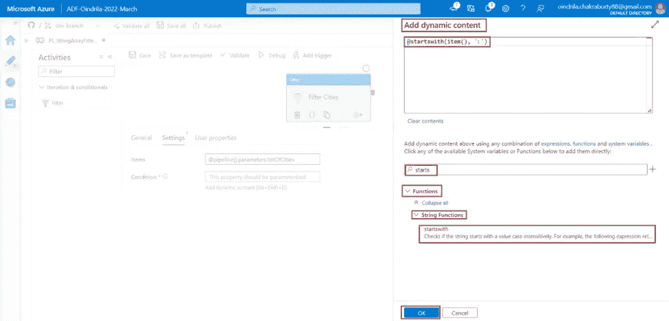

# Azure 数据工厂中的“过滤”活动简介

> 原文：<https://medium.com/codex/introduction-to-filter-activity-in-azure-data-factory-5f7b50d4cf40?source=collection_archive---------3----------------------->

# 什么是过滤器活动

***过滤器******活动*** 是 ***用于将*** 一个 ***过滤器表达式应用到******一个*** ***数组中定义的*** 一个 ***数据工厂流水线*** 。 ***任意变量，或者， ***的参数*********数组*** ，或者， ***的输出******来自其他先前活动*中的 ***可以作为*** 使用****

# *使用过滤器活动创建管道*

****第一步*** - ***打开****(***【portal.azure.com】***)。**

****

*****第二步***-**-**点击***Azure 数据工厂资源***"***ADF-Oindrila-2022-3 月*** "。**

****

*****第三步*** -将 ***Azure 数据工厂******ADF-Oindrila-2022-3 月******设置页面*** 为 ***打开*** 。 ***点击******打开 Azure 数据工厂工作室******链接*** 。**

****

*****第四步*** -第 ***Azure 数据工厂资源******ADF-Oindrila-2022-3 月*** 是 中 ***打开的一个 ***新标签页在******相同的浏览器*** 。现在， ***点击******作者******链接打开******Azure 数据工厂*** ***处于编辑模式*** 。*****

**

****第五步***-**-*点击*******管道******类别*** ***中的*** ***资源浏览器*** ，**

****

*****步骤 6*** - ***转到******参数******标签 ***管道******PL _ StringArrayFilterActivity***。 ***点击******+新建******链接添加******参数******list of cities******数组*** ***提供*** ***【纽约】【伦敦】【东京】【新加坡城】【里斯本】******默认值为******参数******list of cities***，即一个*****

****

*****第 7 步*** - ***搜索******过滤******活动****中的 ***活动浏览器*** 和 ***将其拖动到******设计器窗格的*** 中的***

********

*******步骤 8***-***目标**是用******滤镜******活动上******管道参数******list of Cities*******

*******转到*******选项卡******滤镜******活动*** 。 ***点击***的 ***文本框中的 ***项******属性*** ***来提供******参数*** ，或者，*** ***链接******添加动态内容【Alt+Shift+D】***是 ***显示在*** 下的 ***文本框*** 。 ***点击******链接*** 。*****

******

******第九步***-****list of cities***是 ***中显示的*******可用参数*** 的列表。当 ***选择*** 时，从***可用的* ***参数列表*** 中 的 ***名称 ***选择的*** 参数是*中显示的 ******点击******确定******按钮*** 。************

**

*的 ***值 ***属性******项**表达式语言******@ pipeline()parameters . list of cities***。****

**

****步骤 10***-**-******条件******属性******筛选******活动*** 、 ******这里的*** ， ***过滤条件*** 是为了 ***选择*** 中所有的 ***城市******从*** 到 ***管道参数********

****点击*******条件******属性*** ***提供******过滤条件******应用于******项目*** ，I ***链接******添加动态内容【Alt+Shift+D】***是 ***下显示的******文本框*** 。 ***点击******链接*** 。**

****

*****第十一步-*** ***键入******开始******在*** 中 ***搜索******文本框*** 和 ***按*然后 ***选择******starts with******Function***，这是一个 ***字符串函数*** 。****

*****为*** 本 ***功能*** 将 ***应用于*******类型******数组*** 。即“*”， ***提供******项()******为*******为*** 本 ***函数*** 。***item()******表示****中的每一项 ***管道参数******类型******数组*** 。即“ ***城市列表*** ”。******

*****自*** ， ***条件*** 是对*所有的 ***城市*** ， ***以*** 开头 ***字母******

**最后， ***点击 ***上的*** 确定******按钮*** 。**

**

*的 ***值 ***属性******条件*** 会在 ***表达式语言******@ starts with(item()，' L')*** 。****

**

****第十二步*** - ***调试*** 流水线***PL _ StringArrayFilterActivity******查看******输出的******过滤器******活动* ***过滤器******活动*** 已经 ***成功运行完毕*** 。***

**

*在****选项卡*** 中，将**输出 ***显示为***【伦敦】【里斯本】**** ，即 ***城市*** ，******

**************