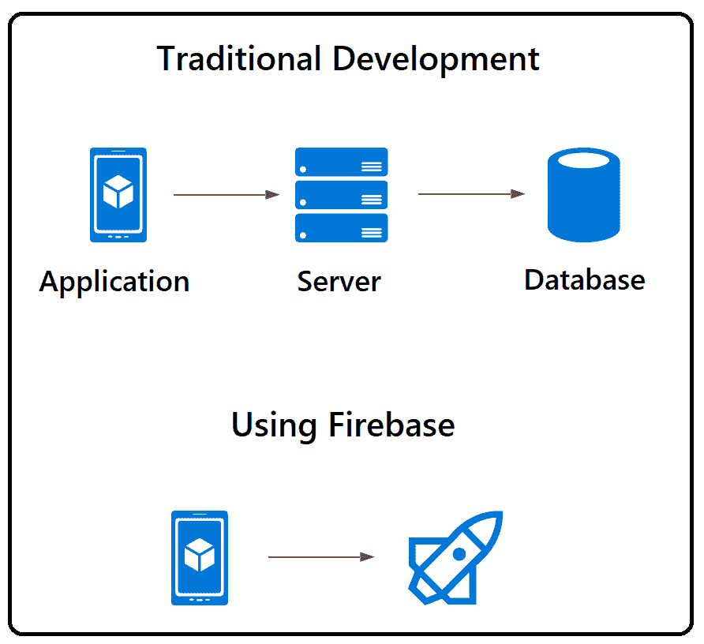

# Firebase 简介

> 原文：<https://medium.com/codex/introduction-to-firebase-116ba3c5e1d?source=collection_archive---------26----------------------->

Max Kukurudziak 在 [Unsplash](https://unsplash.com?utm_source=medium&utm_medium=referral) 上拍摄的照片

## [抄本](http://medium.com/codex)

智能手机和高速互联网的出现导致了移动应用的诞生。在任何一天，你都可以确定一个新的开发者正在创建一个新的应用来解决用户的问题。截至 2020 年，Google Play 有超过 256 万个应用，而苹果的应用商店有超过 185 万个应用可供下载。如果你是一名应用程序开发人员，现在是最好的时机。

但是应用程序开发伴随着为后端服务器编写复杂代码的挑战。但是不要害怕，因为 Firebase 允许你开发应用程序，而不需要花时间编写后端代码。如果你有兴趣了解更多，打开阅读模式，开始向前滚动。在这篇文章中，我们将了解什么是 Firebase 以及你能用它做什么。

**目录**

1.  **什么是 Firebase？**
2.  Firebase 是如何进化的？
3.  Firebase 与传统 app 开发有何不同？
4.  你能用 Firebase 做什么？
5.  使用 Firebase 扩展您的应用程序。
6.  包扎

# 什么是 Firebase？

Firebase 是一个工具，它允许您构建、开发和增长您的应用程序，而不需要后端开发的复杂代码。Firebase 通过一套预构建的工具帮助您增强应用程序开发和管理需求。

如果您是一名开发人员，firebase 可以借助自动化流程的工具帮助您节省大量生产时间，例如:

*   分析学
*   在应用程序认证中
*   数据库管理
*   文件存储器
*   推送消息

Firebase 的核心概念是帮助开发人员提高工作效率和生产力。它通过帮助您管理服务器端服务的后端来做到这一点。

# Firebase 是如何进化的？

Firebase 最初名为“Envolve”，是一个 API 集成，允许开发人员将在线聊天的功能集成到他们的网站中。随着 Envolve 的发展，开发人员开始将它用于超出预期的用途。Avid 开发人员开始使用 Envolve 来同步用户的实时数据。

这导致了 Envolve 联合创始人的“啊哈”时刻，因为他们将在线聊天和实时信息共享功能分开。

这个决定为 Firebase 铺平了道路，Firebase 是一个为开发人员提供后端即服务模型的应用程序。Firebase 作为一个软件变得更好了。2014 年，科技巨头“谷歌”决定收购它。

# Firebase 与传统 app 开发有何不同？

当你打算用传统方法开发一个应用程序时，有一种为前端和后端软件编写代码的内在需求。Firebase 战胜了传统方法，因为它允许您开发应用程序而不需要后端代码。下图清楚地描述了 Firebase 和传统应用程序开发之间的区别-

Firebase 为你提供后台组件，由 Google 通过云平台托管和维护。注册后，Firebase 为您提供客户端 SDK，以便直接与后端服务进行交互。这允许你运行客户端应用程序，而不需要它们之间的任何中间件。

# 你能用 Firebase 做什么？

Firebase 为您提供了一系列工具，帮助您加速应用程序开发过程。这些工具中的一些将帮助您节省测试和开发时间，而一些将帮助您提高用户体验的质量。这里有一些工具可以帮助你测试和开发更好的应用程序。

## 证明

为您的应用程序开发一个认证系统通常需要大量的人力和时间。即使在开发之后，您也需要部署人员来维护身份验证系统的效率。

Firebase 提供了一个身份验证管理工具，可以帮助您构建一个安全无误的身份验证。它允许您用最多不超过 15 行代码创建和管理一个定制的身份验证系统。

您可以允许以多种方式进行用户身份验证，包括

*   电子邮件登录
*   脸书帐户登录
*   电话号码
*   Twitter 帐户登录

还有更多。

简而言之，firebase 的身份验证系统允许您创建一种无代码的方式，为最终用户提供一流的身份验证体验。

## Firebase 实时数据库

这是 Firebase 在谷歌收购后提供的首批服务之一，因此可以肯定地说，这是该平台提供的最古老的服务之一。

它是一个实时数据库，允许开发人员跨所有应用程序实时发送更新的数据。借助于客户机和数据库之间始终存在的多重双向通信，这是可能的。

你也应该知道这里的数据是以 JSON 的形式存储的。

## 云 Firestore

Cloud firestore 于 2019 年发布，被认为是 Firebase 实时数据库的老大哥。Cloud Firestore 与 Firebase 实时数据库的区别在于，这里的数据存储为字段和值对。它是最好的 NoSQL 数据库，允许您跨所有应用程序存储和查询数据。

## 毫升试剂盒

ML kit 允许开发人员将谷歌的机器学习算法集成到他们的应用程序中，而不需要大量的编码或对 ML 的深入理解。您可以使用 ML 工具包轻松地将 ML 特性集成到您的应用程序中。其中一些包括:

*   文本识别
*   人脸识别
*   图像标注
*   地标识别

如果您是 ML 方面的专家，firebase 的 ML 工具包允许您为自己的应用程序创建定制模型。

## 主办；主持

Firebase 托管允许您托管 web 应用程序，而无需编码。Firebase hosting 还支持您在其平台上托管微服务，方法是将它与云功能配对。

# 使用 firebase 扩展您的应用程序

下面是一些使用 Firebase 来扩展应用程序的效用并充分利用它的方法

## Firebase 的谷歌分析

谷歌分析可以让你了解你的用户以及他们如何使用你的应用程序。要创建一个成功的应用程序，您需要拥有关于您的用户的数据，以便做出有效的选择。这正是 Google Analytics 帮助你解密应用程序中所有用户操作的数据的地方。有了谷歌分析，你可以为你的应用程序建立受众，并使用这些特定的数据来改善你的用户体验。

## Firebase 云消息传递

FCM 允许开发人员在他们的所有应用程序中免费发送和接收通知。该工具允许您根据人口统计、行为、兴趣和许多其他特征来隔离最终用户。通过隔离，您可以使用您的应用程序向您的受众发送有针对性的消息。由于 FCM 与 Firebase analytics 相集成，您可以跟踪您的通知来衡量转化率。

## 火情预测

Firebase predictions 从 Google analytics 中分析关于您现有用户的数据，并对他们进行预测。预测是在 ML 概念的帮助下计算出来的，并帮助你确定最终会使用你的应用程序的受众。

## Firebase 应用内消息

该工具帮助您在用户使用您的应用程序时向他们显示定制的消息。这可能会给你带来一个问题——Firebase 云消息(FCM)与 Firebase 应用内消息(FIAM)有何不同？。它们之间的区别很简单。在 FCM 中，通知由仪表板控制，而在 FIAM 中，通知由预定义的标准控制。简而言之，FCM 源于您控制下的服务器，而 FIAM 源于应用程序。

# 包扎

Firebase 是理想的选择，尤其是如果你不擅长编程的话。有了 Firebase，任何人都可以成为应用开发者。在这篇文章中，你已经看到了什么是 Firebase 以及你能用它做什么。现在已经完成了，是时候开始使用 Firebase 并让您的下一个应用程序构建成为一个无缝的过程了。所以，去尝试一下吧。

*原载于*[*https://www . partech . nl*](https://www.partech.nl/nl/publicaties/2020/10/introduction-to-firebase)*。*