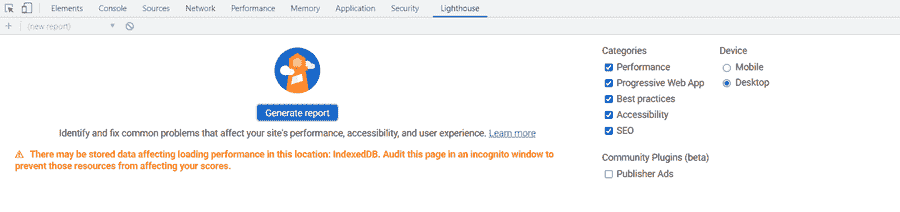
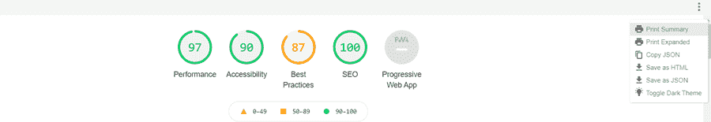
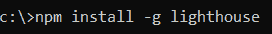

# 谷歌灯塔介绍，捆绑和缩小

> 原文：<https://medium.com/codex/introduction-to-google-lighthouse-bundling-minification-ae1af88e95d4?source=collection_archive---------18----------------------->


今天几乎每个人都使用网站。然而，使用它的目的因人而异。有些人用它购物，有些人用它交易，有些人用它查找信息等等。网络世界不断发生着太多的变化；互联网在新技术的帮助下不断发展以迎合这些变化。

然而，作为拥有这些网站的企业，衡量网站的表现是很重要的。对他们来说，衡量关键点是至关重要的，比如渲染速度有多快，对搜索引擎的反应如何，他们是否坚持最佳实践，等等。

幸运的是，现在有很多工具可以衡量网站的表现，其中之一就是 Google Lighthouse。在本帖中，让我们深入了解什么是 Lighthouse，以及它是如何有用的。

**目录**

1.  什么是灯塔？
2.  灯塔作为网页审计员
3.  如何使用灯塔
4.  捆绑和缩小
5.  结论

# 什么是灯塔？

它是谷歌公司的一个开源工具，用于监控网页的性能。它根据以下参数分析网站-

*   表演
*   渐进式网络应用
*   它是多么容易接近
*   遵循最佳实践
*   优化的 wrt 搜索引擎

Lighthouse 也有一个内部逻辑来检查和生成移动和桌面屏幕的数据。谷歌一直强调，在谷歌搜索结果中排名时，网站的速度非常重要。这是可以理解的，因为页面加载时间越长，用户体验越差。Lighthouse awards 对上述每个参数都给出了满分 100 分，并提供了改进网站这些方面的建议。

“性能”类别基于以下参数衡量页面-

*   文档对象模型中的第一个内容(第一个内容丰富的绘画— FCP)，
*   文档对象模型中页面上的最大内容(最大内容绘画— LCP)，
*   用户与页面交互所用的时间(交互时间-TTI)，
*   FCP 和相互作用时间之间的时间差(总阻断时间— TBT)，以及
*   页面填充的速度(速度指数— SI)。

这些评级是有分量的。例如，三丁基锡化合物和 LCP 占 25 %的权重。通过检查具有上述参数的页面，Lighthouse 提供了关于哪些地方可以改进，哪些地方页面运行良好的数据，以及一些提高整体性能的技巧。

同样，对于可访问性、最佳实践和 SEO，Lighthouse 为报告提供了三个不同的结果集。除此之外，它还为渐进式 web 应用程序和运行时设置提供数据。

# 如何使用 Lighthouse？

Lighthouse 提供了多种方式来访问和生成报告。我们会看到三种方式-

## 通过 Chrome 开发者工具访问

在你的 Chrome 浏览器中按下 **F12** ，寻找灯塔标签。单击它将为您提供生成报告的选项。



点击 Generate Report 按钮，Lighthouse 会检查您所在的页面并提供必要的数据。数据可以保存为 HTML/ JSON 格式，也可以打印。



## 通过节点模块访问

这需要在本地机器上安装 nodejs，因为这需要从命令提示符下访问。这种方法为您提供了自动/批量检查多个页面的选项。一旦安装了节点，必须使用下面的命令全局安装 Lighthouse 节点模块。



安装完成后，输入命令-

```
lighthouse <urltovalidate>
```

这将获取结果并将其导出到 HTML。它将存储在执行它的同一位置。

## 通过 Chrome 扩展访问

进入 Chrome Web 插件商店，安装 Lighthouse 扩展(https://Chrome . Google . com/Web Store/detail/light house/blipmdconlkpinefehnmjammfjpmpbjk)。安装后，Lighthouse 扩展会出现在浏览器上，您可以使用它生成报告。

# 捆绑和缩小

每当我们谈论一个网站的性能和改进的步骤时，我们都不能忽视捆绑和缩小。这是提高性能的两种最简便的方法。它们有助于改善应用程序的请求加载时间。

如果 CSS 和 JS 文件没有捆绑在一起，那么将所有文件从服务器端传送到客户端需要一些时间。由于现代浏览器将同时连接的数量限制为最多 6 个，超过 6 个的请求将被排队并执行。

缩小是另一个过程，其中 javascript 文件中不必要的空格、短变量名、换行符和注释被解决。通过这样做，文件的大小减小了，应用程序开始加载得更快了。

要在 MVC 应用程序中启用缩小和捆绑文件，请转到 system.web.config 文件，并输入以下行-

默认情况下，该值设置为 true，这意味着禁用绑定和缩小。将标志设为假，以继续捆绑和缩小。要将文件捆绑在一起，可以向 App_Start 文件夹中的 BundleConfig 添加代码。

捆绑。Add(新的 style bundle(" ~/Content/themes/base/CSS ")。Include( *添加需要捆绑成逗号分隔值的文件*)；

为了缩小文件，Visual Studio 提供了 web 扩展来缩小所提供的文件。的输出。css 文件将是一个. min.CSS 文件。

# 结论

重要的是提高网页的性能，这有助于增强用户体验。像 Lighthouse 这样的工具提供了价值，并帮助企业确定改进的关键领域。类似地，捆绑和缩小在性能改进中起着关键作用。

*原载于*[*https://www . partech . nl*](https://www.partech.nl/nl/publicaties/2021/07/introduction-to-google-lighthouse-bundling-minification)*。*