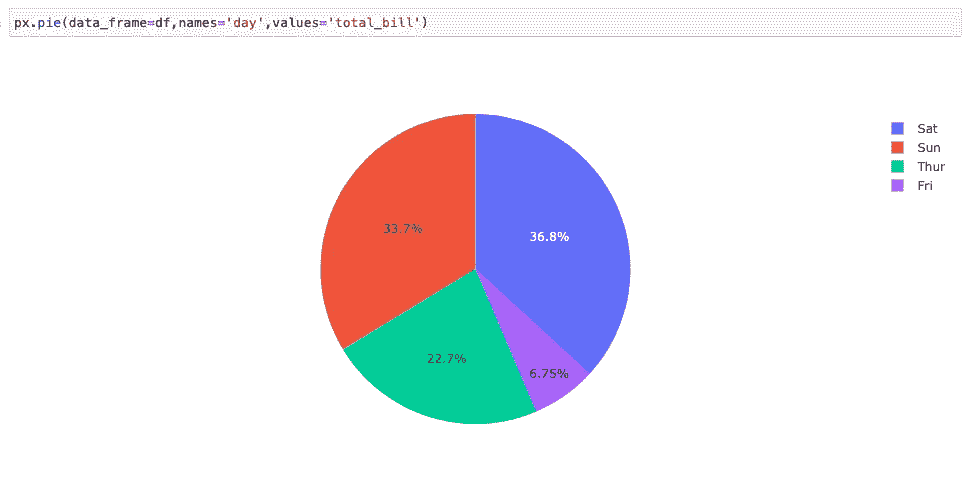
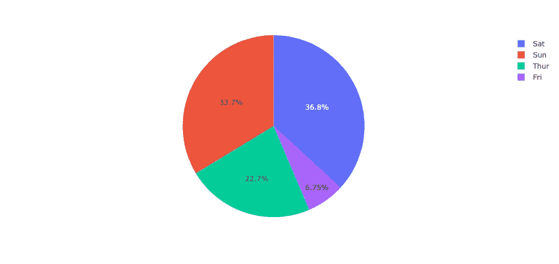
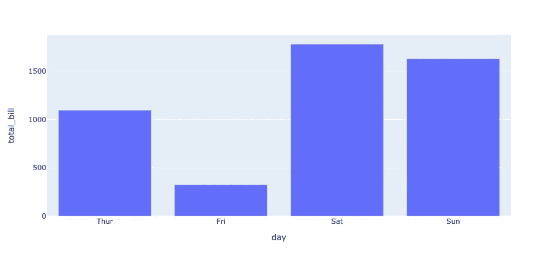
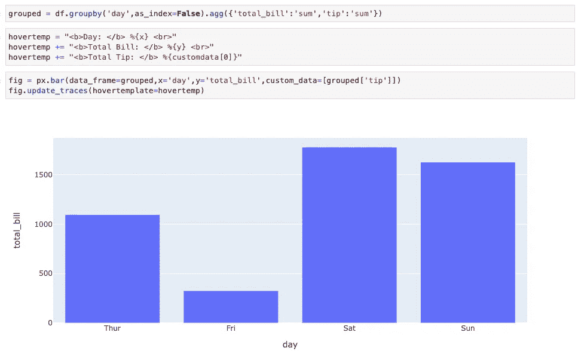

# Plotly 图中的 Hovertemplate 简介

> 原文：<https://medium.com/codex/introduction-to-hovertemplate-in-plotly-graphs-e658c1b4a335?source=collection_archive---------0----------------------->

以及如何使用“自定义数据”的示例

在本文中，我们将尝试指出 Plotly 中的 hovertemplate 是什么，我们如何使用它，以及如何向 hover template 添加自定义数据。实际上，我会做两个例子，一个是饼状图，一个是条形图。我们将在本文中讨论以下内容:

*   如何为基于百分比的图表(饼图等)自定义 hovertemplate？)
*   如何为非基于百分比的图表(条形图、折线图等)自定义 hovertemplate？)
*   如何在 hovertemplate 中使用自定义数据

你可以在这里获得更多细节[。](https://plotly.com/python/hover-text-and-formatting/)

首先，如果你想通过做例子来继续这篇文章，你应该安装一些 Python 包。

```
!pip install pandas
!pip install numpy
!pip install seaborn
!pip install plotly
```

我们用 Pandas 和 NumPy 来玩数据，用 Seaborn 来获取数据，用 Plotly 来可视化数据。

# 介绍

我将导入我们将使用的包。

```
import pandas as pd
import numpy as np
import seaborn as sns
from plotly import graph_objects as go
from plotly import express as px
```

现在我们需要得到数据。我们使用来自 Seaborn 的 **tips** 数据集。

```
df = sns.load_dataset('tips')
```

我正在创建一个简单的饼图。您可以通过执行下面的命令获得相同的图表。当您将鼠标悬停在饼图的一部分上时，可以看到悬停文本。



您刚才看到的文本是由 hovertemplate 创建的。在 hovertemplate 中，我们可以设置我们想要看到的内容。

# 悬停模板

在 hovertemplate 中，我们可以使用 HTML 标签。我们需要为这个属性创建一个模板。为此，我们使用`update_traces`方法。

```
fig = px.pie(data_frame=df,names='day',values='total_bill')fig.update_traces(hovertemplate='HELLO WORLD!')
```

我们向 **update_traces** 方法中的 **hovertemplate** 参数发送一个模板。现在，当我们悬停在一块馅饼上时，我们只会看到“你好，世界！”。因为我们只发送了一个字符串。

这一点要注意。模板参数在这里从基于百分比的(饼图等)改变。)图表以非百分比为基础(条形图、折线图等。)图表。

## 基于百分比的图表的悬停模板

在 hovertemplate 中，如果我们想使用像“x”、“y”、“label”或“values”这样的图形参数，我们需要在 hovertemplate 字符串中对它们进行格式化。

我们在下面看到一个创建饼图的例子。我们可以在 hovertemplate 中使用这些参数(名称、值)。

```
fig = px.pie(data_frame=df,names='day',values='total_bill')
```

我要创建一个字符串变量。我应该用`%{parameter}`样式格式化。

```
hovertemp = "<b>Day: </b> %{label} <br>"
hovertemp += "<b>Total Bill: </b> %{value}"
```

如上所述，我们需要使用`update_traces`方法来应用这个模板。

```
hovertemp = "<b>Day: </b> %{label} <br>"
hovertemp += "<b>Total Bill: </b> %{value}"fig = px.pie(data_frame=df,names='day',values='total_bill')
fig.update_traces(hovertemplate=hovertemp)
```

现在，当您将鼠标悬停在一块饼图上时，您将看到一个动态创建的字符串。



## 非基于百分比的图表的悬停模板

与之前基于百分比的图表不同，我们应该稍微更改一下模板参数。

```
grouped = df.groupby('day',as_index=False).agg({'total_bill':'sum'})hovertemp = "<b>Day: </b> %{x} <br>"
hovertemp += "<b>Total Bill: </b> %{y}"fig = px.bar(data_frame=grouped,x='day',y='total_bill',barmode='group')
fig.update_traces(hovertemplate=hovertemp)
```

我用`x`更改了`label`以访问数据组的名称，用`y`更改了`values`以访问数据组的值。



# Plotly 图形中的自定义数据

我们知道我们只能在图表中添加 2 个数据点。x 和 Y 或名称和值。但是我们可以通过使用`custom_data`属性发送其他数据点。它需要一个列表。

我在分组过程中补充了另一点。我会把小费的总数加到图表上。

```
grouped = df.groupby('day',as_index=False).agg({'total_bill':'sum','tip':'sum'})
```

我们必须通过使用如下的`custom_data`属性来证明这一点。

```
fig = px.bar(data_frame=grouped,x='day',y='total_bill',custom_data=[grouped['tip']])
```

如果我们想使用定制数据，我们应该在 hovertemplate 字符串中使用列表符号。 **customdata[0]** 表示总小费金额。

```
grouped = df.groupby('day',as_index=False).agg({'total_bill':'sum','tip':'sum'})hovertemp = "<b>Day: </b> %{x} <br>"
hovertemp += "<b>Total Bill: </b> %{y} <br>"
hovertemp += "<b>Total Tip: </b> %{customdata[0]}"fig = px.bar(data_frame=grouped,x='day',y='total_bill',custom_data=[grouped['tip']])
fig.update_traces(hovertemplate=hovertemp)
```



# 最后

希望这是有帮助的，你喜欢它。您可以从以下位置访问代码:

[](https://www.kaggle.com/enesbaysan/hovertemplateandcustomdatainplotly) [## HovertemplateAndCustomdataInPlotly

### 使用 Kaggle 笔记本探索和运行机器学习代码|使用来自无附加数据源的数据

www.kaggle.com](https://www.kaggle.com/enesbaysan/hovertemplateandcustomdatainplotly) 

亲切的问候。