# 介绍多层感知器如何工作，但没有复杂的数学

> 原文：<https://medium.com/codex/introduction-to-how-an-multilayer-perceptron-works-but-without-complicated-math-a423979897ac?source=collection_archive---------1----------------------->

当你的咖啡不够甜时，你会怎么办？你可能会加更多的糖。外面冷的时候呢？你会穿更多的衣服。因此，通常情况下，添加更多的东西可以解决问题，这种方法也适用于感知器来解决复杂的问题。

# 多层感知器的基本结构

多层感知器(MLP)为解决复杂问题而添加到感知器中的是一个隐藏层。隐藏层位于输入层和输出层之间，可以有一层以上的神经元。当有多个层时，靠近输入层的层称为下层，靠近输出层的层称为上层。就像输入层一样，每个隐藏层都包含一个偏置神经元。

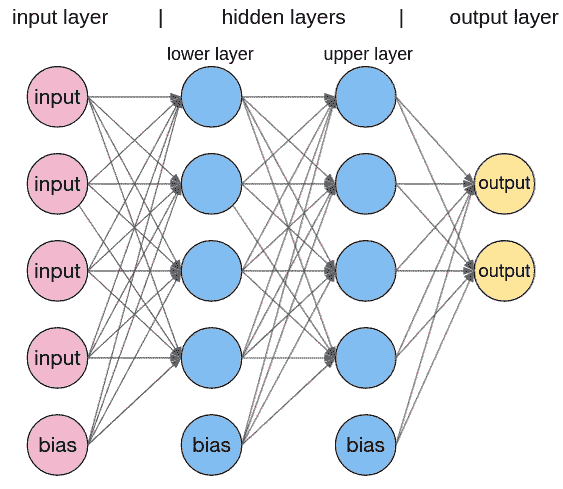

MLP 的基本结构

从结构上要注意的另一点是，每个神经元都与上一层和下一层中的每个神经元相连。这被称为全连接层或密集层。

# 它是如何被训练的

MLP 的主要目标与感知机的目标相同。它试图最小化误差。但是 MLP 有一个稍微不同的过程叫做反向传播。

> 1.选择网络每次将处理的训练实例的数量
> 
> 2.将训练实例传入输入层→隐藏层→输出层
> 
> 3.基于输出层的输出计算输出误差
> 
> 4.以相反的顺序浏览网络，测量每个连接与输出误差的关系
> 
> 5.更新权重以减少输出误差
> 
> 6.重复步骤 2 到 5，直到涵盖每个训练实例
> 
> 7.重复步骤 6 m 历元时间

因此，简单地说，训练实例通过梯度下降调整权重值来迭代地向前和向后通过网络，以减小误差。在解释权重在此过程中如何变化之前，让我们先弄清楚这些术语。

> **历元**:整个数据集的一次循环
> **正向传递**:从输入层到输出层穿过网络
> **反向传递**:从输出层到输入层穿过网络
> **梯度下降**:下一段的主题

# 逐渐改变-梯度下降

术语梯度是指输入值相对于目标函数的偏导数的向量[1]。简单来说，它是一个斜率向量。因此，梯度下降意味着降低斜率以达到最小点。也许，一个可视化的表示会帮助你理解这个过程。

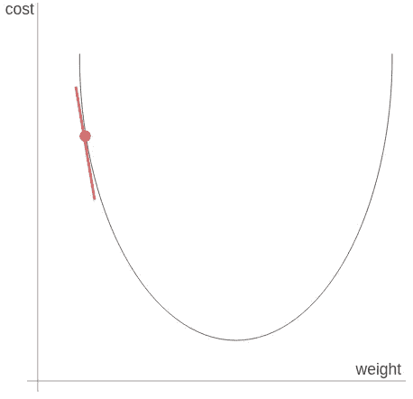

图中随机初始化的点/ **图中的成本**通过计算预测结果和实际结果之间的误差来衡量神经网络的预测能力

假设我们从随机初始化的红点开始。在这种情况下，它的成本价值相当高。降低图中成本值的方法之一是降低点的斜率，使点向下移动。

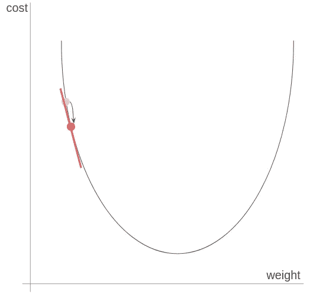

向最低点迈进一步

移动一步后，我们可以看到它的斜率下降了，成本值降低了。然而，仍有改进的余地。

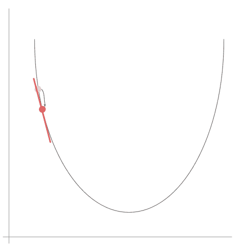

移动直到该点达到最小点

当我们一点一点地移动这个点时，这个点的斜率最终变成 0，这个点达到一个最小值。这个最小点就是我们获得最低成本价值的地方；因此，这是我们获得适当权重值的地方。但是一个点在每次迭代中变化了多少呢？

## 选择在每次迭代中改变多少

这由学习率定义，学习率是梯度下降中的一个重要参数。假设我们有一个大的学习率。然后，梯度下降的步骤如下所示。

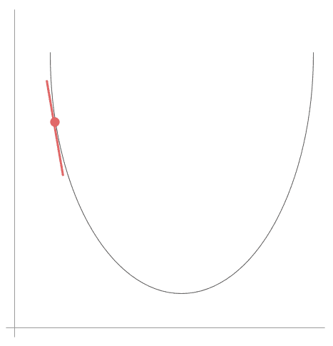

一个点如何以很大的学习速率移动

如你所见，该点不一致地左右移动，而不是稳定地向最小点移动。因此，它可能偏离最小点。另一方面，当我们使用小的学习率时，

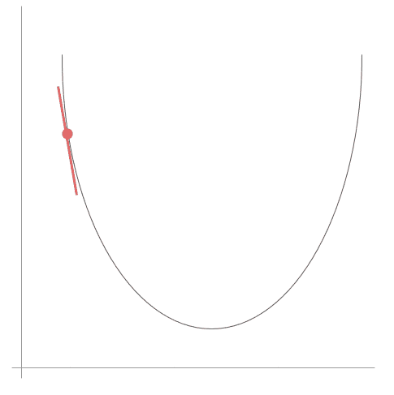

一个点如何以小的学习率移动

该点始终保持在一侧，并稳步下降其斜率，直到它达到一个最小值。其中一个问题是，这可能需要更长的时间。因此，通过交叉验证找到合适的学习率至关重要。除了学习率之外，您应该选择的另一个参数是您将在每次迭代中处理多少训练实例。

## 选择梯度下降的类型

一般来说，你有三种选择。首先，您有批处理梯度下降，每次处理整个数据集。所以一个历元等于一次迭代。因此，每个时期更新一次权重。其中一个优点是它能够停在最小点。然而，由于它每次都处理整个数据集，因此当一个大的数据集被传递到网络中时，它在计算上变得昂贵。

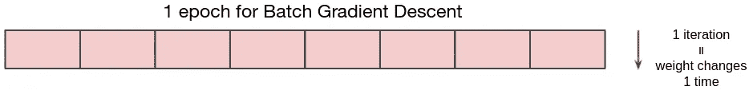

批量梯度下降中通过多少实例的直观表示

第二种选择是小批量梯度下降，每次处理一个数据集的子集。因此，在一个时代，有

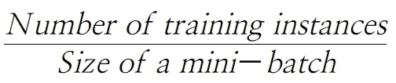

迭代。例如，当我们有 1000 个训练实例和 100 个小批量时，在一个时期中会有 10 次迭代。因此，每个时期权重被更新 10 次。由于这种方法处理子集不同于批量梯度下降，它不会遭受昂贵的计算。然而，它不像批量梯度下降那样稳定在一个最小点上，因为数据集的每个子集根据包含的实例而变化。

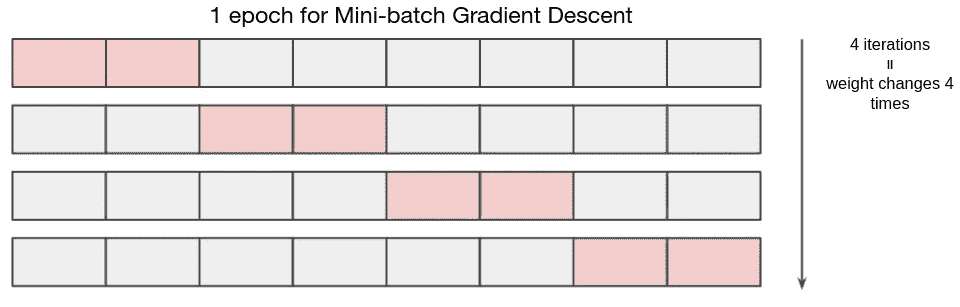

在小批量梯度下降中通过多少实例的直观表示

最后，还有随机梯度下降，它为每次迭代处理一个训练实例。因此，当总共有 n 个训练实例时，权重在一个时期中被更新 n 次。一个好处是比另外两个快很多。但是，因为每个训练实例的变化甚至超过数据集的子集，所以它比其他实例更不稳定。所以有人可能会问，如果随机梯度下降那么不稳定，我们为什么要用它。答案与局部和全局最小值有关。

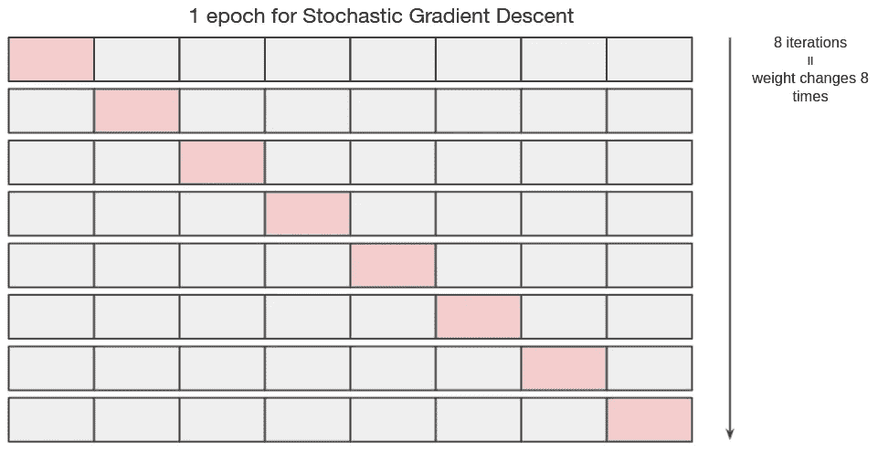

随机梯度下降中通过多少实例的直观表示

## 它是否能逃脱局部最小值

在真实世界的数据集中，您不能保证找到的最小点总是全局最小值。因此，如果您使用稳定减少的批量梯度下降，您可能会根据您开始的位置以局部最小值结束。

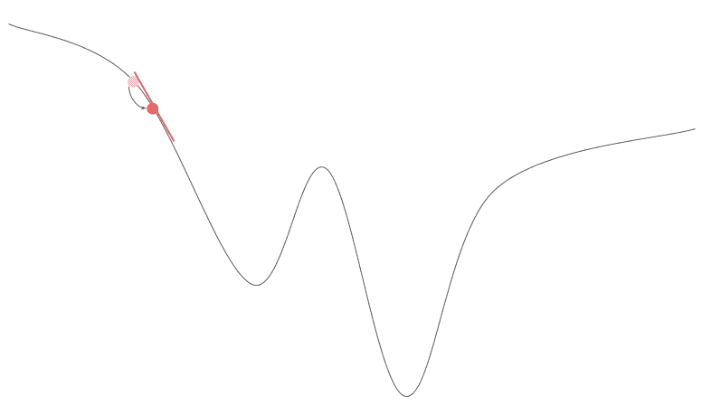

根据网络的起点，证明网络可能会以局部最小值结束

但是当它不稳定时，它可以摆脱局部最小值，找到全局最小值。所以每种方法都有利弊。通过批量梯度下降获得的值是最佳值，但有可能是局部最小值。相比之下，随机梯度下降更有可能找到全局最小值，但其值往往变化很大。所以当我们使用随机梯度下降时，我们通常使用相对较高的学习率来找到全局最小值的近似位置，然后使用相对较小的学习率来找到更精确的位置。

# 功函数梯度下降的必然变化

在感知器上使用梯度下降的一个问题是，不可能从阶跃函数下降一个斜率。因此，MLP 用具有变化斜率值的激活函数代替阶跃函数。

## s 形逻辑和双曲正切(tanh)

两者都有类似的 S 形。区别在于它们的方程式和输出值范围。

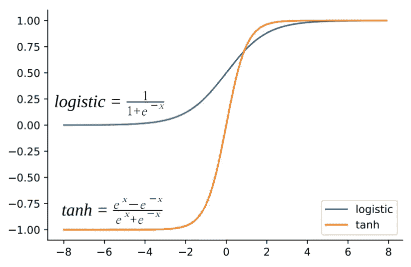

逻辑和双曲正切函数和图形

如图所示，logistic 的范围是从 0 到 1，而 tanh 的范围是从-1 到 1。这似乎是一个很小的差别，但这允许 tanh 有更大的导数。因此，tanh 趋向于比逻辑更快地最小化成本函数。然而，当输入值变得很小或很大时，就会出现问题。

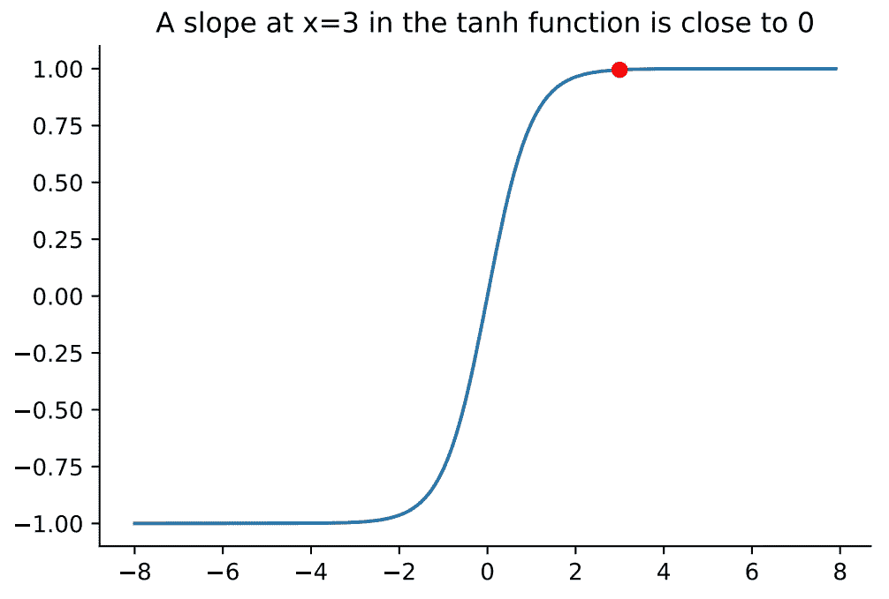

例如，当双曲正切函数中的输入为 3 时，其导数接近于零。由于[链规则](https://salmanfaroz.medium.com/chain-rule-for-backpropagation-55c334a743a2)的原因，梯度随着其通过反向通道而减小，所以在较低的层中梯度值将更小。因此，在较低层，网络可能不知道从哪个方向提高其权重。这就是所谓的消失梯度问题。为了解决这个问题，研究人员提出了一种新的激活函数。

## 线性，但比前两个 Relu 更好

与上面的两个函数相比，Relu 对小于 0 的输入值输出 0，对大于 0 的输入值应用线性函数。所以与 logistic 和 tanh 不同，Relu 总是输出 1 或 0 的斜率，其斜率不会减小。这两个差异有助于神经网络处理消失梯度问题。

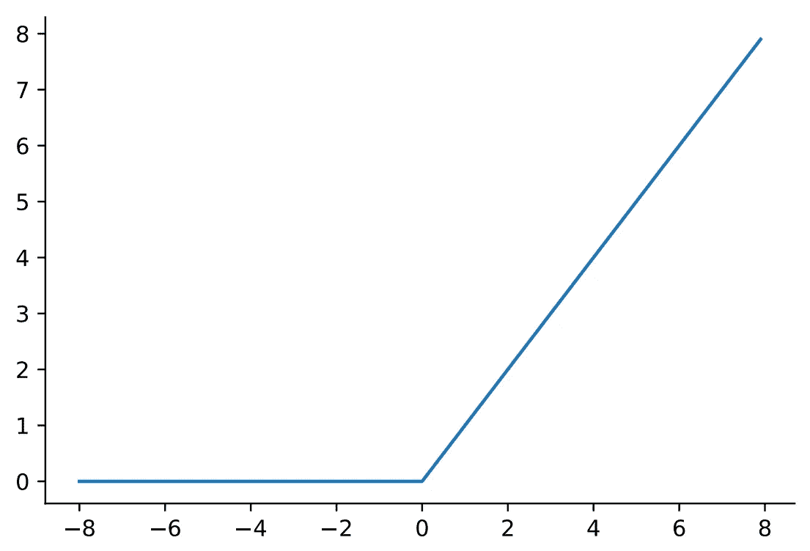

Relu 图

最重要的是，因为它的方程式比其他两个简单得多，所以它通常更快。由于这些好处，它已成为最常用的激活功能。

# 多层如何解决一个复杂的问题？

所以现在你知道 MLP 是如何构成的，它是如何被训练的，以及它与感知机有什么不同。但是为什么添加隐藏层解决了一个复杂的问题仍然是一个问题。这个问题的答案与你刚刚读到的激活函数有关。

由于隐藏层中的每个神经元都包含激活函数，并且输入通过隐藏层，因此网络对输入应用一系列函数。转换的类型取决于您正在处理的问题和您正在查看的层。所以我就笼统的解释一下。

假设我们有一个输入叫 x，第一个隐层激活函数叫 f，第二个叫 g，当 x 被传入第一个隐层时，它的输出是 f(x)。这个 f(x)值然后被传递到第二个隐藏层。因此，我们得到 g(f(x))作为输出。

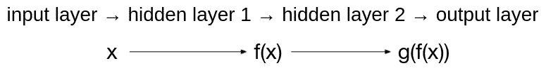

x 在穿过各层时是如何变换的

如你所见，隐藏层允许我们计算多个函数的组合，而不仅仅是 f(x)。这样做的一个好处是，多个函数的组合可以计算单个函数无法单独完成的复杂事情。当这个概念应用于圆形边界时，

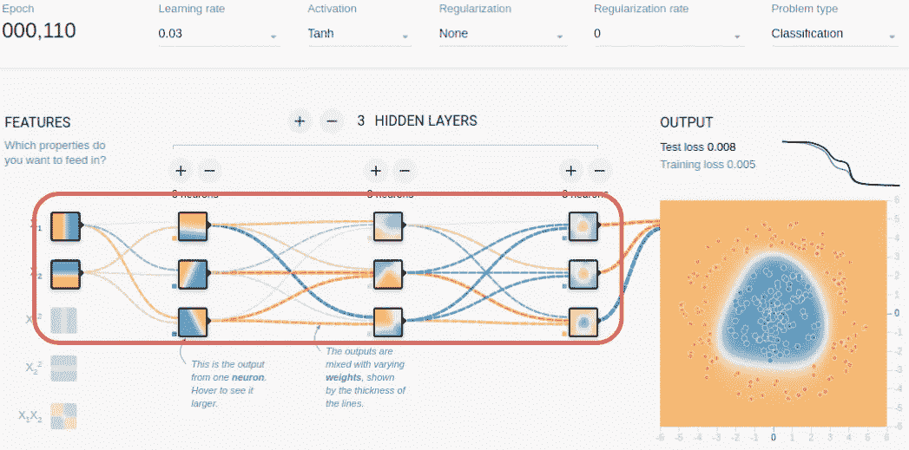

Tensorflow 游乐场演示，展示了神经网络如何获得圆形边界/ [Tensorflow 游乐场](https://playground.tensorflow.org/#activation=tanh&batchSize=10&dataset=circle&regDataset=reg-plane&learningRate=0.03&regularizationRate=0&noise=0&networkShape=3,4,4&seed=0.09368&showTestData=false&discretize=false&percTrainData=50&x=true&y=true&xTimesY=false&xSquared=false&ySquared=false&cosX=false&sinX=false&cosY=false&sinY=false&collectStats=false&problem=classification&initZero=false&hideText=false)

您可以看到，识别出的模式随着向输出层发展而变得更加复杂:从线性到圆形。

## 非线性激活函数的另一个原因

当你在 TensorFlow 游乐场玩不同的选项时，你会注意到线性激活功能有所不同。

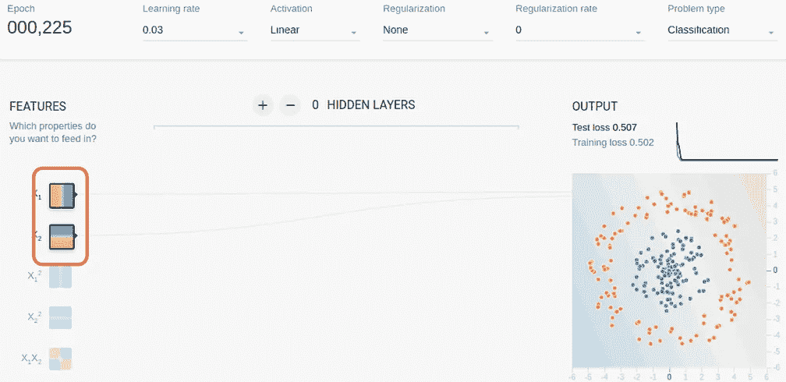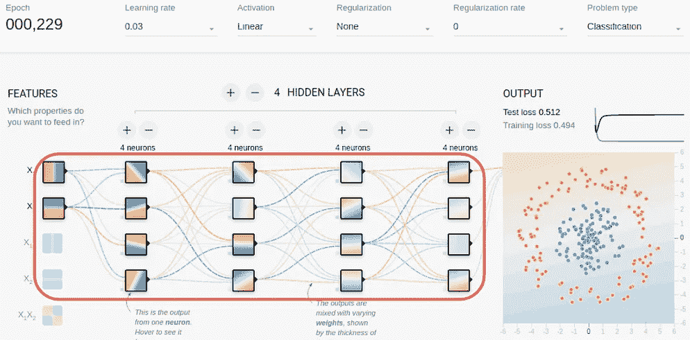

线性激活函数极限的 Tensorflow 操场演示

如果使用线性函数而不是双曲正切函数，则无论添加多少隐藏图层，输出图层中的最终边界都是线性的。为什么？因为线性函数的组合还是线性函数。比如当 f(x) = 5x+4，g(x) = 7x+1 时，f(g(x)) = 5(7x+1)+4 = 35x+9，这还是一个线性方程。

改变这种情况的唯一方法是通过在隐藏层中引入非线性，使得激活函数的组合变得非线性，并识别更复杂的关系，这就是为什么我们使用其他函数而不是阶跃函数。

# 参考

[1]j .布朗利(2020 年，12 月 16 日)。*什么是机器学习中的梯度？*机器学习精通。检索于 2021 年 10 月 14 日，来自[https://machinelingmastery . com/gradient-in-machine-learning/。](https://machinelearningmastery.com/gradient-in-machine-learning/.)

[2]j .布朗利(2021 年 1 月 31 日)。*反向传播和随机梯度下降的区别*。机器学习精通。检索于 2021 年 10 月 14 日，来自[https://machine learning mastery . com/difference-between-back propagation-and-random-gradient-descent/。](https://machinelearningmastery.com/difference-between-backpropagation-and-stochastic-gradient-descent/.)

[3]埃库利尔。(2018 年 2 月 26 日)。*为什么 tanh 作为激活函数几乎总是优于 sigmoid？*交叉验证。2021 年 10 月 14 日检索，来自[https://stats . stack exchange . com/questions/330559/why-is-tanh-almost-better-than-a-a-activation-function。](https://stats.stackexchange.com/questions/330559/why-is-tanh-almost-always-better-than-sigmoid-as-an-activation-function.)

[4]法罗兹，S. (2021 年 8 月 27 日)。*反向传播的链式法则*。中等。2021 年 10 月 14 日检索，来自[https://Salman faroz . medium . com/chain-rule-for-back propagation-55c 334 a 743 a 2。](https://salmanfaroz.medium.com/chain-rule-for-backpropagation-55c334a743a2.)

[5] Géron，A. (2020)。*使用 Scikit-Learn、Keras 和 Tensorflow 进行机器实践学习:构建智能系统的概念、工具和技术*。奥赖利。

[6]哈里斯博士(2013 年 7 月 2 日)。*神经网络中的隐藏层计算什么？*交叉验证。检索于 2021 年 10 月 14 日，来自 https://stats . stack exchange . com/questions/63152/what-the-hidden-layer-in-a-a-neural-network-compute。