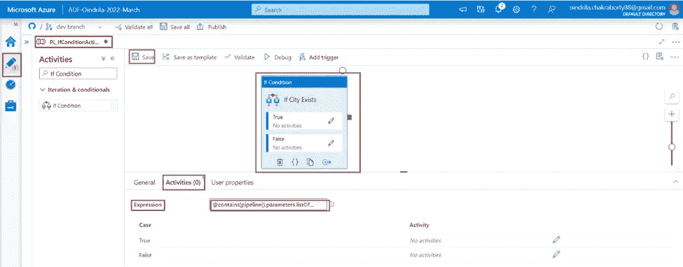

# Azure 数据工厂中的“If 条件”活动介绍

> 原文：<https://medium.com/codex/introduction-to-if-condition-activity-in-azure-data-factory-5e0848f7ffd6?source=collection_archive---------4----------------------->

# 什么是 If 条件活动

***If 条件******活动*** ***提供了******相同的功能*** 即一条 ***If 语句提供了*** ***编程语言*** 。

***如果******表达式解析为真*** ，那么 ***某组活动将运行*** 。 ***如果******表达式解析为假*** ，那么 ***另一组活动将运行*** 。

# 目标

****使用******如果条件******活动上******管道参数******list of cities******验证 *由 ***管道参数******city to search******存在于 ***管道参数******list of cities***的***类型中*****

***第二个*** ， ***如果*** 中的 值存在于 ***管道参数******list of cities******Type******数组*** 然后 ***设置*** 它存在于***使用******设置变量******活动**管道变量******if city Exists***。

***第三个*** ， ***如果******值*** 难道 ***不存在于 ***管道参数******列表*** 的 ***类型******数组中*** ***活动*** 到 ***管道变量******如果 CityExists*** 。***

# 使用 If 条件活动创建管道

***第一步***-**-*打开****(***【portal.azure.com】***)。*

**

****第二步***-**-*点击*-**-**-*Azure 数据工厂资源*-**-*ADF-Oindrila-2022-3 月*-**。***

**

****第三步***-***蔚蓝数据工厂***"***ADF-Oindrila-2022-3 月*** " ***设置页面*** 是 ***打开*** 。 ***点击******打开蔚蓝数据工厂工作室******链接*** 。*

**

****第四步*** -将 ***Azure 数据工厂资源****ADF-Oindrila-2022-3 月* 是 ***在*** 中打开一个 ***新标签在******相同的浏览器*** 。现在， ***点击******作者******链接打开****Azure Data Factory******处于编辑模式*** 。***

**

****第五步***-**-*点击*****管道******类别*** ***中的*** ***资源浏览器*** 和****

****

*****第六步*** - ***转到******参数******标签******管道******PL _ if condition activity***。 ***点击******+新建******链接添加*** 下面的 ***两个*** ***参数*** -**

*   **"*【列表】 ***数组******类型*** ， ***提供*** ***【纽约】【伦敦】【东京】【新加坡城市】【里斯本】***为***默认值*** ，即一个 ***逗号分隔值******
*   *****city to search********String******Type***， ***提供******Kolkata******默认为*******

**********

*****现在， ***转到******变量******标签页的******管道****PL _ IfConditionActivity*。 ***点击******+新建******链接添加*** 一个 ***变量******如果 city exists******字符串******类型* ***不提供任何默认值*** 给这个 ***创建的变量******如果 CityExists*** 。*******

********

*******步骤 7*** - ***搜索******如果条件******活动*******活动浏览器*** 和*****

************

*********第八步***-**-*走*** 到 ***活动******标签*** 。 ***提供******逻辑*****文本框 ***中的*** 为 ***表达式******根据******活动*** 将在 ***发生的情况下执行***********

*********步骤 8.1***-**-*点击******文本框中的*** 。此 ***使*******添加动态内容【Alt+Shift+D】******成为*** ***显示在******文本框*** 的正下方。 ***点击 ***上的*** 链接*** 。*******

******

******步骤 8.2***——现在， ***逻辑*** 即 ***需要*** 才能成为 ***中提供的******表达式语言*** 是***@包含(pipeline(). listofcies，Pipeline()参数。 ***实际存在于****list of cities******Type******Array***。**********

第一个参数 ***表示******从哪里搜索*** "，第二个参数 ***表示******搜索什么*** "在上面的 ***逻辑*** ， ***中提供了*** 在 ***表达式语言*** 。 ***点击******确定******按钮*** 。

***步骤 8.3***-的 ***值 ***文本框******表达式*** "现在是 ***显示*** 如下-***

***第 9 步*** -现在， ***添加******活动执行如果******逻辑表达式*** 提供*****文本框*** ***点击******铅笔图标*** 为 ***真******显示在******格******节*** 下。**

****

*****步骤 9.1***-**-******真实活动******设计窗格*** ， ***搜索*** 为 ***设置变量*** 一旦找到， ***拖拽******活动*** 到 ***设计窗格*** 。***

******

******步骤 9.2***-**-*转到******变量******选项卡******设置变量******活动*** 。 ***点击***的 ***下拉框 ***名称属性*** 。这将 ***显示所有******变量出现在******流水线范围*** 。 ***选择******变量******如果 city exists******从******下拉选项*** 。******

******在******文本框**【值】属性******提供******是。它存在于*** 。***

******

******步骤 10*** -现在， ***添加******活动执行如果******逻辑表达式*** 提供 ***在*** 文本框 ******点击******铅笔图标*** 为 ***假******显示在******下******节*** 。******

******

******步骤 10.1***-**-*-*-**-**-*假活动*-**-**-*设计窗格*-**-**-*搜索*-**为**-*设置变量*-**-**-*活动*-**活动浏览器**-*一旦找到， ***拖拽******活动*** 到 ***设计窗格*** 。******

******

******步骤 10.2***-**-*转到******变量******选项卡******设置变量******活动*** 。 ***点击******名称属性*** 。这将 ***显示******管道范围*** 中存在的所有***变量。 ***选择******变量******如果 city exists******从******下拉选项*** 。******

******在*** 的 ***文本框*** 中的 ***值属性*** ， ***提供******号，它不存在*** 。***

******

******第十一步***——现在，****中的每一个【条件】*** ，即“ ***真*** ”和“ ***假******中的“如果条件”*******

********

*******步骤 12*** - ***调试******流水线******PL _ IfConditionActivity******查看******输出的******If 条件******活动* ***如果条件******活动*** 已经 ***运行成功*** 。******

*******它*** 可以被 ***看到*** 那个， ***自******值*** ，*作为 ***管道参数******城市搜索* ***设置变量******活动附加******假******条件******如果条件******活动*** 得到了*******

************

******在 ***输出******选项卡*** 中，对 ***设置变量******活动附加到******假******条件*********

************