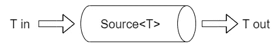
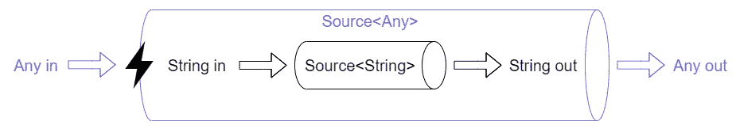
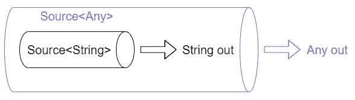
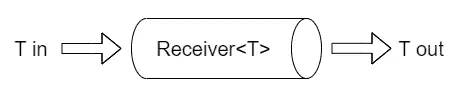
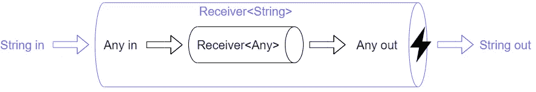
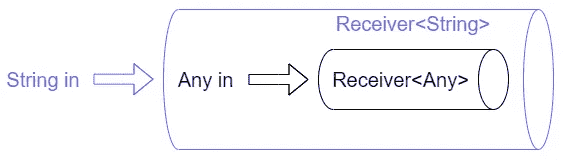

# 面向 Java 开发人员的 Kotlin 介绍—第 3 部分:泛型

> 原文：<https://medium.com/codex/introduction-to-kotlin-for-java-developers-part-3-generics-21e1646ec2ae?source=collection_archive---------12----------------------->

在本系列的第三部分中，我将带您游览 Kotlin 中的泛型。我将概述它们在哪些方面与 Java 不同。我希望你喜欢读这篇文章，就像我喜欢写它一样！如果你做到了，别忘了鼓掌:-)

本系列的其他部分:

*   面向 Java 开发人员的 Kotlin 简介—第 1 部分:函数和操作符
*   [面向 Java 开发人员的 Kotlin 介绍—第 2 部分:类和对象](/codex/introduction-to-kotlin-for-java-developers-part-2-classes-and-objects-dbafe7cb177d)

泛型在 Kotlin 中的工作方式与它们在 Java 中的工作方式非常相似，只有一个主要区别:Kotlin 没有通配符(`?`)。相反，科特林添加了`in`和`out`关键字。这是怎么回事？

# 1.申报地点差异

当你在 Kotlin 中声明一个有通用参数`T`的类`C`时，你可以用这些关键字来注释这个通用参数:

*   `in`:如果这样做，编译器会确保`T`在`C`中只作为方法参数类型出现，否则会产生错误。
*   `out`:如果你这样做，编译器会确保`T`只作为方法返回类型出现在`C`中，否则会产生一个错误。

因此，当 Kotlin 编译器遇到具有泛型参数`T`的类的用法时，它会比 Java 编译器更聪明，因为它有关于`T`的附加信息。让我们看看这在实践中是如何工作的。

[科特林文档](https://kotlinlang.org/docs/generics.html#declaration-site-variance)

## 1.1 生产商

考虑下面这个只产生`T`实例的接口:

注意，这里没有用关键字`out`声明泛型参数`T`(它应该已经声明了)，所以就编译器而言，`T`可能作为方法参数类型出现，也可能作为方法返回类型出现在接口`Source`中:

现在考虑下面的代码，它试图将一个`Source<String>`包装在一个`Source<Any>`变量中:

在编译器看来，情况是这样的:

由于编译器没有关于`Source`使用参数`T`的方式的信息，它将产生一个错误，因为这种设置可能导致`Objects`潜入只允许`Strings`的地方。

要在 Kotlin 中解决这个问题，只需在`T`之前添加`out`关键字，让编译器更智能地处理`Source` 接口:

错误将会消失，因为现在编译器可以确定代码确实是类型安全的:

## 1.2 消费者

同样的道理反过来也适用。考虑下面这个只使用`T`实例的接口:

注意，这里没有用关键字`in`声明泛型参数`T`(它应该已经声明了)，所以就编译器而言，`T`可能作为方法参数类型出现，也可能作为方法返回类型出现在接口`Receiver`中:

现在考虑下面的代码，它试图将一个`Receiver<Any>`包装在一个`Receiver<String>`变量中:

在编译器看来，情况是这样的:

由于编译器没有关于`Receiver`使用参数`T`的方式的信息，它将产生 en 错误，因为这种设置可能导致`Objects`偷偷溜到只允许`Strings`的地方。

要在 Kotlin 中解决这个问题，只需在`T`之前添加`in`关键字，让编译器更智能地处理`Receiver` 接口:

错误将会消失，因为现在编译器可以确定代码确实是类型安全的:

# 2.使用站点差异

声明站点差异是好的，但是一些通用参数不能仅仅局限于`in`或`out`。

以`Array`类为例:

假设`MutableCollection`上的`addAll`方法签名简单地声明如下:

如果我们试图将`Strings`的`Array`添加到`MutableCollection<Any>`中，尽管代码是完全安全的，但这将导致编译器错误，因为据编译器所知，`addAll`方法可能会调用数组中的`set(index: Int, value: Any)`方法，并将任何内容放入我们的`Strings`数组中。

要解决这个问题，只需让编译器变得更聪明，告诉它如何使用`addAll`方法中的数组。通过将签名更改为以下内容，告诉它您将正常工作并且只从数组中读取数据:

错误将会消失，因为编译器现在可以确保代码是类型安全的。

同样的推理也适用于`in`关键字。

这种对`in`和`out`的使用被称为使用位置差异，因为它仅适用于通用参数的一种特定用法。

[科特林文档](https://kotlinlang.org/docs/generics.html#use-site-variance-type-projections)

# 3.恒星投影

假设您声明了一个带有泛型参数`T`的`Foo`类，该参数有一个上限`Upper`。

现在假设您想以这样一种方式键入一个`Foo`变量，编译器允许您将任何类型的`Foo`赋给该变量，例如`Foo<A>`、`Foo<B>`、`Foo<C>`等等(只要`Upper`是`A`、`B`和`C`的超类型)。为了在 Kotlin 中表达变量的类型，您使用了星形投影:您将变量声明为类型`Foo<*>`。

就类型而言，这样的变量是如何表现的呢？返回`T`的`Foo`方法可以返回从类型`Upper`派生的任何东西，因此它们的返回类型变成了`Upper`。对于接受`T`的方法，如果不知道`T` ( `A`、`B`、`C`、…)的确切值，就不可能保证类型安全。所以不能调用这样的方法。

[科特林文档](https://kotlinlang.org/docs/generics.html#star-projections)

# 4.一般上限

可以替换给定类型参数的所有可能类型的集合可以通过使用冒号的上限来限制:

如果需要一个以上的上限，可以使用`where`关键字:

[科特林文档](https://kotlinlang.org/docs/generics.html#upper-bounds)

# 资源

[科特林文档](https://kotlinlang.org/docs/home.html)

[科特林游乐场](https://play.kotlinlang.org/)

[科特林公案](https://play.kotlinlang.org/koans/overview)