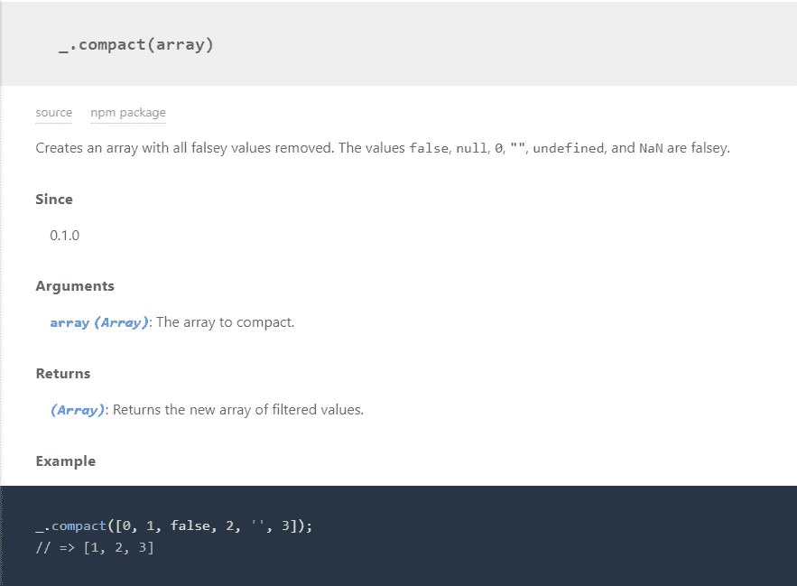

# Lodash 介绍—最伟大的实用程序库之一

> 原文：<https://medium.com/codex/introduction-to-lodash-one-of-the-greatest-utility-libraries-6f28fcd5a3a6?source=collection_archive---------18----------------------->

## *伟大的代码，伟大的文档。*


照片由[努贝尔森·费尔南德斯](https://unsplash.com/@nublson?utm_source=unsplash&utm_medium=referral&utm_content=creditCopyText)在 [Unsplash](https://unsplash.com/s/photos/javascript?utm_source=unsplash&utm_medium=referral&utm_content=creditCopyText) 拍摄

Lodash 是一个根可以追溯到*的库。它甚至有一些后来在 ECMAScript 标准中实现的功能。当然，像任何图书馆一样，它将继续增长。事实也的确如此。它现在是 NPM 下载量最大的图书馆之一。*

根据其官方网站:*“Lodash 通过消除处理数组、数字、对象、字符串等的麻烦，使 JavaScript 变得更加简单。Lodash 的模块化方法非常适合:*

*   *迭代数组、对象、&字符串*
*   *操纵&测试值*
*   *创建复合函数*

与其他一些库相比，它的文档绝对是惊人的，这也使得它非常容易使用，今天，我们将看看这个库。

# 装置

在您的新项目或现有项目中开始使用 Lodash 是轻而易举的事情。您可以以任何方式将它添加到您的项目中。进入[官方网站](https://lodash.com/)并向下滚动一点以查看所有安装选项。

使用 NPM 可能是最简单的方法。打开你的终端，写下

```
npm i lodash --save
```

使用 NPM 安装 Lodash。您也可以下载简化的代码，并使用`script`标签或其他导入方法导入它。

# 文档

正如我以前说过的，Lodash 提供的文档应该是任何具有大量函数或 API 的库的默认文档。它易于阅读，并为每个功能提供了一个例子。



紧凑功能的[文档](https://lodash.com/docs/4.17.15#compact)截图。

在截图中，我们可以看到文档非常简单，包含了我们可能需要的所有信息，比如参数和返回类型，以及深蓝色部分的一个简单的例子。

更具体和利基功能将有多个例子给他们额外的清晰。一个例子就是`[dropRightWhile](https://lodash.com/docs/4.17.15#dropRightWhile)`。

在“文档”页面的左侧，所有函数都按照它们适用的对象类型进行分组。字符串、数组、数字等。

# 使用 Lodash

您可能已经注意到了，也可能没有注意到，Lodash 使用下划线作为它的基本对象，您可以从这个对象调用函数。就像 jQuery 有美元符号一样，Lodash 使用下划线。

确保不要将 UnderscoreJS 和 Lodash 混在一起，因为它们都使用下划线字符作为自己的对象。

**使用 Lodash 最大的缺点**是不是每个函数名都是自注释的。如果您正在寻找一个没有正确命名的特定函数，可能很难找到您要找的东西。但当你大量使用 Lodash 时，这种感觉会随着时间的推移而减弱。

# 结论

Lodash 是一个可以在项目中使用的很好的库。它可以很容易地添加到大型企业应用程序或小型个人项目中。*它对初学者来说很棒*，易于文档化，并且因为有许多合适的功能，可以为专业人员节省相当多的时间。

非常感谢您的阅读，祝您度过美好的一天。