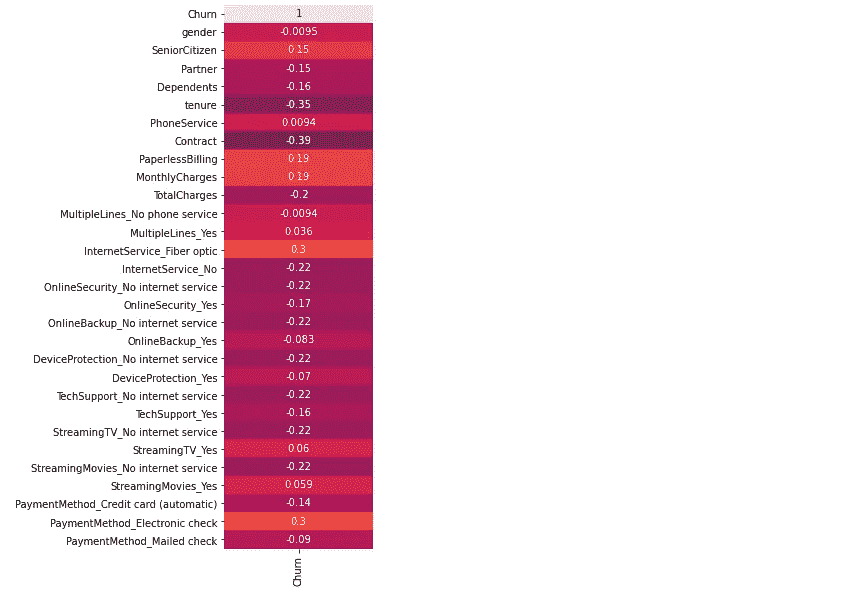
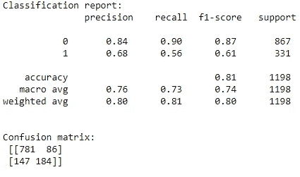

# 机器学习入门:初学者入门

> 原文：<https://medium.com/codex/introduction-to-machine-learning-a-beginners-take-88ae1513594f?source=collection_archive---------12----------------------->

## [法典](http://medium.com/codex)

By Skoch3 —自己的作品，CC BY-SA 3.0，【https://commons.wikimedia.org/w/index.php?curid=10183670 

**作者注:**这是我早期文章[预测客户流失](https://james-r-bishop.medium.com/introduction-to-machine-learning-a-beginners-take-1b1a663ab68f)的原始出版物。我个人认为这篇文章对像我这样的初学者来说更有趣，但它不符合课程要求。出于这个原因，我以其原始格式单独发表这篇文章。

我是人工智能(AI)和机器学习(ML)的新手。我一生都在做情报分析师，处理大量数据中的棘手问题。我曾与信息技术和政策专业人士(以及比我想的还要多的律师)密切合作，制定政策，构建提取、加载、转换(ELT)管道和分析工具，确保数据符合现有和新兴的政策，这就是为什么要遵守法律法规。我担任过项目经理，带领团队完成上述所有工作。虽然我对什么是数据科学和 AI/ML 有很高的理解，但我从未有过实践经验。随着我最近的退休，所有这些都改变了。

我最近参加了 Udacity 的数据科学纳米学位项目。作为第一项任务，我被要求选择任何我希望的数据集，提出一些由数据回答的问题，最后，有效地将这些答案传达给想象中的利益相关者。虽然 Udacity 为这个项目提供了建议数据集，但我选择绘制自己的路线图，并使用由 [Kaggle](http://kaggle.com/) 提供的[电信用户数据集](https://www.kaggle.com/radmirzosimov/telecom-users-dataset)。我选择这个数据集，部分是因为它很健壮，提供了一个很好理解的分类问题，并且数据相当完整，这意味着几乎不需要估算值。我认为最好是在学习时限制我尝试做的新东西的数量。当与数据而不是工具的斗争到来时，开辟新领域就来了。现在，我正在学习工具，一直到 Git。

除了介绍，我开始确定是否有可能预测客户流失？如果是，哪些列最适合构建这个模型，哪个模型效果最好？在互联网上做了一些搜索后，我看到了 Jason Brownlee 的文章[机器学习中的 4 种分类任务](https://machinelearningmastery.com/types-of-classification-in-machine-learning/)。这篇文章指出了我试图解决的具体问题(流失预测),并提出了五种不同的二元分类算法:

*   逻辑回归
*   k-最近邻
*   决策树
*   支持向量机
*   朴素贝叶斯

有了这些信息，我开始构建所有五个模型，将这些模型相互比较，以确定哪一个最适合我的分类问题。我还实现了一个线性回归——知道它对这个问题没有好处——只是因为它太有代表性了。最后，我还实现了一个 Keras 模型作为奖励。在接下来的章节中，如果读者愿意跟随，可以在我的 [Github 库](https://github.com/Sparafucil3/churn_project)中找到这个 churn 项目的所有代码。

senivpetro 创作的人物照片—【www.freepik.com 

# 探索性数据分析

首先，我下载了数据并开始一些探索性的数据分析，查看列和它们包含的数据，以确定数据是否有意义。有一栏对我来说不是很明显，标题是总费用。似乎有理由认为这一栏代表每月费用乘以任期。对这一假设的快速检查表明，总电荷与此近似，但实际上只有大约 8%的时间与期望值相等。该栏中的所有其他观察结果均匀分布在“过度充电”和“充电不足”之间。因为这些值大体上接近预期，所以我假设我的断言是正确的，也许差异可以用税收、回扣或者某些月份的部分账单来解释。

TotalCharges 也是唯一缺少数据的列，有 10 个空行。根据上面的评估，我检查了每一个空行，看看这些是否可能是新客户。在每一个 null 实例中，客户任期都被列为零，这意味着这些确实是新客户，我可以放心地将这些 null 值归为零。在此基础上，TotalCharges 最初有一个 dtype=Object，需要改为 float。在创建数据帧时，我在摄取时解决了这些问题。

随着时间的推移，我意识到的最大问题是数据的不平衡。一开始，我不认为这是一个问题。对于数据集中的每个“客户流失”,大约有两个“未流失”。随着我开发和实现模型，我开始意识到这对机器学习的影响。虽然我没有使用任何技术来减轻这种不平衡数据的影响，但我确实相信这些模型的有效性可以通过一些努力来改善这种不平衡。

# 数据转换

假设我正致力于实现几个 ML 模型，列需要被改为数字类型。对于性别，我设置女性=0，男性=1。对于包含 Yes/No 值的列，我设置 Yes=1，No=0。更有趣的一栏是合同栏。交付时，合同载有"两年"、"一年"和"逐月"的分类价值。我分别用整数 24、12 和 1 替换了这些字符串。所有其他分类列被替换为虚拟列，原始列被删除。如果您一直关注我的 Github 资源库中的 Jupyter 笔记本，您可以在“数据转换”一节中看到所有的转换，以及我对所做转换的推理。

# 发现列关系

一旦我转换了所有的列，我就使用 Pandas 数据框架中提供的 corr()函数进行成对比较。我添加了两行代码，一行选择相关性大于或等于+/-0.30 的列。这确定了“任期”、“合同”和“互联网服务 _ 光纤”——创造的虚拟变量之一。在这三栏中，“任期”和“合同”显然是“流失”的有力指标。我选择拒绝“InternetService_Fiber optic ”,因为 0 和 1 的分布几乎等同于猜测“Churn”/“Not Churn”。虽然这可能不是一个好的选择，但我在随后的所有模型开发中都坚持使用它。事后看来，成本显然是决定离开的一个因素。鉴于光纤服务可能比其他类型的服务更昂贵，删除此栏可能并不明智。

除了相关性为+/-0.30 的所有列之外，我还选择了相关性为+/-0.10 的列。这产生了 20 列(变量)来测试我的响应变量。这明确证明了可以在数据中识别列来回答我提出的问题。

最后，我使用 Seaborn 模块创建了一个热图，以便能够可视化所有这些关系。我马上注意到我的目标变量在热图的右边。有这么多列，我不得不一直滚动到右边才能看到比较。我重新设计了数据框架，将目标变量放在右边，并重新制作了热图，以便于阅读。“流失”和其他变量之间的关系显示在下面的部分热图中。

作者图片

热图清楚地显示了“任期”、“合同”和“流失”之间的密切关系。您还可以看到与我选择不使用的“InternetService_fiber optic”的强烈相关性。有趣的是，“性别”似乎很少或根本不起作用，而老年人似乎是潜在流失的一个指标。由于每月费用/总费用之间的高度相关性，这可能表明有固定收入的老年人希望保持在他们的预算内。

# 将这一切结合在一起

此时，我已经准备好构建和测试一些模型。你可以在我的 Github 存储库中的 Jupyter 笔记本上看到我构建和测试的所有七个模型。为了衡量模型的有效性，我使用了 sklearn.metrics 模块中的 classification_report()和 confusion_matrix()。我使用了两篇有帮助的文章——[了解你的机器学习模型的分类报告](/@kohlishivam5522/understanding-a-classification-report-for-your-machine-learning-model-88815e2ce397)和[了解混淆矩阵以及如何在 Python 中实现它](https://towardsdatascience.com/understanding-the-confusion-matrix-and-how-to-implement-it-in-python-319202e0fe4d)——来更好地了解这些函数的输出。我构建了我开始构建的五个模型以及另外两个模型。在随附的 Jupyter 笔记本中，您可以看到每个模型的详细信息、分类报告、混淆矩阵和 RocCurveDisplay。在这里，我将总结我在这个过程中发现的一些事情。

我并不感到惊讶，但事实证明你可以非常准确地预测客户是否会流失。一些模型的准确率刚刚超过 80%，而其他模型的准确率高达 70%。最好的模型被证明是逻辑回归，我确信除了我没有人会对此感到惊讶。逻辑回归就是为了处理这种类型的二元分类而设计的，所以对我来说也不应该感到惊讶。

作者图片

上图是对逻辑回归模型的评估。在混淆报告中，左栏中的“0”代表“假”或“预测不会搅动”。“1”代表“真实”或“预测会发生变动”。从这个图表中，您可以看到，这个模型的“错误”断言不仅在 84%的时间里是正确的(精度)，而且在数据集的 867 个“错误”案例中，它捕获了 90%以上的案例(回忆)。您还可以看到,“真实”预测有 68%是正确的，而模型只捕捉到数据中所有 331 个“真实”案例中的 56%。实际上，该模型在预测消费者不会离开方面比预测消费者会离开要好。这仍然是有用的信息，并且表明了准确预测流失的能力。

为了理解这个表，左边一列表示第 0 种情况，即假情况。右栏代表第一种情况，即真实情况。第一行代表第 0 种情况，即假情况，而第二行代表第 1 种情况，即真情况。x 轴代表预测，而 y 轴代表真实观察。所以左上角的单元格被预测为假，实际上也是假的。左下角的单元格预测为假，实际为真。右上角预测为真，实际为假，而右下角预测为真，实际为真。将左上和右下相加，除以观察总数，得到 0.806，正好符合分类报告 81%的准确度。如果这些对你来说都没有意义，我推荐阅读[这篇](https://stackoverflow.com/questions/2148543/how-to-write-a-confusion-matrix-in-python) stackoverflow 文章，它讨论了转换混淆矩阵的方法以更好地理解它。

对于那些不熟悉这一切的人，我推荐你看看我创建的所有模型。每个模型都有一个附带的分类报告，混淆矩阵，可能的话，还有一个 RocCurveChart。使用这些工具检查每个模型的优点和缺点。你同意我作为最佳模特的选择吗？请记住，我选择逻辑回归模型是因为它是最好的通用模型，但是其他业务考虑可能会驱使您使用不同的模型。例如，如果留住客户被认为是最重要的事情，那么对真实案例具有更高回忆能力的模型将受到青睐。额外的假阳性值得保留真阳性的成本。相比之下，如果留住客户的成本更高——可能是为了让客户保持忠诚而给予的折扣和积分——那么一个有许多误报的模型可能没有商业意义，因为所有这些折扣和积分都在增加。

freepik 创作的学校照片—【www.freepik.com 

# 结论:

总之，我发现预测客户流失是可能的。我还能够识别数据中最有助于做出准确预测的特征。在实现了七个不同的模型之后，我能够识别出最能做出准确预测的模型。我还确定了改进这些模型的方法。首先，进行一些额外的特征工程，看看移除输入特征是否会使这些模型更强大。“流失”与“不流失”之间的不平衡也对模型产生了负面影响。这可以在分类图中很容易地看到，在分类图中，错误案例的精确度和召回率比真实案例要精确得多。我没有经验告诉你会改善多少。或许，在接下来的几周里，我会将输入数据调整到更平衡的状态，然后再次尝试，看看我是否能改进这个模型。现在，我有更多的学习要做！