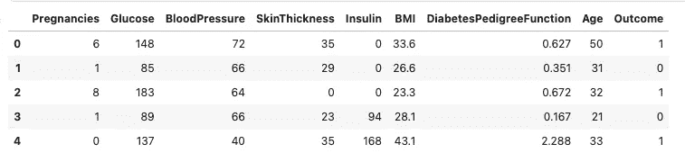
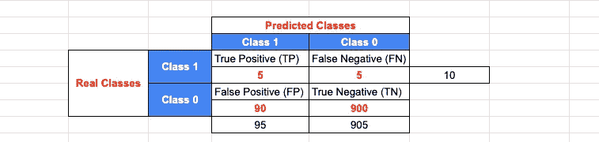
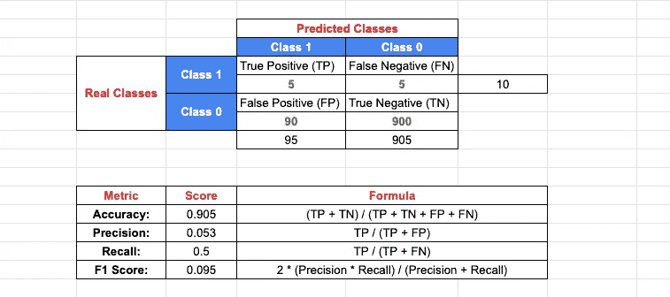
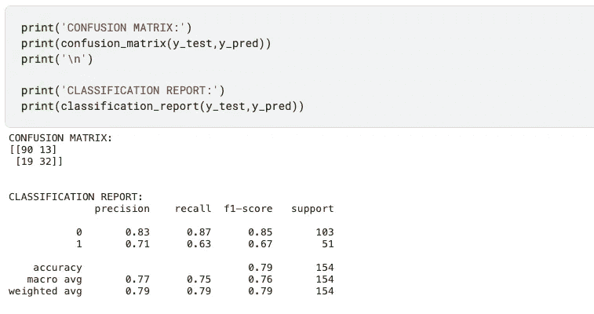

# 分类问题中的模型评估方法介绍

> 原文：<https://medium.com/codex/introduction-to-model-evaluation-methods-in-classification-problems-ceb0a90f6aba?source=collection_archive---------8----------------------->

## Python 中的应用示例:混淆矩阵、准确度、精确度、召回率和 F1 分数

我们将试图通过这个故事指出我们如何衡量分类模型和逻辑回归介绍的成功。


詹·西奥多在 [Unsplash](https://unsplash.com/s/photos/predict?utm_source=unsplash&utm_medium=referral&utm_content=creditCopyText) 上的照片

正如[前面提到的](https://mebaysan.medium.com/introduction-to-model-evaluation-methods-in-regression-models-1b9c1c50f8a0)，我们使用回归模型来预测连续变量。尽管逻辑回归中包含“回归”，我们还是用它来预测分类变量。因此，逻辑回归解决了分类问题。在这个故事中，我使用逻辑回归来获得分类分数。

目标类在目标变量中将有 1。例如，如果我们使用[糖尿病数据集](https://www.kaggle.com/uciml/pima-indians-diabetes-database)来预测其是否患有糖尿病，那么如果观察值患有糖尿病，则目标变量将为 1。



作者图片

# 混淆矩阵

我更愿意举个例子来说明这一点。为了说明混淆矩阵是什么，假设:我们有 **990 笔正常交易**和 **10 笔欺诈交易**。我们将创建一个模型来预测交易是否是欺诈。那么模型**将推断出我们已经有的总共 10 个欺诈交易**中的 5 个真交易和 5 个假交易。并且**我们已经有 990 个非欺诈交易**推断出 90 个假交易和 900 个真交易。

此时，我们创建了一个混淆矩阵。在该矩阵中，行代表实际类别，列代表预测目标变量的预测类别。



作者图片

*   真正(TP):预测类为 1 实际上是 1。欺诈交易被预测为欺诈交易。所以预测是真的。
*   误报(FP):预测的类 1 实际上不是 1。非欺诈交易被预测为欺诈交易。所以，预测是假的。
*   假阴性(FN):预测为 0 的类实际上不是 0。该模型预测了真实欺诈交易的非欺诈性。因此，欺诈交易不会被预测为欺诈交易。所以，预测是假的。
*   真阴性(TN):预测类为 0 实际上是 0。该模型预测了非欺诈交易的非欺诈性。所以，预测是真的。

有时一些术语可能会令人混淆，如肯定和否定。对我们来说什么是积极的，什么是消极的？如果我们在目标类(1)上工作，我们说正。如果我们在非目标类(0)上工作，我们说负。所以，左栏代表正面，右栏代表负面。

> 你可能会问:假阳性(FP)和假阴性(FN)哪个更关键？我可以说假阴性比假阳性更关键。为了说明这一点:我们说非欺诈交易，有人抢劫了一大笔钱。


[Bermix 工作室](https://unsplash.com/@bermixstudio?utm_source=unsplash&utm_medium=referral&utm_content=creditCopyText)在 [Unsplash](https://unsplash.com/s/photos/fraud?utm_source=unsplash&utm_medium=referral&utm_content=creditCopyText) 拍摄的照片

现在我们可以继续学习分类模型的度量标准。

## 分类模型的度量标准

我们有一堆度量标准来衡量分类模型的成功。



我们看到上面的公式来衡量指标。

*   **准确性:**我们正确估计 1 是 1，0 是 0 的成功率是多少？例如，该模型将 5 个(总共 10 个)真实欺诈交易估计为欺诈交易，将 900 个(总共 990 个)非欺诈交易估计为非欺诈交易。我们将两者相加，并将其分为所有观测值的计数。
*   **Precision:** 在估计为 1 的正确值中，我们的成功率是多少？例如，该模型估计 5 笔交易为欺诈交易，90 笔非欺诈交易为欺诈交易。只有 5 个正确的估计。我们将正确估计的百分比计算为估计值 1。
*   **回想一下:**我们在正确估计实际上为 1 的类的值时，成功的百分比是多少？例如，我们有 10 笔非欺诈交易。该模型估计 5 笔交易为欺诈，5 笔交易为非欺诈。我们计算真实欺诈交易的百分比，作为正确的估计。
*   **F1-Score:** 我们可以说是精度和召回率的调和平均值。

## Python 中的应用示例

实际上，我不会深究什么是逻辑回归，以及我们如何使用它。

我将导入我们需要的库。正如我们看到的，我们使用`sklearn.metrics`来获得测量模型的成功。

```
import matplotlib.pyplot as plt
import numpy as np
import pandas as pd
import seaborn as sns
from sklearn.linear_model import LogisticRegression
from sklearn.metrics import confusion_matrix, classification_report, accuracy_score
from sklearn.model_selection import train_test_split
from sklearn.preprocessing import RobustScaler
```

我将快速跳过介绍部分，直接创建一个模型。

```
df = pd.read_csv('../input/pima-indians-diabetes-database/diabetes.csv')X = df.drop(['Outcome'],axis=1)
y = df['Outcome']robscaler = RobustScaler()
X = robscaler.fit_transform(X)X_train, X_test, y_train, y_test = train_test_split(X,y, train_size=0.8, random_state=6)logreg = LogisticRegression()
logreg.fit(X_train, y_train)
y_pred = logreg.predict(X_test)confusion_matrix(y_test,y_pred) # to get cunfusion matrix
print(classification_report(y_test,y_pred)) # to get mectrics such as precision, recall etc.
```



# 最后

我知道，这可能是太快跳过，但我不想混淆。我想把重点放在主要话题上，比如什么是衡量标准？Python 代码不是主要话题。希望你为自己提取了一些花絮，这是有帮助的。

你可以得到下面我为你创建的谷歌电子表格。此外，您可以在电子表格旁摆弄混淆矩阵。

[](https://docs.google.com/spreadsheets/d/1L0MpyBsrwfpIuKwR-2O7pl4FqFnYtJxI0tpKgMLsFdY/edit?usp=sharing) [## 分类问题中的模型评估方法介绍

### Sheet1 预测类类 1，类 0 真实类，类 1，真阳性(TP)，假阴性(FN) 5，5，10 类…

docs.google.com](https://docs.google.com/spreadsheets/d/1L0MpyBsrwfpIuKwR-2O7pl4FqFnYtJxI0tpKgMLsFdY/edit?usp=sharing) 

还有，你可以得到下面的 Kaggle 笔记本。

[](https://www.kaggle.com/enesbaysan/modelevaluation-methods-in-classification-problems) [## 分类问题中的模型评估方法

### 使用 Kaggle 笔记本探索和运行机器学习代码|使用来自皮马印第安人糖尿病数据库的数据

www.kaggle.com](https://www.kaggle.com/enesbaysan/modelevaluation-methods-in-classification-problems) 

亲切的问候。