# 现代数据分析工具简介

> 原文：<https://medium.com/codex/introduction-to-modern-data-architecture-1236272dd5d5?source=collection_archive---------0----------------------->

## Docker、Airbyte、DBT、Apache 与巴西电子商务数据的超集&在 DBT 应用 RFM

在这个故事中，我们将讨论现代数据架构和现代数据架构中使用的开源新一代工具。我已经创建了一个 repo 来使用它。我将在本文中分享回购的一些例子。我们将用于本文的数据集是 Kaggle 的 [**巴西电子商务**](https://www.kaggle.com/datasets/olistbr/brazilian-ecommerce) 。

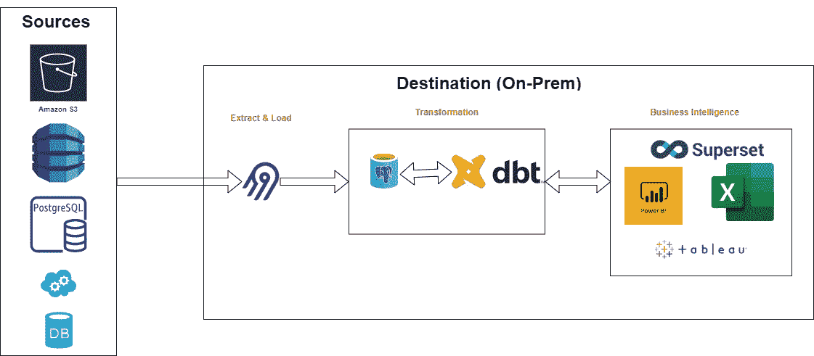

作者图片

# 现代数据架构介绍

在现代数据栈中，ETL 取代了 ELT。那么，ELT 和 ETL 有什么区别呢？在 ELT 中，首先从数据源中提取数据，并加载到目标仓库中。然后，对这些仓库应用转换过程。为此，我们可以使用 [Airbyte](https://airbyte.com/) 。Airbyte 为我们处理 EL 流程。然后，我们可以通过使用 [dbt](https://www.getdbt.com/) 来转换仓库上的数据。dbt 执行 T 过程。然后，我们可以将转换后的数据分发给商业智能软件，如[超集](https://superset.apache.org/)、[元数据库](https://www.metabase.com/)、 [Redash](https://redash.io/) 等。此外，dbt 为市场带来了一个新的角色:分析工程师。

如果你想了解更多关于角色和 dbt 的细节，你可以查看我在 Medium 上发表的文章。

[](/codex/a-modern-data-warehousing-tool-dbt-introduction-to-analytics-engineering-d4245d868e3c) [## 现代数据仓库工具:dbt &分析工程导论

### 利用 Docker 创建自己的实验室模拟英语教学。什么是分析工程。dbt 简介。什么是…

medium.com](/codex/a-modern-data-warehousing-tool-dbt-introduction-to-analytics-engineering-d4245d868e3c) 

# 工具简介

## [空气生物](https://airbyte.com/)

Airbyte 是一个开源的数据集成工具，提供了超过 140 个数据源连接器。通过使用 Airbyte，我们可以轻松地管理和创建数据集成连接。

很容易建立 Airbyte 我们只需要从 GitHub 中克隆它，然后用 Docker compose 运行它。

```
docker-compose up -d
```

对于我们的场景，我们将从 Kaggle 下载数据，并用 Airbyte 将其加载到本地 Postgres 数据库中。我首先将数据加载到本地的数据库中，以使加载过程更容易。

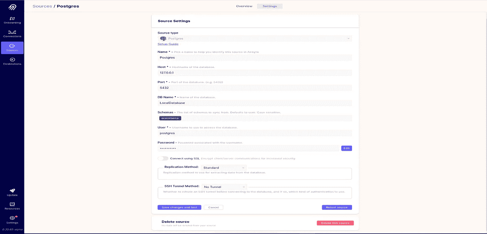

作者图片|本地数据库

然后，我将数据从本地数据库上传到名为 BrazilianEcommerce 的本地数据仓库。我通过在`LocalDatabase`数据库和`BrazilianEcommerce`数据库之间创建一个连接来完成提取和加载步骤。

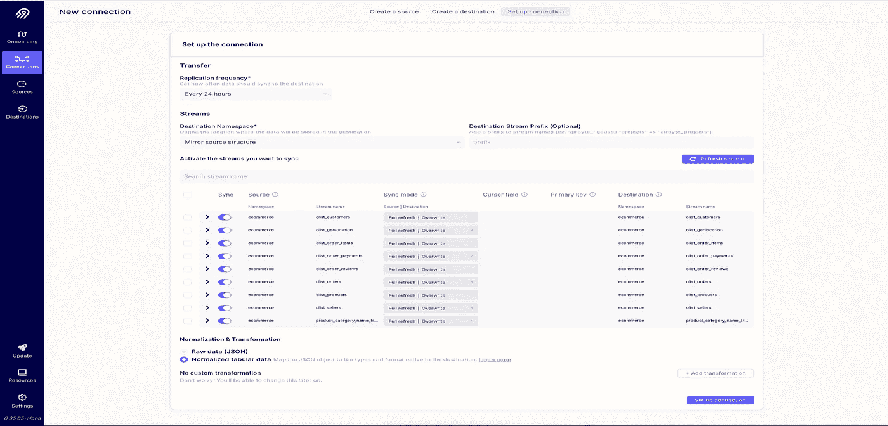

作者图片|数据库之间的连接

然后，我运行提取和加载流程，将数据加载到本地仓库中。我们的数据源将被成功地加载到本地仓库中。

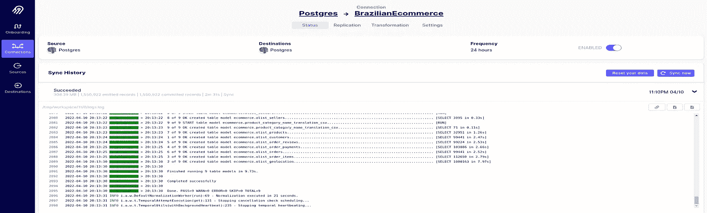

作者图片

## [dbt](https://www.getdbt.com/)

dbt 提供了将软件工程技术应用于我们的数据建模过程的机会。我们可以对数据转换过程进行版本控制。我在我的媒体上发表了一篇关于 dbt 的文章。您可以使用下面的链接访问它。在这个故事中，我将讲述一点我们如何使用 dbt，而不是讲述 dbt 是什么。

[](/codex/a-modern-data-warehousing-tool-dbt-introduction-to-analytics-engineering-d4245d868e3c) [## 现代数据仓库工具:dbt &分析工程导论

### 利用 Docker 创建自己的实验室模拟英语教学。什么是分析工程。dbt 简介。什么是…

medium.com](/codex/a-modern-data-warehousing-tool-dbt-introduction-to-analytics-engineering-d4245d868e3c) 

在 dbt 中，我们只使用`SELECT`语句来创建模型。此外，我们可以创建自己的宏，并在我们的 SQL 代码中使用 Jinja 模板！dbt 有自己的包装中心，即[hub.getdbt.com](https://hub.getdbt.com/)。我们可以下载别人的宏等等。

[](https://hub.getdbt.com/) [## dbt -包装中心

### 使用我们的一个社区包来优化您仓库中的原始数据。

hub.getdbt.com](https://hub.getdbt.com/) 

对于我们的场景，我创建了一个数据集，RFM 应用于它。

```
with fct as (selectsr."customer_unique_id" , sr."segment",sg."geolocation_lat", sg."geolocation_lng", sg."geolocation_city", sg."geolocation_state",so."order_id", date(so."order_purchase_timestamp") order_date,sp."payment_value", sp."payment_installments", sp."payment_type"from {{ ref('stg_rfm') }} srleft join {{ ref('stg_customers') }} sc on sr."customer_unique_id" = sc."customer_unique_id"left join {{ ref('stg_geolocation') }} sg on sc."customer_zip_code_prefix" = sg."geolocation_zip_code_prefix"left join {{ ref('stg_customers') }} sc2 on sr."customer_unique_id" = sc2."customer_unique_id"left join {{ ref('stg_orders') }} so on sc2."customer_id" = so."customer_id"left join {{ ref('stg_payments') }} sp on so."order_id" = sp."order_id")select * from fct
```

dbt 提供了强大的内置代码文档。此外，它通过使用 Dag 来可视化 SQL 流。要查看文档，我们只需要在 dbt 项目中执行两个命令。

```
# To create documentationdbt docs generate# To see documentationdbt docs serve --port 8010
```

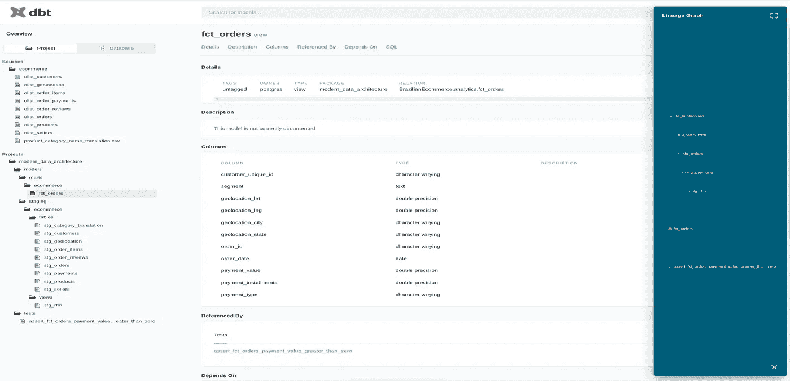

dbt 文档|作者图片

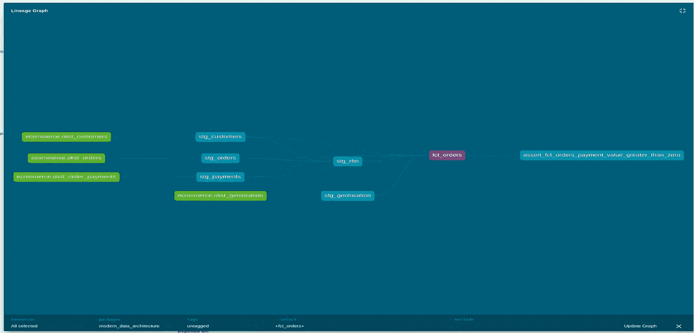

DAG 数据流|作者图片

此外，dbt 使得为我们的模型和源创建定制文档成为可能。

```
One of the following values:| segment             | definition || ------------------- | ---------- || Loyal_Customers     |            || Need_Attention      |            || Hibernating         |            || Potential_Loyalists |            || Champions           |            || At_Risk             |            || Cant_Loose          |            || Promising           |            || New_Customers       |            || About_to_Sleep      |            |
```

我们创建了一个名为`stg_ecommerce.md`文件的文档 markdown。正如我们在下面看到的，我们可以通过在配置文件中使用 Jinja 模板来为模型设置定制文档。

```
models:
  - name: stg_rfm
      description: '{{ doc("segment_info") }}'
```

在 dbt 中，有两种类型的测试:一般测试和单一测试。一般测试基于四个测试来测试列:`unique`、`not_null`、`accepted_values`和`relationships`。除了一般的测试，我们可以创建自己的测试，如下所示。

```
with fct_orders as (select * from {{ ref('fct_orders') }})select"order_id",sum("payment_value")from fct_ordersgroup by "order_id"having sum("payment_value") < 0
```

然后我们通过使用`dbt test`命令来执行我们的测试。

事情是我爱上了 dbt，一切都在他们的官方网站上有据可查。此外，他们在其官方网站上提供组织良好的培训课程。

[](https://courses.getdbt.com/collections) [## 通过 dbt 学习分析工程

### 通过 dbt 实验室团队的课程开始实施 dbt。

courses.getdbt.com](https://courses.getdbt.com/collections) 

## [超集](https://superset.apache.org/)

超集是 Apache 支持的开源商业智能工具。另外，我在我的媒体上发表了一篇关于超集的文章。您可以使用下面的链接访问它。

[](/codex/powerful-bi-tool-apache-superset-ba8e17a8549b) [## 强大的 BI 工具:Apache 超集

### 如何构建和运行超集的清晰解释。我们如何在自定义数据库中存储元数据。如何应用本地…

medium.com](/codex/powerful-bi-tool-apache-superset-ba8e17a8549b) 

超集使用 SQLAlchemy 创建连接。因此，您可以在超集和任何可以用 SQLAlchemy 连接的地方之间创建连接。

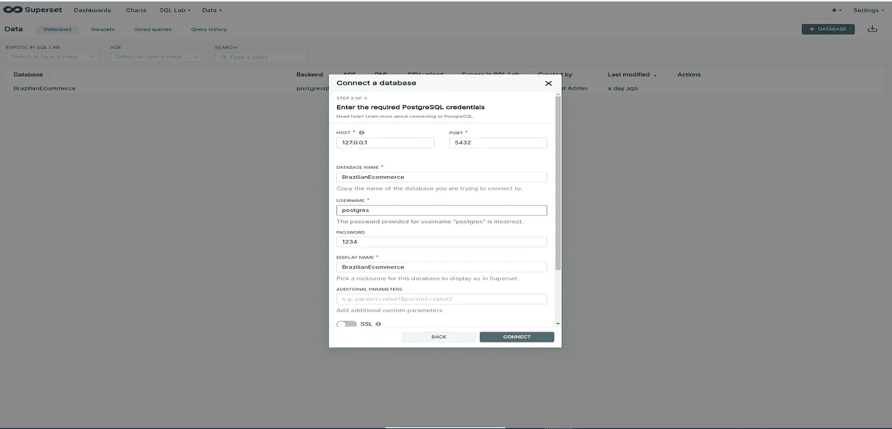

按作者在超集|图像上创建连接

超集内置了一个强大的 SQL 编辑器。

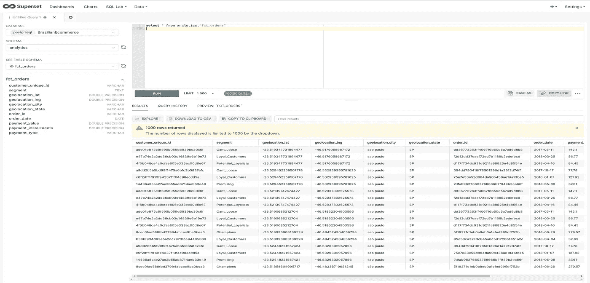

超集的 SQL 编辑器|作者图片

我们可以使用数据库超集连接中的表或视图来创建数据集。

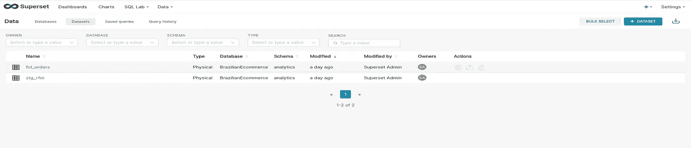

超集数据集|按作者分类的图像

然后我们可以使用这些基于 SQL 的数据集来创建图表。在超集中，有 30 多种图表。

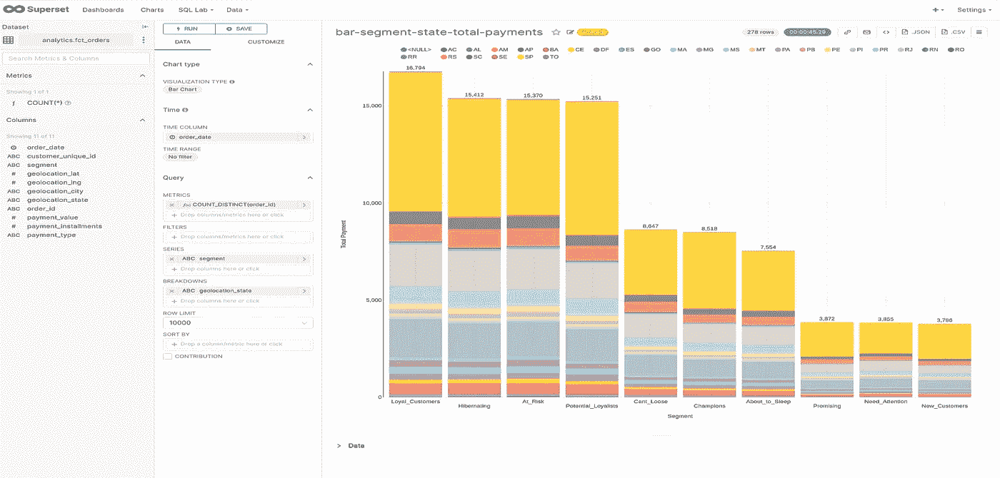

按作者在超集|图像中创建图表

我们通过收集在超集中创建的图表来创建仪表板。

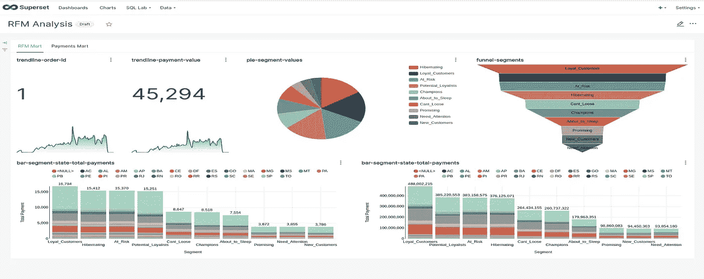

超集仪表板|按作者排序的图像

# 最后

我知道这篇课文有点短。但是，我不想花太多时间解释入门级别的编码。此外，在这篇文章中，上面提到的要点都不需要更深的知识来应用。它们只是基本的例子。希望你学到了新的东西。我和这些技术人员打交道已经快两个月了。我真的很喜欢使用这些技术。

此外，我已经为这段文字创建了一个回购。您可以使用下面的链接访问回购。回购包含我们在这个故事中提到的工具的所有示例。

[](https://github.com/mebaysan/Modern-Data-Architecture) [## GitHub-mebaysan/现代数据架构

### 在 GitHub 上创建一个帐户，为 mebaysan/现代数据架构开发做出贡献。

github.com](https://github.com/mebaysan/Modern-Data-Architecture) 

问候。