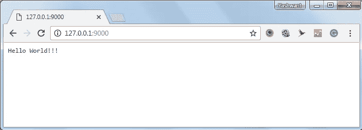

# Node.js 简介

> 原文：<https://medium.com/codex/introduction-to-node-js-173251658bbd?source=collection_archive---------21----------------------->

## [法典](http://medium.com/codex)


图 1: Node.js 徽标

Node.js 是一个服务器端的、开源的、跨平台的 JavaScript 运行时环境。这建立在谷歌浏览器的 JavaScript 引擎(V8 引擎)之上。Node.js 的定义如下；

> Node.js 是一个基于 Chrome 的 JavaScript 运行时构建的平台，用于轻松构建快速且可扩展的网络应用。Node.js 使用事件驱动的非阻塞 I/O 模型，这使得它轻量级且高效，非常适合跨分布式设备运行的数据密集型实时应用程序。

这个系统是用 JavaScript 开发的。我们可以使用微软视窗、Linux 和操作系统来运行这些应用程序。这也为 web 应用程序提供了各种库。我们可以使用“npm”(节点包管理器)来安装这些库。

## Node.js 的特性

Node.js 有一些重要的

1.  ***异步和事件驱动:*** 在 Node.js 中，所有的 API 库都是异步的。异步意味着客户端永远不想等到数据返回消息。调用之后，服务器转移到另一个 API，Node.js 帮助服务器从之前的 API 调用中获得响应。
2.  ***单线程但高度可扩展:*** Node.js 采用单线程编程语言。事件机制帮助服务器以异步方式响应。然后，它使服务器高度可伸缩，创建有限的线程来处理请求。由于它使用单线程编程语言，因此可以为比传统服务器多得多的请求提供服务。
3.  ***无缓冲:*** 这些应用程序只是以块的形式输出数据，而不是缓冲。
4.  ***非常快:*** Node.js 库在代码执行上非常快。

## Node.js 概念

在下图中，我们可以看到所有使用 Node.js 的概念。


图 2: Node.js 概念

## Node.js 用在哪里？

*   单页应用程序
*   I/O 绑定的应用程序
*   数据密集型实时应用(DIRT)
*   数据流应用
*   基于 JSON APIs 的应用程序

## 哪里不用 Node.js？

*   CPU 密集型应用

## 创建应用程序

在创建应用程序之前有一些组件。

1.  ***导入所需模块:*** 使用 **require** 指令加载 Node.js 模块。为此，在您的终端中创建一个名为 index.js 的文件。您可以使用 Visual Studio 代码或 WebStorm 来实现这一点。

```
var http = require("http");
```

***2。创建服务器:*** 类似于 Apache HTTP 服务器。在这里，我们使用 http 实例并调用“ **http.createServer()** ”方法来创建一个服务器实例，并使用与该服务器实例关联的 **listen** 方法在端口 8081 绑定它。然后传递一个带有参数请求和响应的函数。

```
http.createServer(function (request, response) {response.writeHead(200, {'Content-Type': 'text/plain'});

response.end('Hello World\n');
}).listen(8081);

console.log('Server running at http://127.0.0.1:8081/');
```

**3。读取请求并返回响应:**服务器创建并读取客户端发出的 HTTP 请求并返回响应。

```
var http = require("http");

http.createServer(function (request, response) {
   // Send the HTTP header 
   // HTTP Status: 200 : OK
   // Content Type: text/plain
   response.writeHead(200, {'Content-Type': 'text/plain'});

   // Send the response body as "Hello World"
   response.end('Hello World\n');
}).listen(8081);

// Console will print the message
console.log('Server running at http://127.0.0.1:8081/');
```

然后我们可以执行 index.js 文件。在终端中简单地执行这段代码。

```
$ node main.js
```

您可以在服务器中看到输出。在任一浏览器中打开 [http://127.0.0.1:8081/](http://127.0.0.1:8081/) ，观察如下结果。



图 3:“你好世界！”

## 参考

更多信息可以参考 Node.js 官网。

```
[https://nodejs.org/en/docs/](https://nodejs.org/en/docs)
```