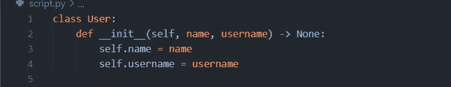
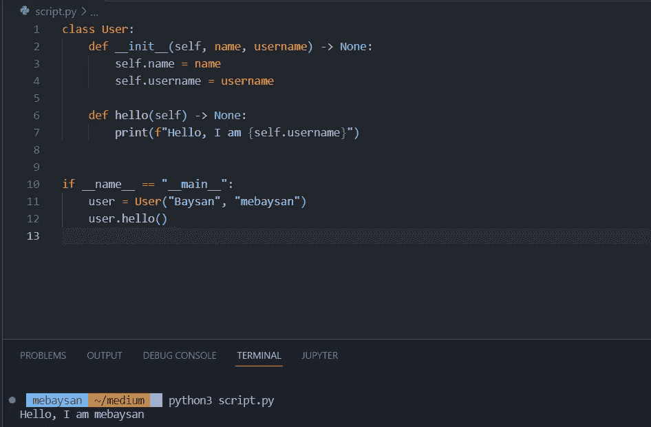
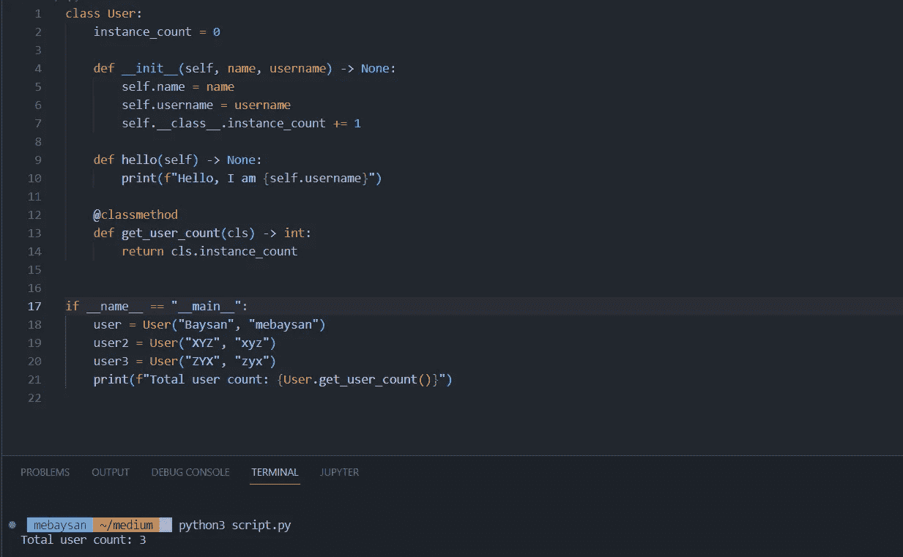
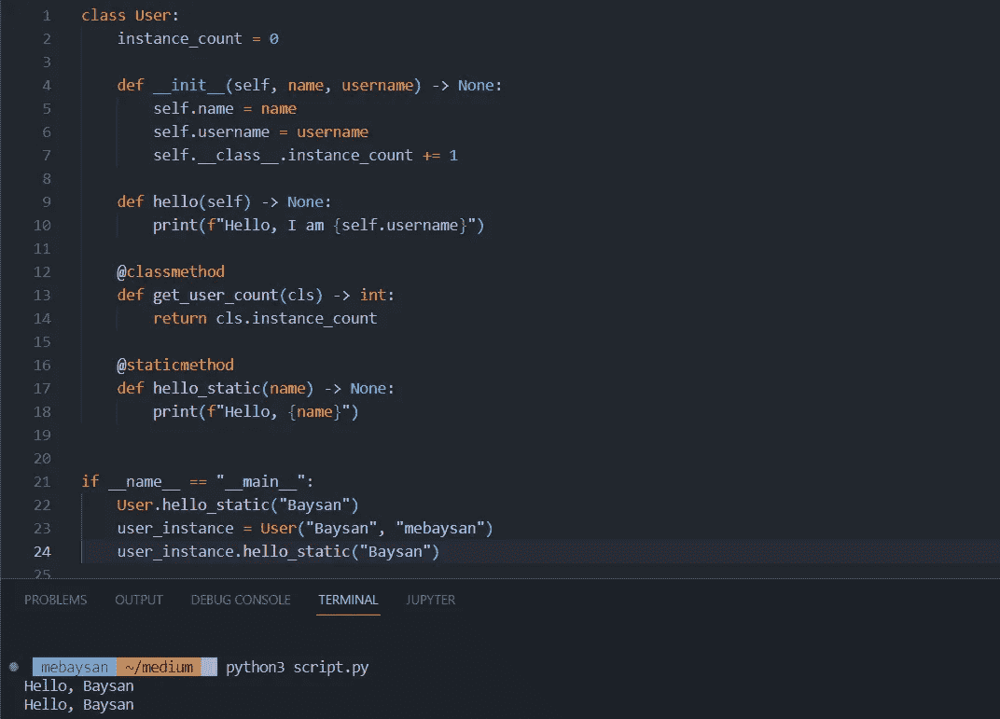
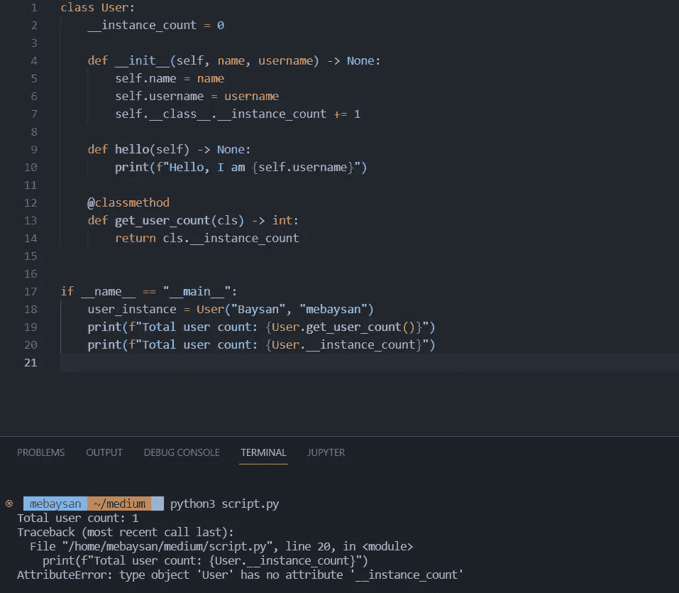
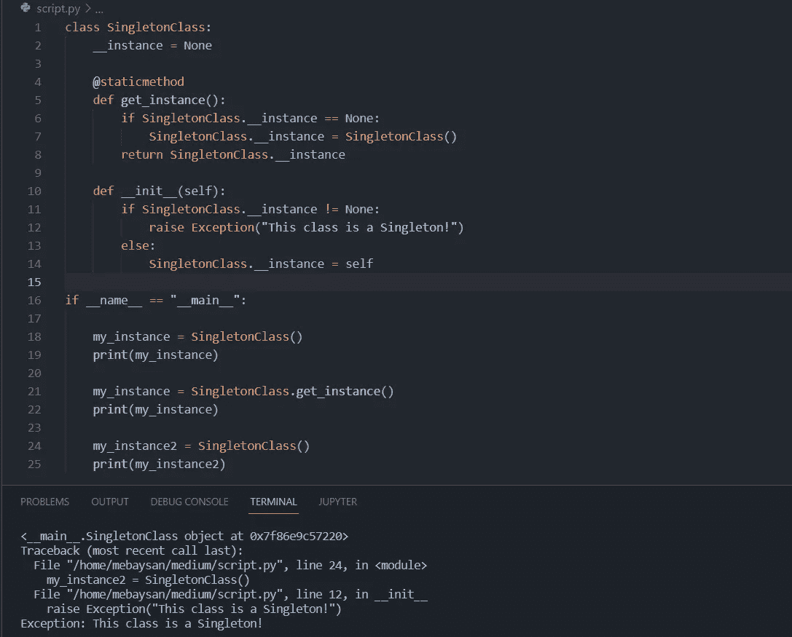

# Python 中面向对象的介绍

> 原文：<https://medium.com/codex/introduction-to-oop-in-python-4f261290c30a?source=collection_archive---------12----------------------->

## 类方法、私有属性、信息隐藏、封装和单例设计模式

你好。我要写的是 Python OOP 101。类方法类型，一些面向对象的原则，如信息隐藏和封装等。，什么是 Singleton，什么是设计模式，这些都是你可以在本文中找到的主题。

 [## Python OOP Metodlar

### 梅哈巴拉，但亚兹姆达 Python ' daki metod türlerinden bahsetmeye al ACA m。

mebaysan.medium.com](https://mebaysan.medium.com/python-oop-metodlar%C4%B1-94fbe75f250) 

# 类方法类型

我们有 3 种类型的类方法。

1.  对象方法:我们可以从实例化的对象中使用这些方法。
2.  类方法:我们可以直接从类中使用这些方法。
3.  静态方法:我们可以从直接类和实例化对象中使用这些方法。

实际上，我想在这里指出这一点。方法是在类下定义的函数。然而，当我们将它们定义在一个类下而不是“函数”下时，我们称它们为“方法”。

## 准备一个类和构造函数方法

有一些特殊的方法。构造函数方法就是其中之一。当一个对象被实例化时，这个方法分配对象的属性。为了使用这个方法，我们使用 Python 中的`__init__`函数。

## 对象方法

我们可以从实例化的对象中使用这些方法。语法是`object.method_name([args])`。在 Python 中，我们必须给出`self`作为第一个参数。

## 类方法

这些方法将类( **cls** )而不是自身作为第一个参数。语法是`CLASS_NAME.method([args])`。他们用`classmethod`装饰。

## 静态方法

我们可以从直接类和实例化对象中使用这些方法。该方法使用`staticmethod`装饰器。这些参数对这些方法很重要。因为这些方法本身并不代表对象或类。

# 信息隐藏和封装

信息隐藏和封装是面向对象编程的原则。通过使用这些原则，我们可以隐藏我们的类或对象的属性，以防止改变它们。

## 私有属性和方法

事实上，如果你在继续之前阅读下面的 2 篇文章，会更好地理解我们为什么使用“__”等。

 [## Python - GeeksforGeeks 中的下划线(_)

### 在本文中，我们将看到 Python 中的下划线(_)。以下是在…中使用“_”的不同地方

www.geeksforgeeks.org](https://www.geeksforgeeks.org/underscore-_-python/)  [## Python - GeeksforGeeks 中的私有变量

### 先决条件:Python 中的下划线在 Python 中，不存在不能被…

www.geeksforgeeks.org](https://www.geeksforgeeks.org/private-variables-python/) 

我将为我要设为私有的属性添加“__”前缀。

在这个例子中，我们隐藏了`instance_count`属性来限制它的可访问性。

# 设计模式

设计模式是反复出现的设计问题的永久解决方案。这些模式是软件开发人员开发并达成一致的解决方案，用于永久解决他们已经工作多年的问题。通过使用设计模式，我们可以更容易地解决已经确定/解决的问题。有三种类型的设计模式。

*   创造模式
*   结构模式
*   行为模式

在本文中，我将展示单例模式的一个应用示例。

## 单一模式

单例是一种“创造模式”。尽管它是设计模式中最简单的例子之一，但却是一种非常强大的技术。简而言之，就是限制一个类只有一个实例化的对象。

# 最后

希望你喜欢。祝你编码愉快。

问候