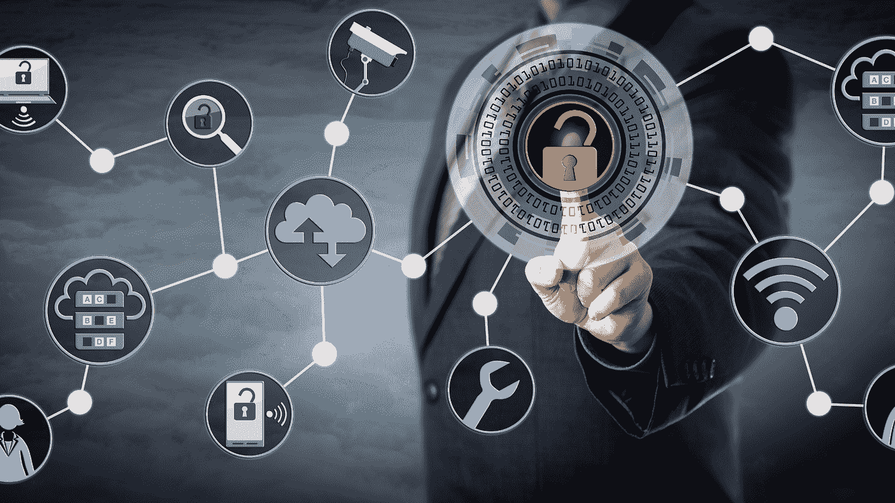

# 特权访问管理简介

> 原文：<https://medium.com/codex/introduction-to-privileged-access-management-2d83182e8205?source=collection_archive---------34----------------------->

PAM(特权访问管理)是建立对特权帐户控制的网络安全措施，即提升 IT 环境中任何用户、帐户和流程的访问和权限。

通过为特权访问控制设计适当的级别，PAM 帮助组织避免或至少减轻由外部攻击或内部疏忽造成的损害程度。

在这篇文章中，我们将看看 PAM，并理解为什么它是必要的。

**目录**

1.  帕姆是什么？
2.  特权是如何授予的，它们内置在哪里？
3.  还有其他权限更少的账号吗？
4.  特权风险和威胁
5.  为什么 PAM 是必要的？
6.  停业清理

# 帕姆是什么？

特权是系统中的一种特殊权利或权限。这不是赋予大众的权利。

PAM 是授予 IT 架构中某个帐户或流程的权限。由于只有少数人拥有提升的访问权限，需要特权目标的帐户经常成为黑客的目标，目的是获得系统的根用户访问权限。

特权访问在错误的人手中会对组织造成大量损害，破坏组织的工作流程。所以帕姆被牵扯进来了。它通过压缩网络攻击者的攻击来充当特权帐户的屏障。

特权赋予用户、帐户和应用程序访问关键资源的必要权限，以完成高优先级任务。

# 特权是如何授予的，它们内置在哪里？

用户帐户或进程的权限建立在操作系统、应用程序、数据库、管理程序、云存储等中。根据用户在各自部门中的角色(如网络管理员或系统管理员)为用户分配权限。

根据系统的不同，权限是基于一组属性制定的，这些属性可以是基于角色的，如业务部门(人力资源、产品管理或 it)，也可以基于个人的资历、特殊情况和例外情况。

# 还有其他权限更少的账号吗？

在最低特权环境中，大多数用户在 90%-100%的帐户中工作。非特权帐户属于最低特权帐户类别。它们由以下账户组成:

## 标准用户帐户

标准用户帐户拥有一组有限的权限，包括基本的便利设施，如互联网浏览和访问有限的资源，这些权限通常根据与角色相关的策略进行划分。

## 来宾用户帐户

来宾用户帐户的权限少于标准用户帐户，并且仅适用于基本的应用程序访问和互联网浏览。

## 超级用户帐户

特殊类型的特权帐户被称为超级用户帐户。它们由专业的管理员处理，他们可以进行系统更改，拥有完全的读/写文件授权，并授予或撤销其他用户的权限。超级用户帐户通常在 Linux/Unix 中被称为 root，在 Windows 中被称为 administrator。

# 特权风险和威胁

由于疏忽和不良特权凭证，特权风险在 IT 组织中很常见。特权证书被普遍称为“通往 IT 王国的钥匙”。Forrester 的一项调查显示，大约 80%的安全漏洞涉及特权凭证。以下是不同的威胁-

## 对特权资产和凭证缺乏了解和认识

长期被遗忘的特权帐户在组织中很常见，也是最不被重视的。这可能会为入侵者打开后门。在许多情况下，涉及前雇员离开公司，以保留访问权。

## 共享密码和帐户

IT 团队通常共享 root 访问和管理员密码，以与其他人分担工作负载和职责。但是，当多个用户操作特权帐户时，不可能将所有帐户执行的操作绑定到一个帐户。除了可审计性问题之外，这还会产生安全性和合规性漏洞。

## 跨 IT 领域过度配置权限

由于权限访问控制限制在阈值水平以上，这可能会导致员工沮丧，从而影响工作效率。员工的角色应该是流动的；它应该以这样一种方式发展，即授予他们更多的特权和更多的责任，同时保留他们不再需要访问的现有特权。

这种过度的特权导致膨胀的攻击面，导致黑客窃取特权凭证或在 IT 系统上安装网络钓鱼软件以获得访问权，这可能对整个 IT 结构中的互连系统产生不利影响。

## 硬编码凭据

特权凭证用于提供 A2A(应用程序到应用程序)访问和 A2D(应用程序到数据库)通信服务，便于对被访问的个人进行身份验证。应用程序、硬件系统、网络驱动程序和物联网设备通常使用常见且容易猜测的默认嵌入式凭据进行开发。员工将机密以明文形式硬编码在文件、代码或脚本中，需要时可以轻松访问。

## 云环境带来了新的特权威胁载体

云和其他虚拟化环境提供了无限的超级用户功能，这些功能为特权用户提供了配置、更改和删除服务器的资源。用户可以毫不费力地在这些特权帐户之间切换，以管理数千个虚拟机(每个虚拟机都有自己的特权帐户和凭据)。

# 为什么 PAM 是必要的？

帐户或进程的特权越多，该帐户受到的威胁就越大。PAM 不仅最大限度地降低了外部违规的强度，还限制了违规发生的范围。PAM 与其他安全技术的不同之处在于，它分解了网络攻击链中的多个点。这有助于化解外部团体或内部攻击对内部网络和系统造成的威胁。

PAM 提供了以下主要优势-

1.  **作为内部和外部威胁屏障的浓缩表面** -用户、帐户和进程的特权越少，攻击者可利用的途径就越少。PAM 减少了导致系统扭曲的路径。
2.  **减少恶意软件传播-**SQL 注入等恶意软件依赖于最低权限的缺失，需要提升权限才能安装或执行。PAM 有助于删除过多的特权，这反过来可以防止恶意软件获得据点或遏制传播，即使它做到了。
3.  **提高运营性能** —将特权分配给更少的用户可以提高整个 IT 系统的运营效率。它有助于消除系统之间的兼容性问题，并抑制停机风险。
4.  **轻松证明合规性** —特权较少的环境意味着合规性更容易，复杂的模型更少，从而有利于审计。

# 清盘

特权访问对任何 IT 组织来说都是非常珍贵的，并且被认为是进入他们的王国的主要钥匙。因此，最好采用 PAM 策略来降低对系统的攻击强度。遵循 PAM 中的一组最佳实践可以用不同的访问级别来增强系统，从而极大地丰富您的系统。

*原发布于*[*https://www . partech . nl*](https://www.partech.nl/nl/publicaties/2021/08/introduction-to-privileged-access-management)*。*