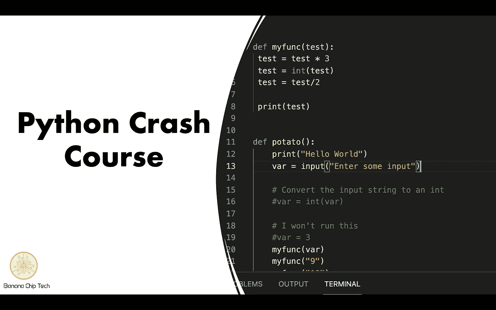

# 编程入门

> 原文：<https://medium.com/codex/introduction-to-programming-dad44b524e05?source=collection_archive---------11----------------------->

## **如何看待编程**

python 编程语言已经成为世界上[最流行的编程语言](https://www.northeastern.edu/graduate/blog/most-popular-programming-languages/)。听说用 python 写的很酷的程序是很平常的事。python 因其简单的语法、多个开源包和多功能性而广受赞誉，为新程序员提供了一个很好的切入点。

## **什么是编程**