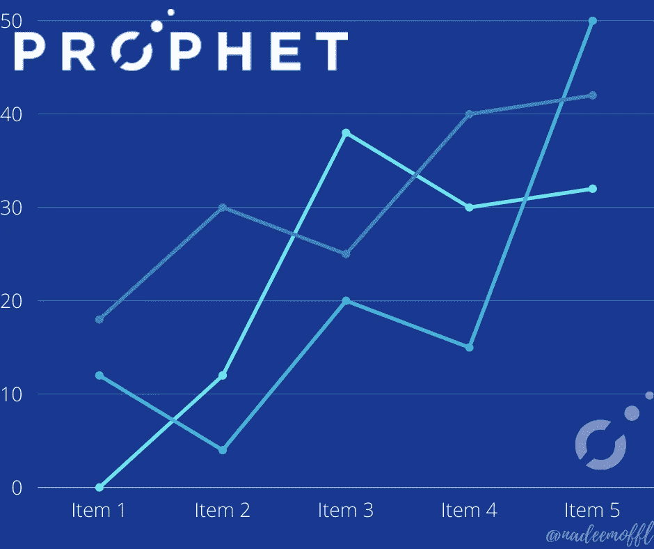
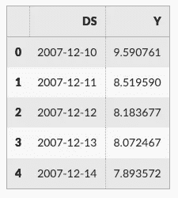
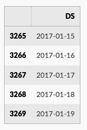
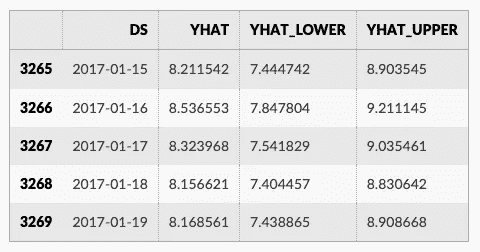
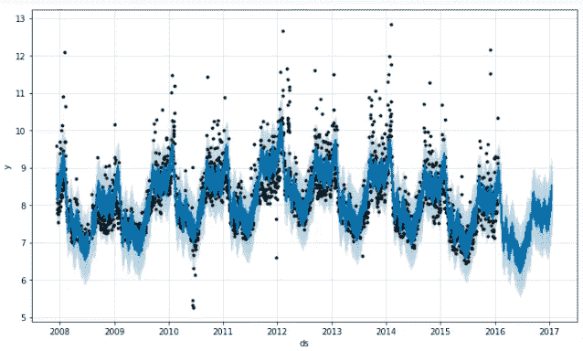
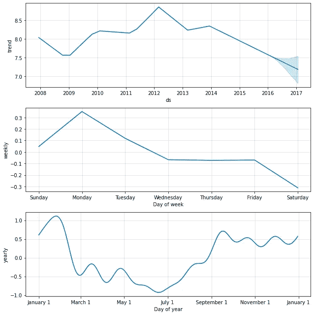

# 先知算法简介

> 原文：<https://medium.com/codex/introduction-to-prophet-algorithm-a59e463a6c72?source=collection_archive---------1----------------------->

Prophet 是一种流行的局部贝叶斯结构时间序列模型。

Prophet 是一个用 R 和 Python 实现的预测程序，它速度很快，提供完全自动化的预测，可以由数据科学家和分析师手动调整。



# 概观

预测是一项常见的数据科学任务，可帮助组织进行容量规划、目标设定和异常检测。

尽管它很重要，但在生成可靠和高质量的预测方面存在严重的挑战，尤其是当存在各种时间序列并且具有时间序列建模专业知识的分析师相对较少时。

为了应对这些挑战，我们描述了一种实用的“大规模”预测方法，该方法将可配置模型与分析师在环性能分析相结合。

具有可解释参数的模块化回归模型，具有时间序列领域知识的分析师可以直观地调整这些参数。

性能分析比较和评估预测程序，并自动标记预测以进行人工审查和调整。

Prophet 是一种基于加法模型预测时间序列数据的过程，在该模型中，非线性趋势与每年、每周和每天的季节性以及假日影响相适应。

它最适用于具有强烈季节效应的时间序列和几个季节的历史数据。

Prophet 对缺失数据和趋势变化非常稳健，通常能够很好地处理异常值。

Prophet 是由脸书核心数据科学团队发布的开源软件。

# 先知如何工作

Prophet 对于以下数据集特别有用:

*   包含更长时间(几个月或几年)的详细历史观察(每小时、每天或每周)
*   具有多重强烈的季节性
*   包括先前已知的重要但不规则的事件
*   有缺失的数据点或大的异常值
*   具有接近极限的非线性增长趋势。

Prophet 是一个具有分段线性或逻辑增长曲线趋势的加性回归模型。它包括使用傅立叶级数建模的年度季节性成分和使用虚拟变量建模的每周季节性成分。

**准确而快速。**

在脸书，Prophet 被广泛应用于为规划和目标设定提供可靠的预测。先知被发现在大多数情况下比任何其他方法表现更好。这个模型适合 ***斯坦*** 这样你就能在几秒钟内得到预测。

> Stan 是用于统计建模和高性能统计计算的一流平台。

**全自动**

无需人工操作，即可对杂乱的数据做出合理的预测。Prophet 对异常值、缺失数据和时间序列中的剧烈变化非常稳健。

**可调预测**

prophet 程序为用户提供了许多调整预测的可能性。您可以通过添加您的领域知识，使用人类可理解的参数来改进您的预测。

**提供 R 或 Python 版本**

我们可以用 R 和 Python 实现 prophet 过程，但是它们共享相同的底层 Stan 代码来进行拟合。使用任何你觉得舒服的语言来获得预测。

# Python 实现

```
# Python
import pandas as pd
from prophet import Prophet**df = pd.read_csv('../examples/example_wp_log_peyton_manning.csv')
df.head()**
```



我们通过实例化一个新的`Prophet`对象来适应这个模型。预测过程的任何设置都被传递到构造函数中。然后你调用它的`fit`方法，传入历史数据帧。安装需要 1-5 秒钟。

```
**m = Prophet()
m.fit(df)**
```

然后在一个数据框中进行预测，该数据框中有一列`ds`包含要进行预测的日期。您可以使用 helper 方法`Prophet.make_future_dataframe`获得一个合适的数据帧，该数据帧延伸到未来指定的天数。默认情况下，它还将包括历史中的日期，因此我们将看到模型也是合适的。

```
**future = m.make_future_dataframe(periods=365)
future.tail()**
```



该`predict`方法将为`future`中的每一行分配一个预测值，将其命名为`yhat`。如果您传入历史日期，它将提供样本内拟合。这里的`forecast`对象是一个新的数据框，包括一个包含预测的列`yhat`，以及组件和不确定性区间的列。

```
forecast = m.predict(future)
forecast[['ds', 'yhat', 'yhat_lower', 'yhat_upper']].tail()
```



您可以通过调用`Prophet.plot`方法并传递您的预测数据框来绘制预测。

```
fig1 = m.plot(forecast)
```



如果您想查看预测组件，您可以使用`Prophet.plot_components`方法。默认情况下，您将看到时间序列的趋势、年季节性和周季节性。如果你包括假期，你也会在这里看到。

```
fig2 = m.plot_components(forecast)
```



可以用 Plotly 创建预测和组件的交互图形。您需要单独安装 Plotly 4.0 或更高版本，因为默认情况下它不会与 prophet 一起安装。您还需要安装`notebook`和`ipywidgets`软件包。

```
**from prophet.plot import plot_plotly, plot_components_plotly

plot_plotly(m, forecast)**plot_components_plotly(m, forecast)
```

# 参考

[](https://mc-stan.org/) [## 斯坦

### Stan 是用于统计建模和高性能统计计算的一流平台。成千上万的…

mc-stan.org](https://mc-stan.org/) [](https://facebook.github.io/prophet/docs/quick_start.html#python-ap) [## 快速启动

### Prophet 遵循 sklearn 模型 API。我们创建一个 Prophet 类的实例，然后调用它的 fit 和 predict…

facebook.github.io](https://facebook.github.io/prophet/docs/quick_start.html#python-ap) [](https://peerj.com/preprints/3190/) [## 大规模预测

### 预测是一项常见的数据科学任务，可帮助组织进行容量规划、目标设定和异常情况预测…

peerj.com](https://peerj.com/preprints/3190/) 

> 如果你学到了新东西或者喜欢阅读这篇文章，请鼓掌👏并分享给其他人看。也可以随意发表评论。💬