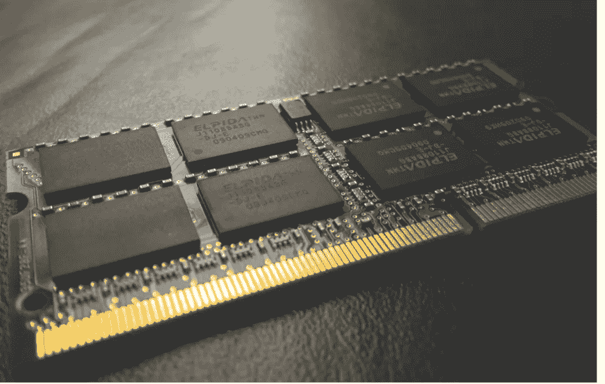
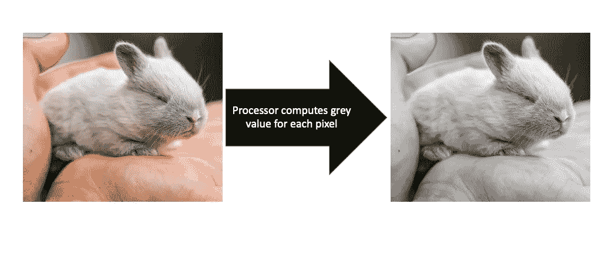
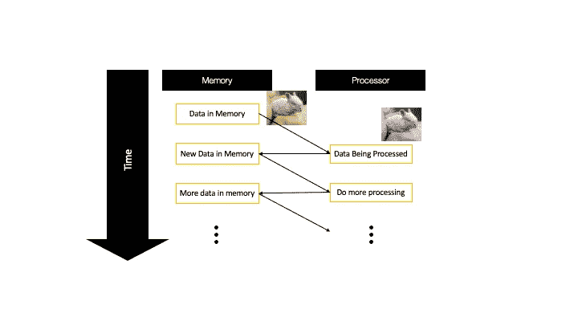

# Python 简介—前言

> 原文：<https://medium.com/codex/introduction-to-python-preface-cc739c8bd3e6?source=collection_archive---------10----------------------->

## 为傻瓜编码或者如何像程序员一样思考代码。

欢迎来到 cubicbay 的 Python 入门课程，并祝贺您开始这一旅程！学习编码可能是你能做出的最重要的决定之一。

1.  如果你只学了一点点编码，并发展了对基本原理的理解，这将对你的生活产生积极的影响，不管你是一名护士，经营一家街角商店还是从事法律工作。你将能够解决你自己的问题，更好地与技术人员交流，甚至可以写一个小脚本来自动化你工作中无聊的部分。
2.  如果你更进一步，成为一名程序员，你将能够舒舒服服地坐在沙发上，编写影响数百万人的软件。你将进入一个无限发挥你的创造力和想法的世界。
3.  如果你有经济动机——没有判决通过——编程已经覆盖了你。如果你知道如何很好地编码，你会很快赚到比你需要的更多的钱，同时解决小谜语，每小时写几十个字。

如果以上任何一个人对你说过话，那就来吧！

## TL；速度三角形定位法(dead reckoning)

读完这篇文章后，你会明白一个计算机程序通常是这样工作的:

*   将所有数据(图像、数字等)放入。)在计算机的内存中
*   在那里，it 人员可以快速访问数据，以便对数据进行更改
*   该程序向处理器发送如何改变数据的指令
*   处理器执行这些指令，从而改变数据
*   结果再次被存储到存储器中

如果这些对你来说都不陌生，可以跳过前言，直接进入第 1 课。

## 从程序员的角度看计算机

下面的文字旨在用简单的英语传达计算机如何工作以及如何执行程序。我们还将了解一些基本术语，这将使我们更容易谈论课程和编码。

当你编程时，从内存和处理器的角度来考虑你的计算机是非常有用的。如果这对你来说是陌生的，不要担心。

让我解释一下。

## 随机存取存储器

[附身摄影](https://unsplash.com/@possessedphotography?utm_source=unsplash&utm_medium=referral&utm_content=creditCopyText)在 [Unsplash](https://unsplash.com/s/photos/random-access-memory?utm_source=unsplash&utm_medium=referral&utm_content=creditCopyText) 上拍照

RAM 是一种数据存储器，就像你的硬盘一样。然而，它允许读和写数据比你的硬盘驱动器快得多。

简而言之，RAM 也被称为“存储器”。它相当于你电脑的短期记忆。例如，如果您在照片编辑程序中打开一幅图像，该程序会将图像从硬盘加载到内存中。在那里，程序可以非常快速地访问和编辑图像。

只是，如果您点击保存按钮，新的图像将再次写入硬盘驱动器。

你会问，如果 RAM 快得多，为什么不去掉硬盘，只使用 RAM 呢？虽然这是可能的，但是太贵了。与硬盘相比，内存的速度使其价格更高。这就是为什么消费类电脑的硬盘存储容量通常比内存大得多。

总结一下:计算机程序把所有的数据(图像、数字等。)在电脑的内存里。在那里，当他们想要对其进行更改时，可以快速访问它。

## 中央处理器

CPU，或简称为“处理器”，是程序在修改数据时使用的计算机部件。

以前，我们看到一个照片编辑软件会将一幅图像加载到计算机的(短期)内存中。例如，如果软件被用来创建一个灰度图像，它使用计算机的处理器。

安库尔·马丹在 [Unsplash](https://unsplash.com/s/photos/pixels?utm_source=unsplash&utm_medium=referral&utm_content=creditCopyText) 上的照片

你可以这样想:

该程序向处理器提供来自存储器的图像以及如何计算给定像素的灰度值的信息。然后处理器以闪电般的速度冲过去执行程序的指令。

它一个接一个地为原始图像的每个像素存储一个新的灰色像素，直到它在灰色阴影中建立了一个完整的副本。然后，它将副本存储在原始图像旁边。

你有没有想过照片或文本编辑软件如何让你“撤销”你做过的事情？*就是这样！*

该软件将简单地在内存中保存你以前的图像版本，并允许你在它们之间来回切换。

概要:程序向处理器发送如何改变数据的指令。处理器执行这些指令，从而改变数据。结果再次被存储到存储器中。

# 程序中的数据流

到目前为止，我们已经看到程序将数据加载到计算机的内存中，并使用处理器来改变数据。这一连串的事件可以在下图中看到。

图 1 cubic bay 进出内存的数据流

程序从上到下，从左到右运行。每一行都一个接一个地运行，就像你阅读代码一样。数据一次又一次地从内存加载、处理和存储回内存。

实际上，这些操作链会变得很长。非常长。

好消息是，在远远超出基础知识之前，所有的计算机程序都以同样的方式运行。

它们启动，将数据从内存中铲入处理器，然后返回，直到它们用完任务或被关闭。

这听起来太容易了，不可能是真的？

我很高兴地告诉你，就是这么简单。当然，计算机可以变得比这复杂得多。然而，就像一个只用几个拨片、变速排挡和方向盘比赛的赛车手一样，你可以不用考虑执行代码的引擎就能写出非常有用的代码。

恭喜你！你已经完全了解了计算机程序，以及它们与内存和处理器的关系。

你现在已经准备好开始编程入门课程的第一课了。在那里，你将学习如何创建变量并将数据存入计算机内存。

***如果您喜欢这篇文章，请查看***[***cubixbay***](https://cubicbay.org/)***和*** [***关注我***](/@gregor.v.dulong) ***了解更多学习资源以及来自科学和编程领域的新闻！***