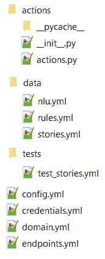
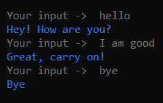
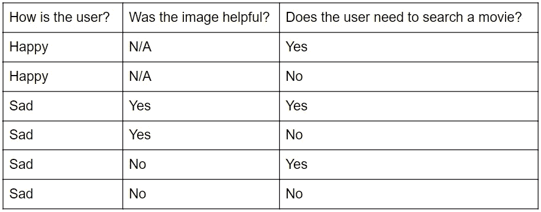

# Rasa 开源简介

> 原文：<https://medium.com/codex/introduction-to-rasa-open-source-8af137eeb2c4?source=collection_archive---------15----------------------->


沃洛季米尔·赫里先科在 [Unsplash](https://unsplash.com?utm_source=medium&utm_medium=referral) 上的照片

本文由 Betacom 分析和创新团队撰写。Betacom 是一家总部位于意大利和德国的公司，在 IT 领域使用创新技术、数字解决方案和尖端编程方法进行运营。您可以在我们的[网站](https://betacom.eu/)上了解更多信息。

# 介绍

> Rasa 是一个开源的机器学习框架，用于自动化的文本和基于语音的对话。理解消息，进行对话，并连接到消息传递通道和 API。

来源:[https://rasa.com/docs/rasa/](https://rasa.com/docs/rasa/)

在本文中，我们将探索 Rasa 的主要概念，并学习如何使用该框架构建一个简单的聊天机器人。

# 概观

Rasa 开源基于 Python，可以使用 pip 安装。请注意，它需要 Python 3.6、3.7 或 3.8。

```
pip install -U pippip install rasa
```

关于安装过程的更多细节可以在[这里](https://rasa.com/docs/rasa/installation)找到。

你可能已经知道，聊天机器人需要后端和前端。第一个是我们今天要构建的，由机器人与用户交互时必须遵循的所有规则和动作组成；而开发第二个意味着创建一个界面，比如一个小部件，允许用户和机器人聊天。构建前端超出了本文的范围，因此我们将使用 Rasa 提供的命令行界面。

构建聊天机器人时，你首先需要明确的是用户目标，也就是用户想要达到的总体目标。为此，用户将发送消息并与助理建议的按钮进行交互。
在用户消息中，**意图**是用户试图完成的事情。一些意图示例包括问候、指定位置、寻求帮助。从用户消息中，也可以提取关键字，称为**实体**。它们可以是电话号码、位置等。

另一方面，助手执行**动作**，比如向用户发回**响应**或者完成默认和自定义动作。响应可以是文本、按钮、图像和其他内容，而定制动作是开发人员编写的运行任意代码的动作，主要用于与外部系统和 API 进行交互。请注意，响应只是一个答案列表，机器人每次都必须从中选择一个答案。运行定制动作代码的服务器被称为**动作服务器**。Rasa 用 Python 维护 Rasa SDK 来实现定制动作，尽管也可以用其他语言编写定制动作。

**表单**是一种定制动作，用于向用户询问多条信息。例如，如果您需要一个城市和一个电影名称来订票观看，您可以创建一个表单来收集这些信息。您可以在表单中描述业务逻辑，比如在剧院中为客户提供不同的座位选项。我们将在后面的文章中详细介绍它们。

我们刚刚讨论的一切都列在**域**中，其中定义了一个助手的输入和输出。

最后，**故事**是对话模型的训练数据格式，由用户和机器人之间的对话组成。用户的消息被表示为带注释的意图和实体，机器人的响应被表示为一系列动作。

# 构建聊天机器人

在这一节中，我们将讨论如何构建一个简单的聊天机器人。如前所述，首先要做的是定义用户目标。我们希望我们的助手充当电影名称的搜索引擎。然后，它将能够介绍自己，并询问用户他们感觉如何，如果他们想搜索电影名称。如果是这样，那么它将声明这样的请求将很快可用，因为我们将在以后的文章中构建这个特性。

让我们行动起来吧！打开一个命令窗口，转到一个空目录，所有的聊天机器人配置文件将被存储。在那里，执行命令`rasa init`并按下`n`来回答问题“你想训练一个初始模型吗？”。一会儿我们会训练这个模型。

这将创建一个具有以下文件夹结构的 chatbot 配置示例:



我们现在可以通过运行命令`rasa train`来训练模型。现在让我们来看看示例聊天机器人能做什么！

打开两个命令提示符，进入聊天机器人的根文件夹。在第一个 cmd 中，运行命令“rasa run actions”来激活操作服务器，即后端将运行的服务器；而在第二个示例中，执行“rasa shell”来加载最后一个经过训练的模型，并启动命令行界面来与助手聊天。

下面是一个基本对话的例子:



示例聊天机器人实际上只能询问用户的感受，并对肯定和否定的回答做出反应。试试你自己，如果你写下你感到悲伤会发生什么。

现在让我们编辑配置文件来实现用户目标。首先要做的是将两个 bot 响应添加到 **domain.yml** 文件中:

*   utter_movie 询问用户是否想寻找一部电影
*   utter_not_yet 通知用户某个功能即将可用。

```
utter_movie:
  - text: "Do you want me to look for a movie?"
  - text: "Do you need me to look for a movie?"
  - text: "Would you like to look for a movie?"

  utter_not_yet:
  - text: "This feature is not available yet. Please come back!"
  - text: "This feature will be available soon!"
```

我们现在必须编辑**数据\故事. yml** 文件，将这些响应添加到对话路径中。目前的故事是

*   “快乐路径”,其覆盖了用户声称快乐的对话，
*   “悲伤路径 1 ”,其覆盖了用户声称很高兴并且机器人响应很有帮助的对话，
*   “悲伤路径 2”涵盖了用户表示悲伤以及机器人响应没有帮助的对话。

然后，我们需要 6 个故事来涵盖所有可能的场景:



包含所有故事的完整文件可以在[这里](https://gist.githubusercontent.com/efontana10/7f5833b2678a5aa80b9cad2f058ef0ff/raw/a75a52d5652c37d870bd7362d0afb7fb6cbdba46/stories.yml)找到。

我们现在可以像以前一样使用`rasa train`命令来训练新模型。

# 结论

我们浏览了 Rasa 开源的基础知识，并学习了如何构建一个简单的聊天机器人。我们建议看一下由`rasa init`命令生成的文件，并尝试添加一些关于意图和响应的例子。在下一篇文章中，我们将讨论如何添加一个自定义动作，并使用实体和槽来提高聊天机器人的技能。回头见！