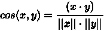

# 推荐系统简介—第二部分

> 原文：<https://medium.com/codex/introduction-to-recommendation-system-part-2-f950d7ef2f9?source=collection_archive---------7----------------------->


马库斯·斯皮斯克在 [Unsplash](https://unsplash.com?utm_source=medium&utm_medium=referral) 上的照片

## [抄本](http://medium.com/codex)

在这篇[文章](https://techsharing21.com/system-design/introduction-to-recommendation-system-part-1)中，我介绍了推荐系统(RS)的基本概念和构建 RS 的两种基本方法，即基于内容和协作过滤。这一次，我们深入研究了一个简单 RS 的实现，它使用基于项目的技术，使用协作过滤方法。你可以基于用户的一个是

# 协作过滤(CF)

正如我在上一篇文章中提到的，CF 是建立在不同个体之间共享兴趣的假设之上的。你可能会想到大数定律和群体行为理论。简而言之，陈述如下:

`If 2 users u1 and u2 review n similar items or conduct close behaviors on those like watching, buying, listening, then they likely have same reviews or behaviors with other items. That's why they say *Tell me who your friends are, I will tell you who you are.*`

虽然有些事情很容易确定其他人是否与他们关系密切，但有些情况下却不那么容易。例如，脸书可以推荐来自你的家乡、在同一所学校或属于同一群体的人，因为这种与简档相关的信息可以很容易地找出(并且可以直接比较)。但是对于像数字歌曲(甚至是古典音乐歌曲)，图片，新闻，CF 是一个更可取的候选。

每个 RS 需要考虑的核心概念是事物之间的相似性。除了之前所解释的代表用户和项目之间关联的矩阵之外，您还需要一个数学工具来计算对象(即用户或项目)之间的相似性(*又称距离*)。直观上，距离可以被视为相似性的倒数，因为

*   两个物体相距越远，它们就越不相似，它们之间的“**距离**就越大
*   物体越相似，它们之间的距离就越近，它们之间的距离就越小。

在机器学习中，有几种类型的距离度量:欧几里德-曼哈顿-闵可夫斯基、柯辛、汉明和马哈拉诺比斯。

## 欧几里德—曼哈顿—闵可夫斯基距离

我相信你熟悉二维空间中两点之间的欧几里德距离公式:


对于 n 维空间，相应地用 n 个特征表示的对象，该公式被概括为:


此度量基于所有方向或对象特征的绝对距离进行计算，如下所示:


作为欧几里德距离和曼哈顿距离的推广形式，闵可夫斯基距离的公式为


注意，对于无穷远处的 p，我们有一个所谓的切比雪夫距离。

## 余弦距离

余弦距离度量用于寻找不同文档之间的相似性。通常，在向量之间的大小无关紧要但方向重要的情况下，我们采用这种度量。我们测量包含频率项的两个文档或向量之间的角度。



## 马哈拉诺比斯距离

根据维基百科的定义，马氏距离(Mahalanobis distance)是一个点 P 和分布 d 之间距离的度量，度量的思路是，P 距离 d 的均值有多少个标准差。

使用 Mahalanobis 距离的好处是，它将协方差方面的整个数据集考虑在内，以测量两个不同对象之间的相似性。

## 汉明距离

与 Minkowski 处理连续或数字数据不同，Hamming distance 是比较两个相同长度的字符串的度量。它是对应字符不同的位置数。比如“苹果”和“桌子”的海明距离是 2。两根弦之间的距离越大，它们就越不相似。

现在，我们已经对不同的距离度量有了基本的了解，让我们进入下一步，即构建一个简单的音乐歌曲 RS。

# 音乐推荐系统

我们使用从[到](http://www.salemmarafi.com/wp-content/uploads/2014/04/lastfm-matrix-germany.csv)的百万首歌曲的数据集。这个数据集在歌曲级别包含两种数据:标签和相似的歌曲。我们将需要一个数据文件来保存一个加权矩阵，代表哪些用户听哪些作曲家的歌曲。

## 数据加载

该数据集有 1257 个用户和 286 个艺术家，这里的艺术家可以被视为项目。数据从*熊猫*库的 *data.csv* 文件中加载。

```
import pandas as pdif __name__ == '__main__':
   data = pd.read_csv('data.csv')
   print(data.shape)
   print(data.head(8).iloc[:,0:6 ])
```

以下是数据集的前 8 行和 6 列:

```
>>> print(data.shape)
(1257, 286)
>>> print(data.head(8).iloc[:,0:6 ])
   user  a perfect circle  abba  ac/dc  adam green  aerosmith
0     1                 0     0      0           0          0
1    33                 0     0      0           1          0
2    42                 0     0      0           0          0
3    51                 0     0      0           0          0
4    62                 0     0      0           0          0
5    75                 0     0      0           0          0
6   130                 0     0      0           0          0
7   141                 0     0      0           0          0
>>>
```

现在，我们知道数据实际上是一个二进制矩阵，其中 **0** 表示用户从未听过该艺术家的任何歌曲，而 **1** 表示他至少听过该艺术家一次。

## 数据预处理

这个例子的目的是展示如何基于项目进行 CF，我们只需要与**项目**(或者本例中的**艺术家**)相关的数据，我们不需要用户信息。所以我们只需删除列**用户**:

```
# --- Start Item Based Recommendations --- #
# Drop any column named "user"
data_item_base = data.drop('user', 1)
```

## 相似度计算

您需要一个数据结构来存储相似性度量。在本例中，我们使用一个方形矩阵 items-items，通过使用 **DataFrame** 来表示项目之间的关联:

```
data_item_base_frame = pd.DataFrame(index=data_item_base.columns, columns=data_item_base.columns)
print(data_item_base_frame.head(6).iloc[:,0:6])
```

然后，我们得到一个类似矩阵的初始结构，其中每对相关项的所有值都是零。

```
 a perfect circle abba ac/dc adam green aerosmith  afi
a perfect circle              NaN  NaN   NaN        NaN       NaN  NaN
abba                          NaN  NaN   NaN        NaN       NaN  NaN
ac/dc                         NaN  NaN   NaN        NaN       NaN  NaN
adam green                    NaN  NaN   NaN        NaN       NaN  NaN
aerosmith                     NaN  NaN   NaN        NaN       NaN  NaN
afi                           NaN  NaN   NaN        NaN       NaN  NaN
```

现在是时候根据上一节提到的距离类型之一来计算距离了。这里我们用**余弦**距离来衡量相似性。由于有了像 SciPy 这样的库，我们不需要太在意细节。

在下面的代码中，我们使用两个循环来计算每对项目的相似性。在第 7 行中，我们使用`1 - cosin_distance`返回的 **cosin** 值的范围在【0，1】之间，以确保条件**距离越小越相似**。为了提高性能，这个矩阵被存储在一个文件中，以避免重复计算。

```
from scipy.spatial.distance import cosine
# Calculate similarily
    for i in range(0, len(data_item_base_frame.columns)):
        # Loop through the columns for each column
        for j in range(0, len(data_item_base_frame.columns)):
            # Calculate similarity
            data_item_base_frame.iloc[i, j] = 1 - cosine(data.iloc[:, i], data.iloc[:, j])
# Save to a file for next time usage 
data_item_base_frame.to_csv('data_item_base_frame.csv', sep=',', encoding='utf-8')
```

在完成相似度计算并更新变量`data_item_base_frame`的**数据帧**后，我们得到如下矩阵:

```
>>> data_item_base_frame
                 a perfect circle      abba     ac/dc adam green aerosmith  ...   trivium        u2 underoath   volbeat yann tiersen
a perfect circle              1.0  0.167317   0.14403   0.230294  0.181366  ...  0.159596  0.140394  0.163286  0.115202     0.142385
abba                     0.167317       1.0       0.0   0.017917  0.051554  ...  0.030359  0.111154  0.024398   0.06506     0.052164
ac/dc                     0.14403       0.0       1.0   0.052279  0.025071  ...  0.029527       0.0  0.094916       0.0     0.025367
adam green               0.230294  0.017917  0.052279        1.0  0.113154  ...       0.0  0.087131  0.122398    0.0204     0.130849
aerosmith                0.181366  0.051554  0.025071   0.113154       1.0  ...  0.082169  0.025071  0.022011       0.0     0.023531
...                           ...       ...       ...        ...       ...  ...       ...       ...       ...       ...          ...
trivium                  0.159596  0.030359  0.029527        0.0  0.082169  ...       1.0  0.029527  0.077771       0.0          0.0
u2                       0.140394  0.111154       0.0   0.087131  0.025071  ...  0.029527       1.0  0.023729  0.126554     0.050735
underoath                0.163286  0.024398  0.094916   0.122398  0.022011  ...  0.077771  0.023729       1.0       0.0     0.022272
volbeat                  0.115202   0.06506       0.0     0.0204       0.0  ...       0.0  0.126554       0.0       1.0          0.0
yann tiersen             0.142385  0.052164  0.025367   0.130849  0.023531  ...       0.0  0.050735  0.022272       0.0          1.0
```

## 过滤

到目前为止，我们已经有了类似项目的所有必要信息。我们接下来要做的是，对于每个商品，我们通过使用如下外观来过滤其`n`最相似的商品:

```
# Initial a frame for save closes neighbors to an item
data_neighbors = pd.DataFrame(index=data_item_base_frame.columns, columns = range(1, 11))for i in range(0, len(data_item_base_frame.columns)):
  data_neighbors.iloc[i,:10] = data_item_base_frame.iloc[0:, i].sort_values(ascending=False)[:10].index
```

我们设置 n = 10，这意味着我们将选取与当前项目最接近的 10 个项目。每当用户选择某首歌曲时，rs 将检查变量 data_neighbors 的值，并向用户显示 10 首相似的歌曲。结果如下:

```
>>> data_neighbors
                                1               2                 3   ...                 8                   9                  10
a perfect circle  a perfect circle    lostprophets   crystal castles  ...               mgmt               bjork         digitalism
abba                          abba       tori amos  dropkick murphys  ...     tegan and sara  panic at the disco         the smiths
ac/dc                        ac/dc      mando diao        schandmaul  ...  killswitch engage          guano apes            editors
adam green              adam green  regina spektor              mgmt  ...         digitalism             ramones            justice
aerosmith                aerosmith    the national       the subways  ...     the libertines       frank sinatra        the wombats
...                            ...             ...               ...  ...                ...                 ...                ...
trivium                    trivium  kelly clarkson        kanye west  ...             oomph!    a perfect circle     the libertines
u2                              u2     amon amarth               atb  ...      dream theater                 him            incubus
underoath                underoath      schandmaul              dido  ...    crystal castles          mando diao   the decemberists
volbeat                    volbeat      audioslave       alicia keys  ...            genesis      britney spears  the white stripes
yann tiersen          yann tiersen   amy macdonald           incubus  ...    subway to sally         david bowie   a perfect circle[285 rows x 10 columns]
```

你可以在这里查看这个基于商品的 CF 系统的完整代码:

```
import pandas as pd
from scipy.spatial.distance import cosineif __name__ == '__main__':
    data = pd.read_csv('data.csv')
    # --- Start Item Based Recommendations --- #
    # Drop any column named "user"
    data_item_base = data.drop('user', 1)
    # store DataFrame
    data_item_base_frame = pd.DataFrame(index=data_item_base.columns, columns=data_item_base.columns)
    # Calculate similarily
    for i in range(0, len(data_item_base_frame.columns)):
        # Loop through the columns for each column
        for j in range(0, len(data_item_base_frame.columns)):
            # Calculate similarity
            data_item_base_frame.iloc[i, j] = 1 - cosine(data.iloc[:, i], data.iloc[:, j])data_item_base_frame.to_csv('data_item_base_frame.csv', sep=',', encoding='utf-8')
    # data_item_base_frame = pd.read_csv('data_item_base_frame.csv')
    print data_item_base_frame.head(6).iloc [:,0:5]# Initial a frame for save closes neighbors to an item
   data_neighbors = pd.DataFrame(index=data_item_base_frame.columns, columns = range(1, 11))for i in range(0, len(data_item_base_frame.columns)):
        data_neighbors.iloc[i,:10] = data_item_base_frame.iloc[0:, i].sort_values(ascending=False)[:10].index
```

在我的下一篇文章中，我将解释如何实现一个基于用户的 CF 系统。TBD

# 承认

我非常感谢范文东允许我翻译他的[原文](https://viblo.asia/p/lam-the-nao-de-xay-dung-mot-recommender-system-rs-phan-2-4dbZNxom5YM)。

【https://techsharing21.com】原载于 2021 年 2 月 3 日[](https://techsharing21.com/system-design/introduction-to-recommendation-system-part-2)**。**