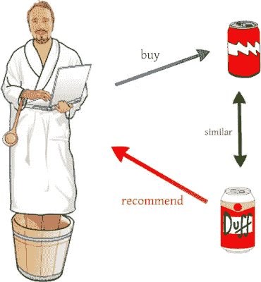
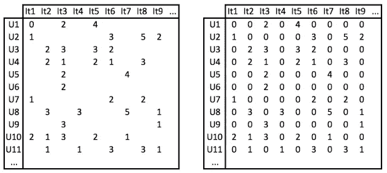

# 推荐系统简介—第一部分

> 原文：<https://medium.com/codex/introduction-to-recommender-system-part-1-a29d52d2ff6b?source=collection_archive---------7----------------------->

## [法典](http://medium.com/codex)

你见过吗

*   你的父母刚刚开始使用脸书并和一些人交朋友。几天后，脸书推荐了一些你根本不认识的远房亲戚。
*   你正在逛街，希望找到你想买的东西。然后是一堆像牛仔裤、手袋、皮带等物品。过了一段时间，你是否意识到你已经走了多远，完全忘记了你最初的目的？
*   你没有心情听几首流行歌曲。然后你发现还有其他流行歌曲也是同样的旋律，从来没有一首…摇滚。

我上面列出的所有故事都有一个共同点:一个(或一些)特定的系统能够寻找和暗示一些你可能没有意识到但可能会感兴趣的东西。这样的系统就是推荐系统(或平台、引擎)——一种**人工智能**的新兴应用。如果你计划在 AI 领域开始你的职业生涯，我希望这个系列能给你一些兴趣和动力。

# 什么是推荐系统？

把它想象成一个和你一起度过了一段时间的经纪人，或多或少，以某种方式弄清楚你的偏好，试图找到符合那个偏好的人，并为你推荐他们。你是一个人，一个很酷的人，对漂亮女孩很感兴趣。重要的是有很多人你需要约会和了解，这需要很多时间。因此，你需要作为媒人的应用程序，它们可以向你推荐符合你偏好的应用程序。下图是电子商务系统中的一个常见例子。

当你购买一个产品(或者甚至对某些产品表现出兴趣)时，RS 会从某些角度显示与你感兴趣的产品相近的其他产品。显然，这样的推荐给客户和提供商都带来了价值。更进一步，大多数大型电子商务系统，如亚马逊或沃尔玛，都有自己的 RS，负责:

*   从喜爱的产品、产品评级、评论、甚至点击数、产品浏览量等方面跟踪客户行为。
*   根据客户的历史数据，rs 将预测他们的后续步骤并提供建议。

这个想法很简单。在接下来的部分中，我们将进一步了解 RS 的功能组件以及实现它的基本步骤。

## RS 组件

采用 ML 方法的 RS 具有 3 个基本方面的特征，即

*   遥感的目标——用户
*   可以是电子商务系统的产品、数字音乐服务的歌曲、社交网络的其他用户或博客帖子的项目。项目不仅是 RS 输入的数据源，也是 RS 需要确定并呈现给用户的最终输出。
*   用户对项目的反馈可以是评论、评分或其他任何内容，rs 可以根据这些内容来构建其推荐，并评估推荐在多大程度上符合用户的期望。

## 数据模型

给定所有收集的数据，即用户简档、项目细节和反馈，有必要表示各个方面之间的关系，以便可以通过优化其目标来改进 rs，这反过来被建模为优化问题。一个例子是使用矩阵来揭示任何两个方面之间的关系，即每个用户对如下项目的兴趣:

矩阵解释了用户对一个项目的兴趣程度。空单元格意味着用户**还没有与**项相关联。这就是 RS 的任务——基于用户相关的历史数据，提供用户不知道的建议。换句话说，它预测空白单元格的重量，**在将它们显示给用户之前，根据预定义的标准对它们进行优先级排序。**

## 种类

基本上，RS 可以采用两种方法，即

*   **基于内容的推荐系统**:考虑当前项目的信息、特征，向用户推荐相似的项目。例如，当你在亚马逊上购买男式牛仔裤时，系统会自动列出类似的商品。
*   **协同过滤推荐系统**:分析共享或具有相同简档或兴趣的用户，或者从当前项目的某些角度分析彼此接近的用户。则与这些用户相关联的其他项目将被考虑、优先化并推荐给用户。这种方法的原理是基于人类兴趣的相似性来提供推荐。例如，如果你经常阅读(或撰写)一些特定主题的技术文章，系统会向你推荐其他相关文章，标题为“其他人对此很感兴趣”，听起来很熟悉吧？

显然，为了让**基于内容的**方法工作良好，它需要(大量)关于类似项目的信息。为了识别哪些项目与哪些项目相似，需要收集数据，处理和分析数据库中的所有项目。这和**基于用户的**协同过滤不一样。直截了当地说，它只需要 item_id、user_id 列表和与当前项目相关的反馈，这使得该方法被 RS 广泛采用。

# 如何建立推荐系统

一般来说，通过机器学习方法实现 RS 需要经过 4 个循环的主要步骤:收集数据、标准化数据、选择和训练模型以及评估。

## 数据收集

简而言之，如果你依赖用户对商品的评分，那么你只是从你的数据库中抓取一些现有的数据。然而，随着技术的发展，用户倾向于在互联网上花费更多的时间，他们的在线行为变得更加复杂和多样化，他们的期望远远超过“1+1=2”。我相信你在网上读到过这样一句话，有时，“甚至顾客也不知道他们在寻找什么”。话虽如此，仅仅使用项目评级的数据源来猜测应该向用户推荐什么是不够的。评级指标的替代指标包括项目上的鼠标点击次数、项目页面详细信息上的平均会话持续时间或交互(跳出率)等。根据系统及其目标以及后续步骤中应用的数学技术，度量列表可能会有所不同。

在收集之后，您可能会在不同的会话中得到大量的数据，因为在项目访问期间触发了不同事件的响应。然后使用各种(数学)技术处理收集的数据，最终获得用户项目兴趣矩阵。

## 数据标准化

数据采集的输出矩阵主要是一个稀疏矩阵，有很多不完整的单元，如下图左侧所示。为了让机器学习算法能够使用，你需要将数据标准化，例如，得到图右边的完整矩阵。

## 选择并训练模型

获得完整的矩阵后，您需要选择一个模型来计算用户和项目之间的相似性。这一步的细节将在我的另一篇文章中提供。这一步的目标是回答用户对哪些项目最感兴趣。输出是预定义数量的此类项目的列表。

## 评估模型

像任何其他机器学习问题一样，需要基于测试数据集来评估模型性能，从测试数据集可以执行一些特定于模型的参数调整，以改善推荐结果。不用说，自身数据的各种问题会需要不同的方法来评估。

# 讨论

事实上，在 RS 的实际部署中，我们可能会根据系统考虑其他改进。举个例子，

*   N 个项目的列表可以适于与每个用户的情况相一致
*   不应该推荐那些已经购买或优先级较低的产品
*   需要根据每天新生成的数据更新模型

# 承认

我非常感谢范文东允许我翻译他的[原文](https://viblo.asia/p/lam-the-nao-de-xay-dung-mot-recommender-system-rs-phan-1-aWj53V2Gl6m)。

*最初发表于*[*【https://emerging-it-technologies.blogspot.com】*](https://emerging-it-technologies.blogspot.com/2021/01/introduction-to-recommendation-system.html)*。*