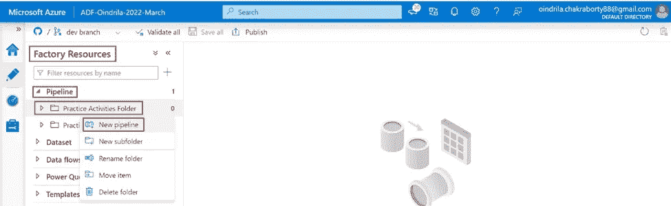

# Azure 数据工厂中的“设置变量”活动介绍

> 原文：<https://medium.com/codex/introduction-to-set-variable-activity-73bcddcf0318?source=collection_archive---------6----------------------->

# 什么是设置可变活动

***设置变量******活动*** 是**用来设置 的 ***值一个 ***类型的现有变量字符串*** 、***【Bool】***，或者 ***数组中定义的******数据工厂********

# **使用设置变量 Activity 创建管道**

*****第一步***-**-**打开 ***蔚蓝门户***(***portal.azure.com***)。**

****

*****第二步***-**-*点击*-**-**-*Azure 数据工厂资源*-**-**-*ADF-Oindrila-2022-March*-**。**

****

*****第三步***-The***Azure Data Factory******ADF-Oindrila-2022-3 月******设置页面*** 是 ***打开*** 。 ***点击******打开 Azure 数据工厂工作室******链接*** 。**

****

*****第四步***-Azure***数据工厂资源******ADF-Oindrila-2022-3 月*** 是 ***在*** 中打开的一个 ***新标签在******相同的浏览器***现在， ***点击******作者******链接打开******蔚蓝数据工厂*** ***处于编辑模式*** 。**

****

*****第五步*** - ***点击*******管道******类别*******资源浏览器*** ， ***点击*******

**********

********第六步***-**-*转到******参数******选项卡******管道******PL _ usepipeline variables***。 ***点击******+新建******链接添加*** 一个 ***参数******地址行******字符串******类型 ***提供******地址:M.G. Road 路 221 号。城市:加尔各答。状态:西孟加拉邦******为******默认值为******参数******address line***。********

******

******第七步***-**-*转到******变量******选项卡 ***管道******PL _ UsePipelineVariables***。 ***点击******+******新建******链接添加******变量与******名称******城市名称****字符串***做 ***不提供******默认值*** 。********

*中的 ***值一个 ***变量*** 可以 ***或者*** 被 ***提供为*** 一个 ***默认值******或者*** ，可以 ***设置 ***这里的*** ， ***值*** 会被 ***设置使用******设置变量******活动*** 。*******

***第八步***-**-*搜索******设置变量******活动****活动浏览器 和*

****

*****第九步***-**-*转到******变量******选项卡******设置变量******活动*** 。 ***点击***的 ***下拉框 ***名称属性*** 。这将 ***显示所有******变量出现在******流水线范围*** 。 ***选择******变量******城市名******从******下拉选项*** 。*****

****在******文本框中的值属性*** ， ***要么是****硬编码值*** ， ***要么是*** ， ***动态内容*** ，即 *****点击******文本框******值属性*** 。 ***链接******添加动态内容【Alt+Shift+D】***是 ***显示在*** 下的 ***文本框*** 。 ***点击******链接*** 。*****

**

****第十步***-的 ***值“***City name***”***变量*** 会在 ***表达式语言***——**——*@ substring(pipeline(). address line，add(index of(pipeline(). address line，' City:')，6)，sub(sub(indexof(pipeline()参数)。*******

*最后， ***点击******确定******按钮*** 。*

**

*   ****index of(Pipeline()parameters . address line，' City:')*** ***返回******位置**第一个出现******字母******C***， ***字****
*   ****加【index of(Pipeline)】parameters . address line，‘City:’(6)******返回*** 的 ***位置*的**的“ ***首字母*** 的“**串*串*** ，即 ***持有*** 的 ***值*** 的“之”
    这里，“ ***6*** 是 ***增加了*** ，因为，在“ ***首字母*** ”的“ ***串*** ，即 ***持有*** 的“ ***值*** 的“T68”*
*   ****index of【Pipeline】(【parameters . address line】‘State:’)******返回***the***Position*the**of***First Occurrence***the*Letter****S***"，of*
*   ****sub(index of(Pipeline(). address line，' State:')，2)*** ***返回****位置******最后一个字母******字符串*** ，即 ***持有******值***
    在这里， ***2*** 是 ***减去*** ，因为， ***字符串*** ，即 ***持有******值******属性******
*   ******sub(sub(index of(pipeline(). address line，' State:')，2)，add(index of(pipeline(). address line，' City:')，6))返回******差值*******位置******的最后一个字母*** 。 那个 ***保存着******属性******城市:****中的****地址线*******

****的 ***值***的 ***变量******城市名****现在显示为* 以下-****

********

*******第十一步*** - ***调试*** 流水线***PL _ UsePipelineVariables******查看******输出的******设置变量******活动* ***设置变量******活动*** 已经*运行成功。*******

**********

*****在****选项卡*** 中，将*输出 ***显示为******加尔各答***--*******

********