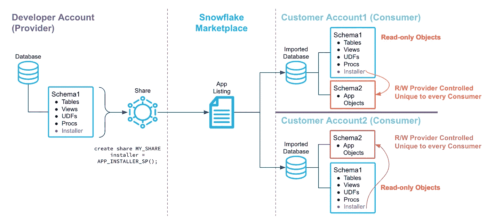

# 雪花原生应用简介

> 原文：<https://medium.com/codex/introduction-to-snowflake-native-application-bbd7d024b3db?source=collection_archive---------2----------------------->

# 背景

整个软件行业主要是基于应用和应用所基于的平台/框架。ISV 和开发人员构建应用程序来解决特定的问题，让用户更有效率，并从中获利。对所有人都是双赢。例如，2008 年，当苹果推出 iPhone SDK 供开发者在 iOS 平台上开发应用时，它彻底改变了移动行业。当开发者开发一个非常简单的应用程序，比如把屏幕变成手电筒，他们就发财了。

类似地，雪花提供了一个本地应用程序框架来在雪花数据云上构建应用程序。雪花之所以创建这样一个功能，是为了将应用程序转化为数据，而不是将数据转移到应用程序提供商，并继续打破孤岛的理念。有了这样的框架，应用程序提供商就不必管理基础设施，也不必担心保护敏感的客户数据。同时，应用程序消费者不必担心将敏感数据发送到其数据云之外。

# 介绍

Snowflake Native Apps 是一个使用 snow flake Native Application Framework 构建的应用程序，它利用了一组功能，如存储过程、任务、流、UDF、Snowpark 等。低代码 UX 框架(Streamlit)、遥测、记录和货币化。一旦应用程序构建完成，就可以通过雪花市场使用雪花强大的安全数据共享功能进行分发和交付。雪花市场就像一个应用商店。应用程序的消费者/用户可以在他们自己的雪花帐户中从雪花市场部署该应用程序。就像你用 AppStore 在 iPhone 上安装应用一样。创建应用程序的 ISVs 开发人员可以规定应用程序的盈利条款，无论是一次性收费、按月订阅还是免费！

雪花已经建立了数据清理室应用程序，Capital One 建立了一个名为 Slingshot 的应用程序，你可以在这里找到它。高盛也为他们的客户[开发了一个应用程序。](https://developer.gs.com/blog/posts/legend-plus-snowflake-native-apps)

# 体系结构

在上面左侧的架构图中，开发人员创建了他们自己的与应用程序相关的对象(表、视图等)和代码(UDF、存储过程、任务等)。除了“安装程序”之外，它与您今天进行的数据共享完全相同。安装程序是一个存储过程，通常用于运行一组 DDL 命令来创建应用程序所需的对象。当消费者从共享(上图的右侧)创建数据库时，他们还会获得安装程序存储过程，运行该存储过程可以在运行应用程序所需的另一个模式(让我们称之为 AppDB)中创建一组对象。此安装程序进程可以定制为基于安装程序中传递的参数创建不同的对象。这有助于开发人员根据客户可以启用的功能进行收费。请注意，数据存储在消费者帐户中，因此消费者负责支付用于处理数据和运行应用程序的存储和仓库费用。顺便说一下，开发者也可以向他们的客户提供一个雪花读写帐户，并向客户收费，如果他们的客户没有雪花帐户的话。开发人员/提供商无法登录消费者帐户，也看不到他们的数据。消费者对 AppDB 拥有完全控制权，并且可以控制 AppDB 如何与其帐户中的其他数据进行交互。

开发人员代码(逻辑和安装过程)有一个选项，使代码对客户不可见。这样他们就可以保护自己的知识产权。

# 构建雪花原生应用的一些想法:

*   行业模型—提供维度模型和自动化，以便将数据接收到特定行业(如零售、医疗保健等)的预定义维度模型架构中。
*   消费数据集市—提供模式以将消费数据从多个雪花型帐户输入，从而创建一个仪表板来监控雪花型帐户的消费和操作。
*   变更数据捕获和 SCD 类型 2:通过预定义的代码提供快速且易于构建的 CDC 和缓慢变化的维度类型 2。如果客户需要大量的表来提供数据的历史变化，这可能会很方便。
*   数据丰富:为客户数据集提供数据丰富，为客户提供一些个性化的数据。

# 摘要

雪花原生应用框架为开发者提供了开发和发布应用到雪花市场的能力。客户可以访问雪花市场，获得该应用程序，将该应用程序安全地安装在他们的雪花帐户中，将他们的敏感数据保留在他们的帐户中，而不是将其导出到 SaaS 应用程序中。Snowflake 确保开发人员和客户保护他们的数据/代码不受对方的影响。开发人员有不同的方法来开发应用程序，包括他们的代码如何运行，数据最终存放在哪里，数据如何流动，应用程序如何保护，以及如何向客户公开日志/应用程序活动。对开发者来说，最重要的部分是将开发者的创新工作货币化。

这项功能处于私人预览阶段(截至 2022 年 8 月)，但如果你想开始，请联系你的客户团队并阅读 [Brad Culberson](https://medium.com/u/34379116c51a?source=post_page-----bbd7d024b3db--------------------------------) 有一篇关于如何创建雪花原生应用的[好文章](/@bradculberson/my-first-native-application-on-snowflake-120b931d63c7)。

*免责声明:本文所表达的观点是我个人的，不一定代表我的雇主(雪花)。*