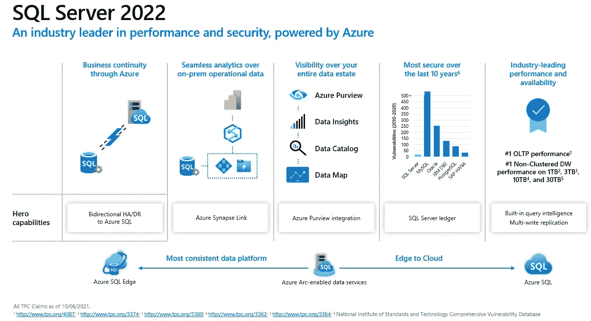

# SQL Server 2022 简介

> 原文：<https://medium.com/codex/introduction-to-sql-server-2022-a94695fdd166?source=collection_archive---------6----------------------->

## SQL Server 2022 是迄今为止与 Azure 连接最紧密的 SQL Server 版本！

在 [Ignite 2021](https://news.microsoft.com/ignite-november-2021-book-of-news/) 宣布，SQL Server 的下一个版本将被称为 [SQL Server 2022](https://www.microsoft.com/en-us/sql-server/sql-server-2022) ，CTP 和 RTM 版本将在 2022 年发布！

发布 SQL Server 2022 的文章可从[这里](https://cloudblogs.microsoft.com/sqlserver/2021/11/02/announcing-sql-server-2022-preview-azure-enabled-with-continued-performance-and-security-innovation/)获得。

SQL Server 2022 是迄今为止与 Azure 连接最紧密的 SQL Server 版本，在以下领域有重要创新:性能、安全性和连续可用性:

*   现在，通过 Azure SQL 托管实例中的链接功能，配置云灾难恢复变得更加容易
*   默认启用的查询存储与**智能查询处理**的**新一代**相结合，将允许在一些常见场景中提高性能，而无需更改 T-SQL 代码。**参数敏感性计划** (PSP)允许您缓存同一个参数查询的多个执行计划！**基数估计(CE)反馈**将为查询优化器和查询处理提供有关查询执行指标的更详细信息，以改进未来的决策！
*   安全性、可伸缩性和可用性方面的创新证实了 SQL Server 是全球最安全的 RDBMS 之一！
*   通过 **PolyBase REST API** 访问和使用**其他存储系统**的可能性为外部系统提供了新的集成场景
*   T-SQL 语言的新扩展将会让开发者非常高兴！

以下是了解 SQL Server 2022 更多信息的一些链接:

*   [了解有关 SQL Server 2022 的更多信息](http://aka.ms/sqlserver2022)
*   [注册申请 SQL Server 2022 早期采用计划，随时了解最新消息](http://aka.ms/EAPSignup)
*   [观看 SQL Server 2022 的技术深度剖析](http://aka.ms/sqlserver2022mechanics)
*   [注册参加 SQL Server 2022 网络研讨会](http://aka.ms/sqlserver2022webinar)
*   [不要错过我们曝光的数据](http://aka.ms/dataexposed)

 [## SQL Server 2022 简介(Ep.1)

### 请加入我们，了解 SQL Server 的最新版本，并了解它的所有新功能…

docs.microsoft.com](https://docs.microsoft.com/en-us/shows/data-exposed/introduction-to-sql-server-2022-ep1?WT.mc_id=DP-MVP-4029181) 

享受 SQL Server 2022！