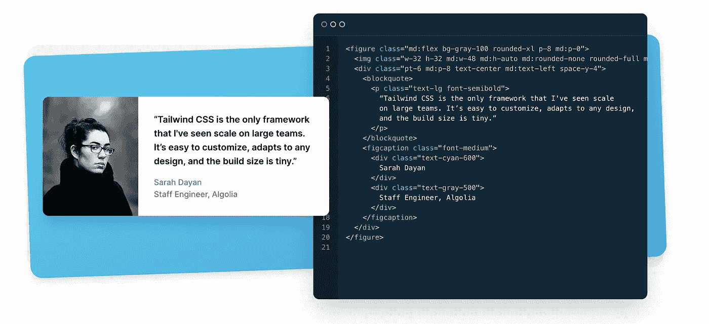

# TailwindCSS 简介

> 原文：<https://medium.com/codex/introduction-to-tailwindcss-90361b692f7a?source=collection_archive---------3----------------------->

Tailwindcss 是一个实用优先的 css 框架。它允许使用预定义的类别，如`text-center`、`mt-6`、`flex`等。

有了 Tailwind，你不需要考虑很多预定义的类，直接在项目中开始使用它们。在开始项目之前拥有所有的实用程序类不是很好吗？