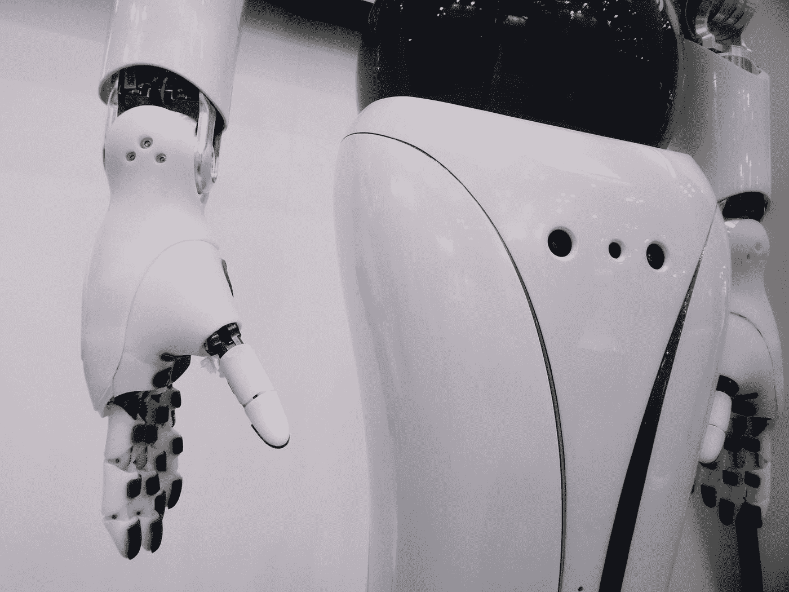

# 介绍商业领袖负责任的人工智能的 4 个原则

> 原文：<https://medium.com/codex/introduction-to-the-4-principles-of-the-responsible-ai-for-business-leaders-b7f5c8df5ba9?source=collection_archive---------7----------------------->

[附身摄影](https://unsplash.com/@possessedphotography?utm_source=medium&utm_medium=referral)在 [Unsplash](https://unsplash.com?utm_source=medium&utm_medium=referral) 上拍照

## [抄本](http://medium.com/codex)

## 如何实现开发和实现负责任的人工智能综述

人工智能(AI)技术促进了对每个人都有深远影响的决策，这就是为什么我们需要一个可靠的共享标准来确保 AI…