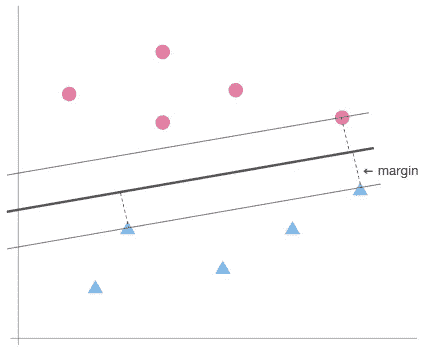

# 支持向量机简介

> 原文：<https://medium.com/codex/introduction-to-the-support-vector-machine-cd4a5857246e?source=collection_archive---------9----------------------->

## 从它如何分类到它如何执行多类分类

兰斯·阿斯佩在 [Unsplash](https://unsplash.com?utm_source=medium&utm_medium=referral) 上拍摄的照片

久而久之，我们开始处理不同类型的数据。以前因为计算能力有限，只考虑简单的数据。随着计算能力的增强，数据的范围也在扩大。现在，我们可以评估文本、图像和视频数据。这些数据的一个共同点是它们具有大量的特征，而传统方法在这些数据上通常表现不佳。所以在这种情况下，可以使用支持向量机。

# **以线性边界开始**

想象 10 个点如下图所示分布。你如何用一条线性边界来分类这些点？

10 分的分配

两个类中间的一条线可以正确的对分进行分类。

划分两个阶级的线

这条线是由以下等式定义的 2 维空间的超平面的例子

> B 在我们继续之前:一个**超平面**是一个 p 维空间中具有 p-1 维的子空间。因此，在二维空间中，超平面是一条线。在三维空间中，超平面是一个平面。

回到上面的例子，您可以通过将一个数据点插入超平面来对点进行分类。如果结果值大于 0，则该点位于超平面的上部。另一方面，如果该值小于 0，则该点位于下部。

用超平面的值对点进行分类

然而，上面显示的超平面并不是唯一可以分隔这 10 个点的线。正如你在下面看到的，可能有无限多的超平面分割这 10 个点。

可能的超平面的例子

因此，我们需要选择最好的一个。换句话说，它可以正确地对训练和测试观察进行分类。

# **什么被认为是最好的，为什么**

一种常见的方法是选择最大边缘超平面。顾名思义，它是一个具有最大边缘的超平面，边缘是训练观察和超平面之间的垂直距离。在下图中，边距用虚线表示。

边距用虚线表示

但是我们为什么要用最大余量来选择超平面呢？这是因为如果一个点远离超平面，我们可以对我们的预测更有信心。因此，将超平面放置在离训练观察尽可能远的地方，是比将超平面放置在训练观察附近更自然的选择。使用最大间隔超平面的分类器称为最大间隔分类器。

# **什么定义超平面的形状**

最大边缘线上的 3 个支持向量

从上面的图中，3 个点直接位于最大边缘线上。这些点被称为支持向量，它们的名字来源于这样一个事实，即最大边缘超平面的形状只取决于这些点。因此，如果我们移动其中一个支持向量，超平面的方向将会改变，如下所示。然而，在超平面的边缘之外移动或添加点不会改变它的方向。

仅仅一个支持向量如何改变超平面的演示

# **最大间隔分类器的问题**

最大间隔分类器的一个问题来自它的硬间隔。与上面的例子不同，如果在边缘内添加一个点，那么不可避免地要移动最大边缘超平面，以便它能够正确地对所有的观察结果进行分类。例如，如果将下面的点添加到上面的 10 个数据点，最大边缘超平面将如下所示移动。

在边缘内增加一个点如何改变超平面

这是一个非常巨大的变化。这是因为最大间隔分类器对于异常值来说是不鲁棒的，并且这种行为可能导致过度拟合。

最大间隔分类器的另一个限制是，找到一个能够正确分类每个观察值的超平面并不总是可能的。例如，当两个不同类别的点重叠时，不可能找到线性边界。

当类别重叠时

为了解决这些问题，我们可以使用支持向量分类器。

# **允许一些错误分类**

与最大间隔分类器不同，支持向量分类器实现了软间隔。正如你可以从它的名字推断的那样，软边允许观察在边的错误的一边，甚至是超平面的错误的一边。这些观察成为支持向量。

软边距允许在边距内进行一些观察

因此，它可能无法完美地分离两个类别，但它对于异常值是稳健的，并且能够正确地对大多数观察值进行分类。问题是软差值允许多少错误分类的案例。

如果只允许几个点，那么最终的差距将会很小。相比之下，如果允许大量的点数，那么最终的差额将会很大。

作为允许不同数量的错误分类的软边距，边距如何变化

每一种都有利弊。具有几个支持向量的窄差不太可能减少方差，并且偏差仍然很低。因此，仍然会有过拟合的问题。另一方面，具有许多支持向量的宽裕度将减少方差，但是由于可能穿过超平面的若干观察，可能增加偏差。因此，可能会出现欠拟合，而不是过拟合。

正如您所看到的，选择您的容忍程度与偏差-方差权衡有关，这可以通过 r 中 e1071 包的成本参数进行调整。通常，成本值是通过交叉验证选择的。

使用 e1071 包装中的调节()执行交叉验证

# **支持向量分类器的局限性**

然而，支持向量分类器仍然是一种线性方法。因此，当一个分布不是线性的，它不可避免地表现不佳。

显示线性方法不适用于非线性分布

因此，我们引入了支持向量机。

# **对于非线性边界—支持向量机**

为了增加非线性，支持向量机用预测器的多项式函数来扩大特征空间。意思是，不是 X1，X2 …，Xp，扩大的特征空间包括 X1，X1，X2，X2，…，Xp，Xp。但是这是如何带来非线性的呢？

在扩大的特征空间中，由于新的特征，线性不可分的数据点变得可分。通常，在扩大的特征空间中使用的判定边界是线性的。但是当我们将决策边界带到原始特征空间时，边界变成非线性的。也许，更好的方法是直观地了解这是如何工作的。

两类非线性分布

假设我们有如下的点分布。显然，线性决策边界在这种分布中表现不佳。在这种情况下，我们可以尝试通过添加由两个预测值组成的另一个维度来扩大特征空间。

在扩大的特征空间中变得可线性分离

现在有了 3 个预测值，就有可能线性分割这两个类别。而当我们把这个带回原来的特征空间，平面就变成了一个圆形的边界。

扩大的特征空间中的线性边界在原始特征空间中变成非线性的

然而，盲目地扩大特征空间会导致大量的特征最终变得难以计算。因此，支持向量机不是将预测器转换为多项式函数，而是使用测量观察值之间相似性的核来达到相同的效果，而无需显式地使用更高维度。

内核背后的数学解释不在本帖讨论范围之内，但是如果你有兴趣，[你可以关注这个链接](https://www.quora.com/What-are-kernels-in-machine-learning-and-SVM-and-why-do-we-need-them/answer/Lili-Jiang?srid=oOgT)。

# **不同类型的内核**

因为核与决策边界直接相关，所以核的选择取决于数据点如何分布以及数据集看起来如何。在 e1071 软件包的 svm 函数中，有 3 种常用的选择:线性、多项式和径向。

正如它们的名字所告诉你的，它们中的每一个都产生一个线性的、多项式的和圆形的判定边界。其中，线性核通常在有大量特征或计算时间至关重要时有用，因为它比其他核快得多。

线性核的例子

当使用多项式核时，其次数可以通过次数参数进行调整，次数越高，模型越灵活。

具有更高程度的模型具有更高的灵活性

另一方面，径向核的摆动可以通过 gamma 参数进行调整，gamma 值越高，摆动越多。

具有较高 gamma 值的模型会有更多的摆动

# **划分两个以上的类别**

因为支持向量机是支持向量分类器的扩展，所以支持向量机不适合多类分类。但是，有几个扩展可以处理这些问题。

第一种方法叫做一对一分类。顾名思义，这种方法每次评估一对类。

> 1.构造 K(K-1)/2 个支持向量机
> 
> 2.使用 K(K-1)/2 个支持向量机对观测值进行分类
> 
> 3.统计观察被分配到每个班级的次数
> 
> 4.为观察选择最常分配的类别

一对一的视觉效果

例如，如果有 3 个类别 a、b 和 c，那么这些类别就有 3 种组合:ab、ac 和 bc。因此，一对一分类构造了 3 个支持向量机。假设 ab 和 ac 选 a，bc 选 c。由于有 2 a 和 1 c，一对一分类会将观察结果分类为 a 类。

**一对全体** 也顾名思义，这种分类是将一个阶层与其他所有阶层进行比较。因此，这种方法不是将一个观察值分为两类，而是告诉它是否属于某一类。

> 1.构造 K 支持向量机
> 
> 2.使用 K 支持向量机对观察值进行分类
> 
> 3.选择一个概率分数最高的类
> 
> ([更详细的解释](https://jermwatt.github.io/machine_learning_refined/notes/7_Linear_multiclass_classification/7_2_OvA.html))

相比一对一，优势是显而易见的。它需要更少的 SVM，所以速度更快。然而，它的工作方式不可避免地带来了一个问题。例如，假设一个数据集中的 10 个类中的每一个都有 100 个样本。然后，每个 SVM 将在 100 到 900 个样本之间执行二元分类。这种不平衡的数据集会产生误导性的结果。由于这个原因，当给定多类变量时，e1071 包中的 svm()使用一对一方法。

# 参考

[1]阿尔邦，C. (2017 年 12 月 20 日)。*使用 RBF 核时的 SVC 参数*。克里斯·阿尔邦。【https://chrisalbon.com/code/machine_learning/support_】T2
vector _ machines/SVC _ parameters _ using _ RBF _ kernel/。

[2] Boehmke，B. (2020 年 2 月 1 日)。*用 r 动手机器学习*。第十四章支持向量机。[https://bradleyboehmke.github.io/](https://bradleyboehmke.github.io/HOML/svm.html.)T9[HOML/SVM . html .](https://bradleyboehmke.github.io/HOML/svm.html.)

[3]乔汉，未标明日期。*支持向量机的友好介绍*。KDnuggets。[https://www . kdnugges . com/2019/09/friendly-introduction-support-vector-machines . html](https://www.kdnuggets.com/2019/09/friendly-introduction-support-vector-machines.html.)

[4]詹姆斯·g .(2021)。*统计学习导论:r 中的应用*。斯普林格。

[5]奥列扎克，M. (2020 年 8 月 29 日)。Svm 内核:它们实际上做什么？中等。[https://towards data science . com/SVM-kernels-what-do-they-actually-do-56ce 36 f 4 f 7 b 8。](https://towardsdatascience.com/svm-kernels-what-do-they-actually-do-56ce36f4f7b8.)