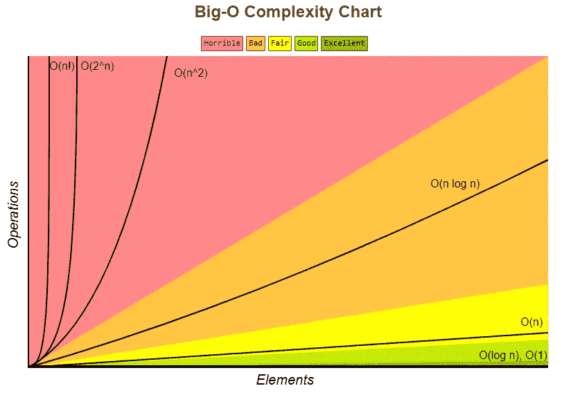
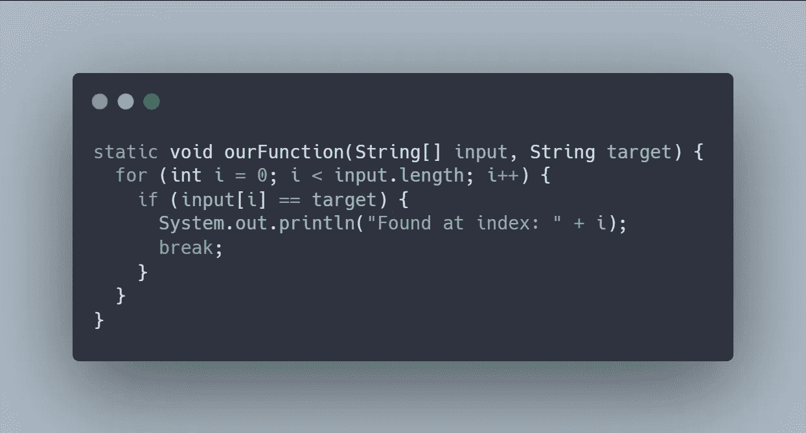
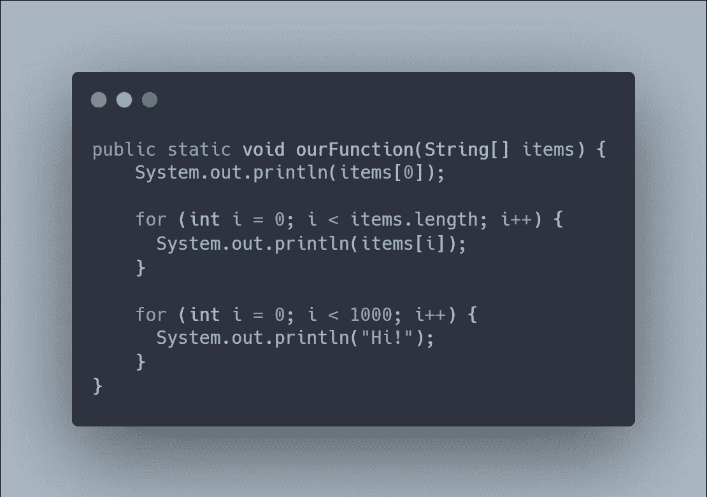
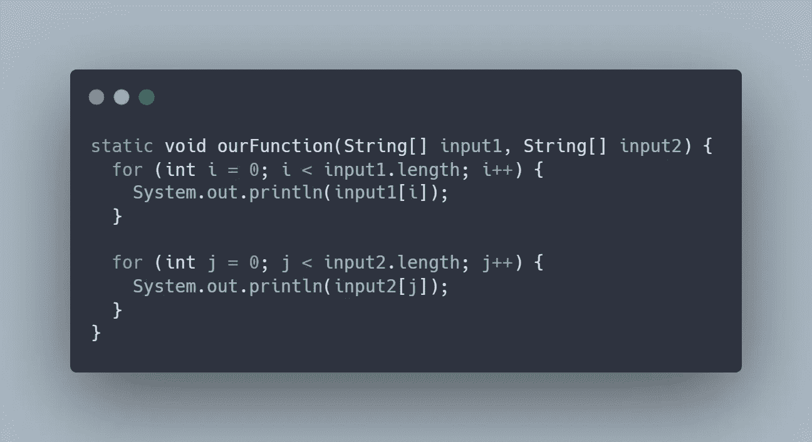
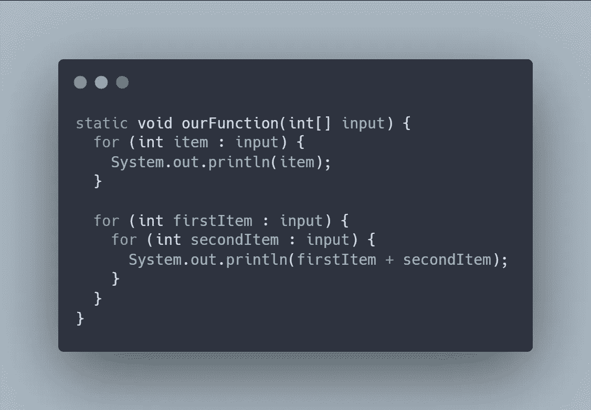

# 编程中的时间复杂性介绍:Big-O 符号

> 原文：<https://medium.com/codex/introduction-to-time-complexity-in-programming-big-o-notation-c44780c65739?source=collection_archive---------7----------------------->

我正处于编码面试对我来说有点可怕的阶段。这是招聘过程中我们大多数人都害怕的一个阶段。要度过这一关，需要耗费大量的精力和努力。这就是为什么，在过去的几周里，我一直在练习编写面试代码。我正准备面对一个编码面试，因为我最近一直在申请一个职位空缺。在编码面试中最常谈论的话题之一是 Big-O 符号。

每当我们编写和执行代码时，它都必须消耗我们的资源(在这种情况下是时间和空间)。时间是指代码将执行多长时间，而空间是指代码将占用我们多大的内存。这就是大 O 的由来。它用于测量我们代码的时间和空间复杂度。如果我们能够识别代码的复杂性，那么我们就能够提高它的性能。

# 大操作系统

有一个名为 [Big-O Cheat Sheet](https://www.bigocheatsheet.com/) 的网站，在那里我们可以找到不同 Big-O 符号的列表。它是从最差到最好排列的，你可以参考符号所在区域的颜色。

Big-O 复杂度图(来源:【https://www.bigocheatsheet.com/】T2)

根据上面的这些符号，我们可以在执行代码时使用它们来提高性能。例如，当我们创建一个复杂度为 O(n)的函数时，我们可能会想办法让我们的函数以更好的复杂度运行(这些复杂度被标记为一般、良好或优秀)。我们如何改进我们的代码？这就是数据结构和算法派上用场的时候。我们可以使用另一种方法来存储数据，或者我们也可以使用另一种方法来编写解决方案。

# 但是首先，我们需要能够确定代码的复杂性

当我们想要确定代码的复杂性时，有一个规则可以参考。这些是计算我们的 Big-O 的简单方法，而不是在我们的代码中一行一行地去做。

## 1.总是最坏的情况

你可能会猜测第一条规则是什么意思。这条规则表明，无论何时执行代码，我们都需要考虑可能的最坏情况。

例如，当我们使用循环访问数组成员时，我们会陷入 O(n)符号。但是，当我们只想找到某个成员，并且该元素是数组的第一个成员时，这意味着我们只运行一次迭代(如果我们在迭代成功找到特定元素时放置 break)。

但是，我们需要考虑这个循环的最坏情况。该项可能是数组的最后一个成员，这意味着我们需要遍历每个成员，直到找到我们需要的项。

## 2.移除常数

因为我们只关心代码的可伸缩性，所以我们可以很容易地删除 Big-O 中的常量。

在上面的代码片段中，我们有一个从数组中打印项目的函数。然后，它将遍历数组的每个成员，并再循环 100 次。如果我们逐行计算 Big-O，我们将得到 O(1 + n + 1000)。

常量的问题是，无论何时输入或数组大小改变，它们都不会改变。如果我们传递一个 10 个成员的数组，那么 n 将由 10 个成员组成。但是，如果我们传递一个一百万的数组，那么 n 的值也是一百万。但是，常数会保持不变。

## 3.不同的输入应该有不同的变量

第三条规则非常简单，我们需要在代码中为不同的输入使用不同的变量。所以，如果你有一个有两个输入的方法，比如输入 1 和输入 2。然后，该方法将逐个遍历 input1 成员，并对 input2 执行同样的操作。这个案子的关键是什么？

好的，如果你遵循我们的规则，那么你可能已经猜到在我们的大 O 中有两个不同的变量，它是 O(a + b)。这与 O(n)基本相同，但是 O(n)意味着我们有一个输入。在这种情况下，我们有两个输入，这两个输入可能有不同的成员数，所以我们需要为 Big-O 指定两个不同的变量。

## 4.删除非主导术语

最后，我们来到了最后一条规则。让我们看一下下面的例子，因为如果我们看一个例子会更容易理解。

上面的代码片段复杂度为 O(n + n)。因为规则说要去掉非支配项，这意味着我们需要去掉 n，只留下 n，所以它是 O(n)。为什么？因为，使用 Big-O，我们关心代码的可伸缩性。一旦将来我们的投入越来越大，n 将消耗更多的资源。我们想把重点放在最糟糕的部分，这就是为什么我们只为我们的 Big-O 选择主导术语。

仅此而已！我们已经讨论了为什么我们需要理解时间复杂性，不同的 Big-O 符号，以及确定 Big-O 的规则。这是我最近的在线课程[Master the Coding Interview:Data Structures+Algorithms](https://www.udemy.com/course/master-the-coding-interview-data-structures-algorithms/)的摘要，来自 Andrei Neagoie(我建议你购买并观看课程，Andrei 比我更好地解释了这个概念)。该课程还解释了一些我在本文中还没有涉及到的概念。

我知道这篇文章只涉及了 Big-O 的基础知识，我计划再写一篇文章来更深入地探讨这个概念。也许我会解释一下我们从上面的图表中看到的每个大操作系统。