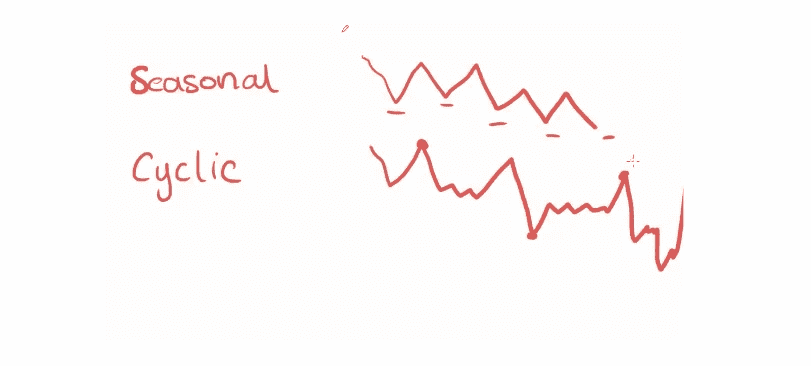

# 时间序列预测简介:平滑方法

> 原文：<https://medium.com/codex/introduction-to-time-series-forecasting-smoothing-methods-9a904c00d0fd?source=collection_archive---------4----------------------->

## 时间序列的基本术语，预测的平滑方法和 Python 三重指数平滑的应用示例，超参数优化

嘿，我已经有一段时间没写信了。事实上，我错过了这个平台，但是我有借口为什么我不能写任何出版。我已经非常接近完成我的大学教育，并且在这几个星期里我在我的职业生涯中做了一些改变，我不能写。谢天谢地，现在我可以在^^.写我想要的东西了

在这个故事中，我们将讨论什么是时间序列预测，它的基本术语是什么，以及我们如何在 Python 中应用它们。我希望你喜欢并从这个故事中提取花絮。


凯文·Ku 在 [Unsplash](https://unsplash.com/s/photos/time-series-forecasting?utm_source=unsplash&utm_medium=referral&utm_content=creditCopyText) 上的照片

# 时间序列的基本术语(预测)

我们可以说基于时间序列的工作在这个领域占有很大的份额。基于有序时间观察创建的数据称为“时间序列”。我们将解释 4 个基本术语来理解时间序列。

*   静止的
*   趋势
*   季节性
*   循环

## 静止的

*   平稳表示时间序列的统计特征不随时间而变化。
*   如果一个时间序列的均值、方差和协方差不变，并且随时间稳定，我们可以说这个时间序列是平稳的。

下面有一个平稳时间序列的示例图片。


图片由 [VBO](https://www.veribilimiokulu.com/)

## 趋势

*   趋势表示时间序列的增加或减少。
*   长期趋势是一个时间序列的递增或递减结构。

我们在下面看到增加和减少时间序列的例子。


一个递增时间序列的例子|图片由 [VBO](https://www.veribilimiokulu.com/) 拍摄


时间序列增加的示例|图片由 [VBO](https://www.veribilimiokulu.com/) 提供

## 季节性

*   这个术语基本上问了这个问题:趋势是否遵循一个模式？
*   我们说，如果有一个按周期发生的模式，时间序列中就有季节性。

我们看到一个具有季节性的时间序列示例如下。


图片由 [VBO](https://www.veribilimiokulu.com/)

## 循环

*   周期有点类似于季节性。然而，它弱于季节性，以显示出现的模式。
*   它包含重复的模式。
*   处理时间序列中的季节性模式既简单又快捷。
*   在周期时间序列中，模式是长期的，很难在短期内处理它们。

下面我们看一张图来想象周期和季节时间序列的区别。



图片由 [VBO](https://www.veribilimiokulu.com/)

## 水平

该水平是时间序列的平均值。

# 对时间序列本质的理解

一般规则:时间序列更容易受到前一个时间序列的影响。例如，6 月 2 日的销售比 6 月 1 日的销售更有效。为了更好地理解这条规则，我们将学习两个关键术语:移动平均线和加权平均线。

## 移动平均数

简而言之，这个平均值告诉我们一个时间序列的未来值是它的`k`以前值的平均值。


图片由 [VBO](https://www.veribilimiokulu.com/)

我们看到一个低于 4 天的移动平均线的例子。


图片由 [VBO](https://www.veribilimiokulu.com/)

## 加权平均值

它类似于移动平均线。它的主要思想是给予最新的观察更多的权重(重要性)。


图片由 [VBO](https://www.veribilimiokulu.com/)

我们在下面看到一个加权平均计算的例子。


图片由 [VBO](https://www.veribilimiokulu.com/)

现在，我们知道了理解时间序列预测的基本术语。时间序列预测有 3 种类型:

*   平滑方法
*   统计方法
*   机器学习

在这个故事中，我们将深入探讨平滑的方法。

# 平滑方法

有 3 种不同的平滑方法可用于 3 种不同的情况:

*   单一指数平滑法
*   双指数平滑法
*   三重指数平滑(TES)

我们将解释我们上面提到的所有这些方法，并做一个关于 TES 的应用实例。

## 单一指数平滑法

这种方法只适用于平稳的时间序列。如果要用这种方法，时间序列就不应该有趋势性和季节性。

这种方法:

*   可以处理水平
*   通过指数校正进行预测
*   根据“未来与过去更相关”对以前的值进行加权
*   按以前的实际值和以前的预测值进行预测(以指数方式给出权重)

这种方法的公式:


图片由 [VBO](https://www.veribilimiokulu.com/)

*   y_hat t:要预测的时间单位
*   yt-1:以前的 act 值(学习，方法从这个值学习)
*   y_hat t-1:以前的预测值(记住，方法是从这个值开始记忆)
*   答:平滑因子。它介于 0 和 1 之间

因此，该方法使用先前的实际值和先前的预测值来预测下一个值。


SES |图片示例 [VBO](https://www.veribilimiokulu.com/)

## 双指数平滑法

这种方法适用于平稳和趋势时间序列。如果要用这种方法，时间序列应该没有季节性。

这种方法

*   能够处理水平和趋势
*   考虑趋势效应的指数修正
*   除了 SES，趋势也被考虑在内
*   应该用在没有季节性和单一变量(特征)的时间序列上

公式:


图片由 [VBO](https://www.veribilimiokulu.com/)

最新的等式告诉我们，下期=级别+趋势。在均值上，下期=上期均值(水平)+趋势。


SES |图片示例由 [VBO](https://www.veribilimiokulu.com/)

## 三重指数平滑法(TES，又名霍尔特-温特斯)

这种方法适用于平稳、季节性和趋势性的时间序列。

这种方法；

*   能够处理水平、趋势和季节性
*   除了 SES 之外，趋势和季节性也被考虑在内
*   是改进最多的平滑方法
*   预测动态地考虑水平、趋势和季节性
*   应与具有趋势和/或季节性以及单一变量(特征)的时间序列一起使用

这种方法的公式:


图片由 [VBO](https://www.veribilimiokulu.com/)

## 平滑方法汇总表

我们在下面看到了我们上面谈到的平滑方法的对比表。


图片由 [VBO](https://www.veribilimiokulu.com/)

# Python 三重指数平滑的应用实例

在这一节中，我们将用 Python 做一个应用实例来应用 TES 方法。我为这部分准备了一个 Kaggle 笔记本。我们将使用来自`statsmodels`的名为`co2`的数据集。您可以使用下面的链接浏览笔记本。

[](https://www.kaggle.com/enesbaysan/applied-example-of-triple-exponential-smoothing) [## 三重指数平滑的应用实例

### 使用 Kaggle 笔记本探索和运行机器学习代码|使用来自无附加数据源的数据

www.kaggle.com](https://www.kaggle.com/enesbaysan/applied-example-of-triple-exponential-smoothing) 

## 安装包

首先，我们需要安装并导入所需的包。

```
import itertools
import warnings
import matplotlib.pyplot as plt
import numpy as np
import statsmodels.api as sm
from sklearn.metrics import mean_absolute_error
from statsmodels.tsa.holtwinters import ExponentialSmoothing
```

我不需要安装软件包，因为我正在使用 Kaggle。然而，如果你在本地工作，也许你需要安装软件包。在这种情况下，您可以使用下面的代码。

```
!pip install matplotlib
!pip install numpy
!pip install statsmodels
!pip install sklearn
```

## 加载和准备数据

在这个应用示例中，我们将使用上面提到的`statsmodels.api`包中的 CO2 数据集。该数据集是 1958 年 3 月至 2001 年 12 月期间 CO2 记录。

```
data = sm.datasets.co2.load_pandas()
y = data.data
y.head()
```


作者图片

该数据集的时间范围是每周。我们将把范围从每周改为每月。

```
y = y['co2'].resample('MS').mean()
```

然后，我将检查是否有空值。

```
y.isnull().sum()>>> 5
```

我将填写这 5 个空值。为此，我使用了`bfill`方法。如果一个观察值为空，则自动填充下一个观察值。

```
y = y.fillna(y.bfill())
```

并获得数据集的第一个概览。

```
y.plot(figsize=(15, 6))
plt.show()
```


作者图片

## 创建比较训练值、测试值和预测值的函数

我们可以使用下面的函数直观地比较实际值和预测值。

```
def plot_co2(train, test, y_pred, title):
    """
        This function to visualize the act and predicted value of y
    """
    mae = mean_absolute_error(test, y_pred)
    train["1985":].plot(legend=True, label="TRAIN", title=f"{title}, MAE: {round(mae,2)}")
    test.plot(legend=True, label="TEST", figsize=(6, 4))
    y_pred.plot(legend=True, label="PREDICTION")
    plt.show()
```

我们使用“train["1985":]”来缩小可视化的范围。

## 创建 TES 模型

我将把我的数据集分成训练和测试部分。

```
# from 1958 to end of the 1997
train = y[:'1997-12-01']
len(train)  # 478 month# from 1998 to first month of the 2001
test = y['1998-01-01':]
len(test)  # 48 ay
```

现在，我将基于上面划分的训练数据集创建(训练)一个 TES 实例(模型)。为了创建一个 TES 实例，我们使用来自`statsmodels.tsa.holtwinters`包的`ExponentialSmoothing`。

```
tes_model = ExponentialSmoothing(train,
   trend="add",
   seasonal="add",
   seasonal_periods=12
   ).fit(smoothing_level=0.5,
         smoothing_trend=0.5,
         smoothing_seasonal=0.5
   )
```

现在，我可以通过使用我创建的 TES 实例来预测 N 步之后的情况。我们在 48 步后进行预测，并将预测值存储到`y_pred`变量中。

```
y_pred = tes_model.forecast(48)
```

我们可以使用我们上面创建的名为`plot_co2`的方法来可视化真实值和预测值。

```
plot_co2(train, test, y_pred, "Triple Exponential Smoothing")
```


作者图片

实际上，我们已经完成了“用 Python 实现三重指数平滑的应用示例”。然而，我不想就此打住。因为还有一个非常重要的话题:TES 的超参数优化。我们将在下一节学习如何优化 TES 的超参数。

## 三重指数平滑的超参数优化

在开始如何为 TES 优化超参数之前，我想先简单介绍一下什么是超参数。超参数是创建或构建模型时使用的参数。举个例子，我们上面看到 TES 公式中有一些参数。我们可以通过播放这些参数来创建 TES 模型。我们可以尝试使用不同的参数来获得模型的最佳结果。这就是超参数调整/优化。

我已经编写了一个函数来优化 TES 模型。我不想一行一行地解释这个故事中的代码。如果您想获得更多细节，可以通过 Kaggle 链接，通过注释行来更好地理解代码。

```
def tes_optimizer(train, test, abg, trend_mode='add', seasonal_mode = 'add', seasonal_period=12,step=48):
    """
        This function to optimize hyperparameters for the TES model
    """
    best_alpha, best_beta, best_gamma, best_mae = None, None, None, float("inf")for comb in abg:
        tes_model = ExponentialSmoothing(train, trend=trend_mode, seasonal=seasonal_mode, seasonal_periods=seasonal_period).\
            fit(smoothing_level=comb[0], smoothing_trend=comb[1], smoothing_seasonal=comb[2])
        y_pred = tes_model.forecast(step)
        mae = mean_absolute_error(test, y_pred)
        if mae < best_mae:
            best_alpha, best_beta, best_gamma, best_mae = comb[0], comb[1], comb[2], mae
        print([round(comb[0], 2), round(comb[1], 2), round(comb[2], 2), round(mae, 2)])print("best_alpha:", round(best_alpha, 2), "best_beta:", round(best_beta, 2), "best_gamma:", round(best_gamma, 2),
          "best_mae:", round(best_mae, 4))return best_alpha, best_beta, best_gamma, best_mae
```

我们在上面看到了优化函数。为了使用该功能，我将创建超参数对。该函数将尝试每一对以在模型上获得更好的结果，然后返回最佳参数。

```
alphas = betas = gammas = np.arange(0.10, 1, 0.20)abg = list(itertools.product(alphas, betas, gammas))
```

然后，我将这些参数推送给优化器函数，以获得最佳参数。

```
best_alpha, best_beta, best_gamma, best_mae = tes_optimizer(train,test, abg)
```

## 决赛最佳 TES 模特

我们拥有创建或构建新 TES 模式的最佳参数。让我们使用参数创建一个新模型。

```
final_tes_model = ExponentialSmoothing(train, trend="add", seasonal="add", seasonal_periods=12).\
            fit(smoothing_level=best_alpha, smoothing_trend=best_beta, smoothing_seasonal=best_gamma
```

然后用最终模型预测 48 步。

```
y_pred = final_tes_model.forecast(48)
```

现在，如果我们使用上面创建的 visualizer 函数，我们可以看到优化模型和未优化模型之间的成功差异。


作者图片

如果你看一下之前的 TES 结果图表，你就会明白为什么超参数优化如此重要。

# 最后

希望你喜欢这个。我喜欢编码和解释。我更愿意给出一个 TES 的应用例子，而不是 DES 和 SES。因为，正如我们之前提到的，TES 是平滑方法中改进最多的方法。我希望您将使用它来构建自己的项目。

亲切的问候。