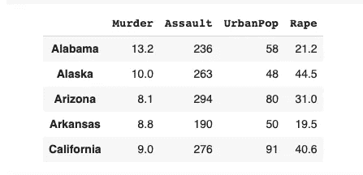

# 无监督学习和 K-Means 简介

> 原文：<https://medium.com/codex/introduction-to-unsupervised-learning-and-k-means-ee8f103ac70a?source=collection_archive---------5----------------------->

## Python 中 K-Means 算法的优化及弯头可视化

在这个故事中，我们将试图理解什么是无监督学习，我们将做一个关于无监督学习的例子。


照片由[通讯社在](https://unsplash.com/@olloweb?utm_source=unsplash&utm_medium=referral&utm_content=creditCopyText) [Unsplash](https://unsplash.com/s/photos/learning?utm_source=unsplash&utm_medium=referral&utm_content=creditCopyText) 上的跟踪拍摄

# 无监督学习

基本上，我们可以说，如果因变量(目标变量)不在数据集中，那么这个问题就是一个无监督学习问题。无监督学习算法不需要因变量(目标变量)。我们可以使用无监督学习来解决以下问题:

*   使聚集
*   联合
*   异常检测

# k 均值

K-Means 是无监督学习的一种基本算法。这是一种划分方法。基本上就是把`n`点分成`k`簇。K-Means 使用数据点的距离来划分`k`聚类。由于使用了距离，该算法无疑会受到离群点的影响。为了避免这种情况，我们可以调整异常值并缩放数据。对 K-Means 使用非数值数据是不可能的。

我们看到 K-的输入意味着如下:

*   d:数据库，数据。{t1，t2，t3 … tn}
*   k:我们想要划分的集群数量

应用 K-Means 的步骤:

*   分配随机{m1，m2 … mk}平均值
*   为每个`tn`分配最近的平均聚类
*   为每个聚类重新分配 mk 值(平均值)
*   从第一步开始重新申请
*   如果值的分类没有变化，则返回分类

K-Means 只给出一个输出:聚类。

# 在 Python 中应用 K-Means

我将在 Google Colab 上做例子。在做这些例子时，我们将使用这个数据集。该数据集包含美国各省的暴力统计数据。我们将把省份分成随机数量的群。在第二个示例中，我们将尝试找出划分的最佳集群数量。

## 设置工作空间并获取数据

首先，我将在 Colab 中执行这些行。

```
!pip install numpy
!pip install pandas
!pip install matplotlib
!pip install sklearn
!pip install yellowbrick
```

然后，我将导入所需的包。

```
import numpy as np
import pandas as pd
import matplotlib.pyplot as plt
from sklearn.preprocessing import MinMaxScaler
from sklearn.cluster import KMeans
from yellowbrick.cluster import KElbowVisualizer
```

现在我可以读取数据了。

```
df = pd.read_csv('https://raw.githubusercontent.com/vincentarelbundock/Rdatasets/master/csv/datasets/USArrests.csv',index_col=0)df.head()
```



作者图片

## 应用 K-均值

如前所述，K 均值会受到异常值的影响。在这个例子中，我不会做详细的特征工程。我只是简单地缩放数据框。

```
scaler = MinMaxScaler((0,1))scaled_df = scaler.fit_transform(df)
```

现在我们可以创建一个 K 均值模型。我将创建模型并对其进行拟合。

```
kmeans = KMeans(n_clusters=2)kmeans.fit(scaled_df)
```

我们将数据分为两类。稍后我们将看到如何找到最佳的集群数。现在我想重点介绍一下 K 均值模型的一些属性。

```
kmeans.n_clusters # total count of clusterskmeans.cluster_centers_ # clusters' centerskmeans.labels_ # a label for each observationkmeans.inertia_ # we can say sum of error
```

我们可以通过`inertia`值来测量误差。基本上，它代表了质心和观测值之间距离的总和。

应该注意的是，`cluster_centers_`属性将质心表示为观察值。我强调了`cluster_centers_`，因为我们将使用它们来可视化集群中心。

## 可视化集群

在本节中，我们将可视化数据。首先，我要将其转换为数据框。

```
scaled_df = pd.DataFrame(scaled_df)
```

你可能会问，我们如何用 4 维来可视化数据？稍后，我会写什么是主成分分析，我们将知道如何可视化超过 3 维的数据。但是现在，我只想象二维空间。

```
plt.scatter(scaled_df.iloc[:, 0],
scaled_df.iloc[:, 1],
c=kmeans.labels_,
s=50,
cmap="viridis")
plt.show()
```


作者图片

## 可视化质心

如果我们想要可视化质心，我们需要使用质心的点在我们上面画的第一个图的基础上创建另一个图。

```
# getting centroids
centroids = kmeans.cluster_centers_ # plotting the data by 1st and 2nd dimensions
plt.scatter(scaled_df.iloc[:, 0],
scaled_df.iloc[:, 1],
c=kmeans.labels_,
s=50,
cmap="viridis")# plotting the centroids
plt.scatter(centroids[:, 0],
centroids[:, 1],
c="red",
s=200,
alpha=0.8)plt.show()
```


作者图片

如果我打印`centroids`变量，我会看到像观察一样的点。质心的值是每个变量聚类的最佳点。


作者图片

## 手动方法查找最佳聚类数

我们可以使用[肘](https://en.wikipedia.org/wiki/Elbow_method_(clustering)#:~:text=In%20cluster%20analysis%2C%20the%20elbow,number%20of%20clusters%20to%20use.)方法来找到最佳集群数。为此，我将创建两个变量:`inertias`和`cluster_range`。

```
inertias = []cluster_range = range(1,20)
```

`inertias`将存储每个聚类计数的惯性，`cluster_range`将存储聚类计数的范围。我将创建一个循环直到`cluster_range`并计算惯性，然后将簇计数的惯性附加到`inertias`。

```
for cluster_count in cluster_range:
    kmeans = KMeans(n_clusters=cluster_count).fit(scaled_df)
    inertias.append(kmeans.inertia_)
```

我已经准备好在同一个图上可视化误差和聚类数，以便通过 Elbow 方法确定最佳聚类数。

```
plt.plot(cluster_range, inertias)
plt.xlabel("Inertia Value for each Cluster Count")
plt.title("Cluster Count")
plt.show()
```


作者图片

似乎 3 是集群的合理计数。现在，我可以通过向`n_clusters`属性传递 3 来创建一个新的 K-Means 模型。

## 使用包查找最佳聚类数

此外，我们可以使用`yellowbrick`包来自动寻找最佳集群数。

我将创建一个空的 K-Means 模型，并将这个模型传递给 **KElbowVisualizer** 函数。然后，我要通过`scaled_df`来拟合。

```
model = KMeans()kelbow = KElbowVisualizer(model,k=(1,20))kelbow.fit(scaled_df)
```

我可以使用`kelbow.show()`方法绘制肘值。


作者图片

此外，我还可以获得集群数量的最佳值。

```
kelbow.elbow_value_>>> 3
```

## 匹配标签和数据

在这一节中，我将使用最佳聚类数创建一个 K-Means。然后，我将观察结果分成 3 组。最后，我将合并标签和未缩放的原始数据。

```
model = KMeans(n_clusters=3)model.fit(scaled_df)df['Label'] = model.labels_df.head()
```


作者图片

# 最后

我写这篇文章的时候很享受。希望你也喜欢。此外，你可以查看我的个人资料，了解我关于机器学习和数据科学的其他内容。

亲切的问候。