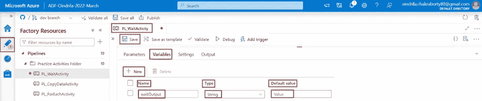

# Azure 数据工厂中的“等待”活动介绍

> 原文：<https://medium.com/codex/introduction-to-wait-activity-in-azure-data-factory-d60c4c037f91?source=collection_archive---------9----------------------->

# 什么是等待活动

当 ***等待******活动*** 被**用在一个****管道中等待******指定的时间段*** ***之后再继续执行后续的******

**********等待******活动******等待的时间段*** 需要在**中指定*********

# ****使用等待活动创建管道****

*******第一步***-**-*打开****(***【portal.azure.com】***)。*****

********

*******第二步***-**-*点击*-**-**-*Azure 数据工厂资源*-**-**-*ADF-Oindrila-2022-3 月*-**。****

********

*******第三步*** -将 ***Azure 数据工厂******ADF-Oindrila-2022-3 月******设置页面*** 为 ***打开*** 。 ***点击******打开 Azure 数据工厂工作室******链接*** 。****

********

*******第四步*** -第 ***Azure 数据工厂资源******ADF-Oindrila-2022-3 月*** 是 中 ***打开的一个 ***新标签页在******相同的浏览器*** 。现在， ***点击******作者******链接打开******Azure 数据工厂*** ***处于编辑模式*** 。*******

******

******第五步***-**-*点击*******管道******类别*** ***中的*** ***资源浏览器*** ，****

********

*******第六步***-***目标*** 是为了**创建***管道参数******waitTimeInSecond****Int***********

******另外 ***创建另一个*** ***管道参数******waitFinishMessage******字符串******类型*** ，并且，用 ***默认值*********

**********流水线*** ***等待******指定时间段*** ，它 ***赋值******值******流水线参数******waitFinishMessage**********

*********步骤 6.1***-**-*创建*-**-*两个管道参数-*-**-**-*waitTimeInSecond*-**--**-**-*Int*-**- *****waitFinishMessage*******String******Type***， ***提供******等待结束************

************

*********步骤 6.2*** -现在， ***创建*** 一个 ***管道变量******wait output******字符串******类型*** 。做 ***不提供*** 任何 ***默认值*** 。******

************

*********步骤 7-*** ***搜索******等待******活动****中的 ***活动浏览器******将其拖动到******设计器窗格中的**********

****************

***********第八步***-**-*转*** 到 ***设置******页签*** 。 ***点击******滑块文本框*******属性*** 。 ***链接******添加动态内容【Alt+Shift+D】***是 ***下显示的******滑块*** 。 ***点击******链接*** 。*********

************

*********第九步***-***参数******waitTimeInSecond***"是 ***中显示的*******可用参数*** 。 ***点击******参数******等待时间秒****下的 ***部分******参数*** ，********

************

*********第十步*** - ***搜索******设置变量******活动*******活动浏览器******将其拖动到******设计器窗格*** ***等待******活动到******输入******设置变量******活动*** 。*******

**********

********第十一步***-**-*转到******变量******标签******设置变量****活动*** 。 ***点击*******名称属性*** 。这将 ***显示所有******变量出现在******管道范围*** 中。 ***选择******变量******wait output******从******下拉选项*** 。********

*******点击******文本框******值属性*** 。 ***链接******添加动态内容【Alt+Shift+D】***是 ***显示在*** 下的 ***文本框*** 。 ***点击******链接*** 。****

********

****的 ***值 ***变量******wait output******需要*** 为 ***设置*** 为*** 的 ***值 ***参数******waitFinishMessage* ***选择******参数******waitFinishMessage******从******可用参数列表*** 。最后， ***点击******确定******按钮*** 。*********

**

****第十二步***-**-*调试*** 流水线*****PL _ wait Activity******查看******输出*** ******管道******PL _ wait activity***已经 ***运行成功*** 。******

******它的*** 可以被 ***看到*** 它的 ***等待******活动执行*** 为 ***75 秒*** ，即 ***1 分 15 秒***将 ***等待******活动控制权转移给******设置变量******活动上的******第 76 个*** ，即 ***当******

******

***在****页签******输出*** 被 ***显示*** 由 ***设置变量******活动*** 被 ***等待结束***--****

********