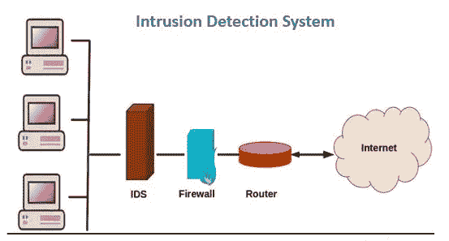
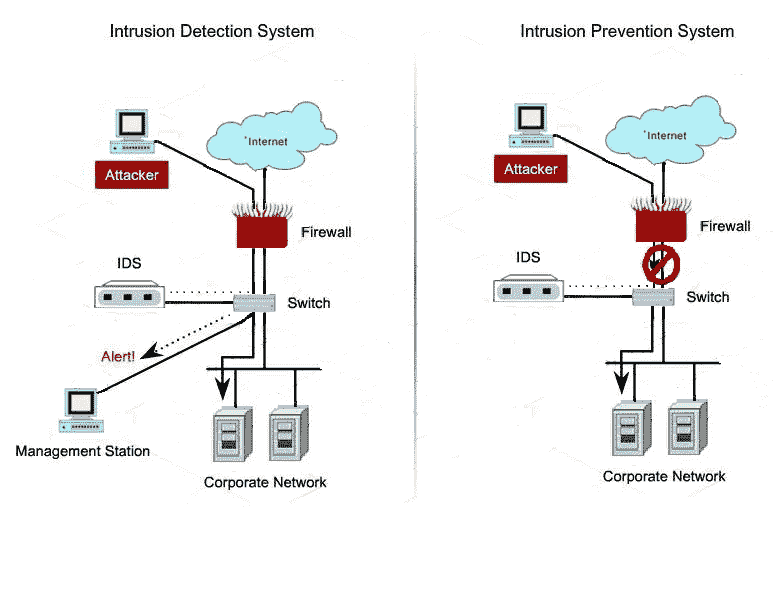
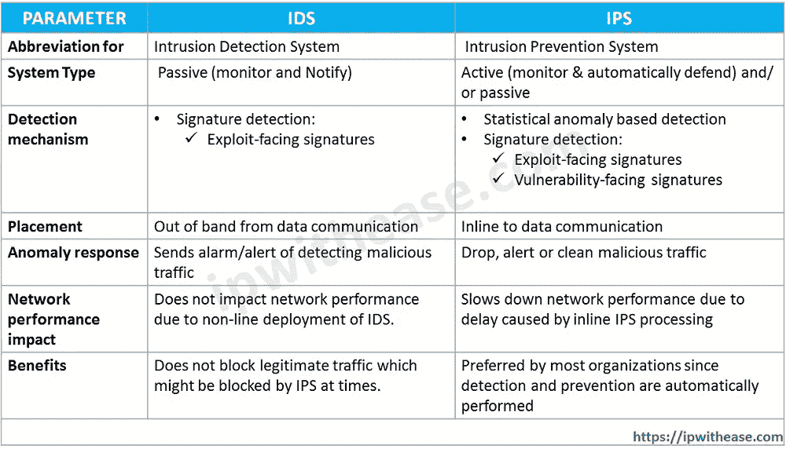

# 入侵检测

> 原文：<https://medium.com/codex/intrusion-detection-8b192f789f49?source=collection_archive---------8----------------------->

## 你没有注意到的安全问题。

[贝尔纳德在 Unsplash 上拍摄](https://images.unsplash.com/photo-1520697830682-bbb6e85e2b0b?ixlib=rb-1.2.1&ixid=MnwxMjA3fDB8MHxzZWFyY2h8N3x8c2VjdXJpdHl8ZW58MHx8MHx8&auto=format&fit=crop&w=500&q=60)

数字世界正在发生很多变化，不是吗？即使采取了大量的安全措施，我们也无法让我们的系统预防所有的伤亡。入侵是网络攻击者用来制造系统漏洞的一个重要概念。让我们来看看入侵到底是怎么回事。

# 闯入

简单地说，入侵可以定义为在数字网络上进行可疑活动的任何未经授权的非法手段。这些活动通常由个人或有组织团体的成员进行，并有一定的目标或经济回报。这些成员执行网络活动，包括身份盗窃、盗窃和金融凭证、企业间谍、数据勒索软件、网络钓鱼以及拒绝服务攻击，以利用系统漏洞进行非法使用。

[根据 puprlesec.com 的数据，近**6000 万**美国人受到身份盗窃的影响，大多数入侵活动发生在美国，占 38%，其次是印度(17%)、日本(11%)和俄罗斯(4%)。](https://purplesec.us/resources/cyber-security-statistics/#:~:text=Federal%20And%20Local%20Government)

## 入侵者的分类

[入侵者技能组合—图片](https://www.pexels.com/photo/business-code-coding-computer-270632/)

为了对入侵者进行分类，入侵者可以被识别为**网络活动家**或**黑客活动家**，他们为政治或社会事业工作，窃取用户的所有原始数据和凭证。这些入侵者被分类为:

*   ***Masquerador* :** 攻击者(个人)，伪装成非合法用户，非法应用从外部渗透合法用户账户的技术。
*   ***误发者:*** 合法的授权用户(权利所有者)，执行未经授权的操作，向攻击者提供对私有和机密信息的访问权限，并通过失去他们的权限使他们的系统易受攻击者攻击。这个用户来自内部。
*   ***秘密用户:*** 这些用户既可以来自内部，也可以来自外部。这些攻击者通过控制系统和访问来逃避审计收集和访问控制。

# 入侵者及其技能

正如罗伯特·格林所说，

> "未来属于那些学习更多技能并以创造性的方式将它们结合起来的人."

入侵者还根据他们在创建和探索创建和识别漏洞的新方法方面的技能进行分类。因此，这些入侵者在他们的技能组合上被分类为:

*   **学徒:**这些入侵者通常是具备基本技能的初学者。他们的知识是有限的，通常使用非常容易纠正的开发脚本。这些攻击者也被称为**脚本杀手**。
*   **熟练工:**熟练工是指正在努力提高自己技能的进攻者。熟练工的技能相对来说比学徒更强，因为他们可以编写和修改脚本，并且确实有可能使他们的脚本有点难以破解的知识。大多数入侵者都属于这一类。
*   **主人:**这些攻击者是精通所有入侵相关活动的专家入侵者，并且拥有关于入侵的高级知识。这些攻击者通过修改和定制开发脚本来使用开发脚本，同时开发他们需要区别对待的脚本。这些拥有先进技术技能的黑客探索新类型的漏洞，并相应地创建最难解决的脚本。一些黑客受雇于国家支持的组织。

为了保护系统免受恶意攻击，请访问文章以了解这些威胁的详细信息以及消除这些威胁的对策。

 [## 针对用户的 4+1 安全威胁警报

### 网络攻击——这可能会以不可预知的方式伤害你。

medium.com](/codex/4-1-security-threats-alerts-for-users-8266c0b251e) 

# 入侵的类型

[像素图像](https://www.pexels.com/photo/unrecognizable-hacker-with-smartphone-typing-on-laptop-at-desk-5935791/)

入侵活动有一个很长的列表，其中提到了一些；由黑客和网络激进分子实施，包括:

*   远程根危害
*   网络服务器损坏
*   猜测/破解密码
*   复制包含信用卡号码的数据库
*   未经授权查看敏感数据
*   运行数据包嗅探器
*   分发盗版软件
*   使用不安全的调制解调器访问内部网络
*   使用无人值守工作站
*   冒充高管获取信息

# 入侵者是如何表现的？

[未飞溅图像](https://media.istockphoto.com/photos/robber-picture-id692119266?b=1&k=20&m=692119266&s=170667a&w=0&h=_OVJQqPV15mM2HjQTEjKFrt4VPkd2P0GVXKrQQk7Mfg=)

因此，考虑到所有的危险和预防措施，重要的阶段是了解入侵者如何执行操作，以及凭据可能变得脆弱的可能策略。入侵行为分为 6 大类。

**目标获取&信息收集**

在这种情况下，入侵者执行:

*   浏览公司网站，了解公司结构、人员、关键系统、特定网络服务器和所用操作系统的详细信息
*   使用 DNS 查找工具(如 dig、host 等)收集目标网络的信息；和查询 WHOIS 数据库
*   使用 NMAP 等工具为无障碍服务绘制网络地图
*   向客户服务联系人发送查询电子邮件，审查回复中有关电子邮件、客户端、服务器和所用操作系统的信息，以及回复人的详细信息
*   识别潜在易受攻击的服务，例如易受攻击的 web CMS

**初始接入**

在此阶段，入侵者执行以下操作:

*   *暴力破解*(猜测)获取网页服务器内容管理系统(CMS)的密码
*   利用 web CMS 插件中的漏洞获取系统访问权限
*   向关键人员发送指向网络浏览器漏洞的鱼叉式网络钓鱼电子邮件链接

**权限提升**

在这种情况下，观察到以下行为:

*   扫描系统以查找利用系统漏洞的应用程序
*   利用易受攻击的操作获得提升的权限
*   安装嗅探器来捕获管理员密码
*   使用捕获的管理员密码访问特权信息

**信息误用&系统利用**

在此情况下，观察到以下动作:

*   扫描文件以获取所需信息
*   将大量文档转移到外部存储库
*   使用猜测和捕获的密码访问特权信息

**管理访问权限**

在这种情况下，会观察到入侵者的以下行为动作，包括:

*   安装远程管理工具或带有后门的 rootkit，以便以后访问。
*   为以后访问网络使用管理员密码。
*   修改或禁用系统上运行的 IDS 或防病毒程序。

**覆盖轨道**

在这种情况下，观察到以下行为:

*   使用 rootkits 隐藏系统上的文件。
*   编辑日志文件以删除入侵期间生成的条目。

# 入侵检测

入侵可能以某些方式发生，但是可以使用不同的方法来识别入侵。可以使用以下方法识别入侵:

## 1)记忆方法

这种方法包括收集合法用户在一段时间内的行为数据。分析当前观察到的行为，以确定该行为是合法用户的行为还是入侵者的行为。这种方法进一步使用:

*   ***统计方法:*** 使用观察指标的单变量、多变量或时间序列模型对观察到的行为进行分析。
*   ***基于知识:*** 在专家意见的帮助下，根据一组模拟合法行为的规则对观察到的行为进行分类。
*   ***深度学习:*** 借助模型中应用的人工算法概念和深度学习算法，使用数据挖掘技术对训练数据集进行测试，可以检查入侵。

## 2)基于签名的方法

在这种方法下，大量已知模式的
恶意数据将与存储在系统中或通过网络传输的数据进行比较和匹配。签名需要足够大，以最大限度地降低误报率，同时仍能检测到足够大部分的恶意数据。它广泛应用于反病毒产品、网络
流量扫描代理和 NIDS

## 3)启发式方法

这种方法包括使用规则来识别已知的渗透或利用已知弱点的渗透。还可以定义识别可疑行为的规则，即使该行为在已建立的使用模式范围内。更明确地说，这些规则是具体的。SNORT 是基于规则的 NIDS 的一个例子。

# 什么是 IDS？

IDS 也称为入侵检测系统，它收集并分析来自计算机或网络内各个区域的信息，以识别可能的安全入侵。对于基于这些警报的安全问题，安全运营中心(SOC)分析师或事件响应者可以调查问题并采取适当的措施来补救威胁。

[华为的入侵检测机制](https://www.google.com.pk/url?sa=i&url=https%3A%2F%2Fforum.huawei.com%2Fenterprise%2Fen%2Fdifferences-between-ids-and-ips%2Fthread%2F484497-867&psig=AOvVaw3CR4ifXbMDeb31N76Q8xyj&ust=1642263085330000&source=images&cd=vfe&ved=0CAsQjRxqFwoTCLiWufbQsfUCFQAAAAAdAAAAABAJ)

除了如何检测入侵的机制之外，还需要某些要求来理解入侵中的恶意行为。对这种有效身份证的要求包括:

*   连续运行。
*   要容错。
*   抵制颠覆。
*   对系统施加最小的开销。
*   根据系统安全策略进行配置。
*   适应系统和用户的变化。
*   扩展以监控大量系统。
*   提供适度的服务降级。
*   允许动态重新配置。

## 入侵检测系统的类型

一般来说，IDS 有三种类型，即**基于主机的 IDS** 、**基于网络的 IDS** 和**混合 IDS** ，在防止干预方面需要三个逻辑组件，即:

*   **传感器——主要用于收集数据。**
*   **服务器——用作分析器，检查数据中是否存在入侵。**
*   **用户界面——一个很好的用户界面，用户使用它来控制、观察和查看系统行为。**

# IDS 与 IPS 的对比分析

IPS 的作用当然是预防，而 IDS 的作用是检测入侵。

[维基共享资源](https://cdn-images-1.medium.com/max/800/0*FOMCcY5-nGWuN-nL.png)

在比较上述两个系统时，某些独特的事实使它们不同且独特，因此可以简化为:

[IDS vs IPS——IP 轻松搞定](https://www.google.com.pk/url?sa=i&url=https%3A%2F%2Fipwithease.com%2Fdifference-between-ips-and-ids-in-network-security%2F&psig=AOvVaw3cKG4XWTPJ25LJQ_Jfb_JA&ust=1642264341353000&source=images&cd=vfe&ved=0CAsQjRxqFwoTCNDj0MjVsfUCFQAAAAAdAAAAABAx)

**如何预防？**

在研究了解了核心预防措施后，Science direct 总结了所有的预防技巧，组成一个盒子。避免未授权访问的建议之一是高级身份验证系统和启用的扩展和软件。要进一步了解高级认证系统，下面的文章可以帮助你。

 [## 哪一种是最好的用户认证方法？

### 用户验证—用户最关心的安全问题。

medium.com](/codex/which-one-is-the-best-user-authentication-method-6b0ffbac8dd5) 

**根据**[sciencedirect.com](https://www.sciencedirect.com/topics/computer-science/intrusion-prevention#:~:text=Second%20Edition)%2C%202014-,Intrusion%20Prevention,-Intrusion%20prevention%20is)的说法，有许多方法可以阻止攻击或不需要的流量进入你的网络，其中最常见的就是防火墙。预防措施如下:

*   防火墙(将在后面的文章中讨论)
*   包过滤(防火墙的类型)
*   委托书
*   反恶意软件和防病毒软件
*   阻止来自源地址的流量
*   重置连接
*   高级认证系统

通过保持您的系统处于最新状态并受到保护，将不会有任何干扰和困扰您。今天到此为止。

下一篇文章是关于防火墙及其与 IDS 和 IPS 的联系。

敬请关注更多内容。