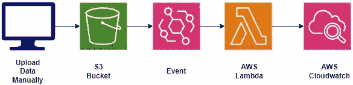
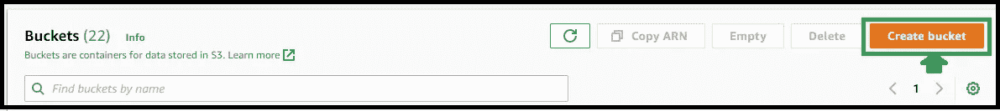
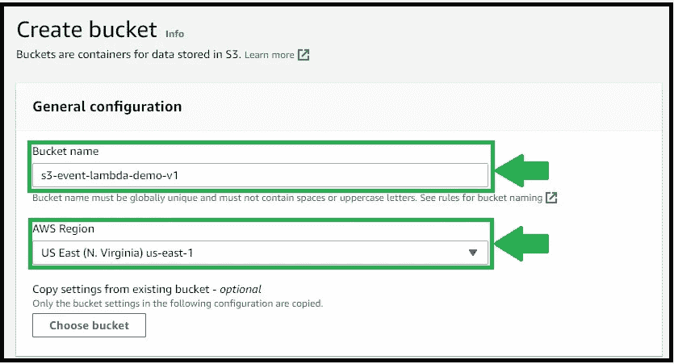
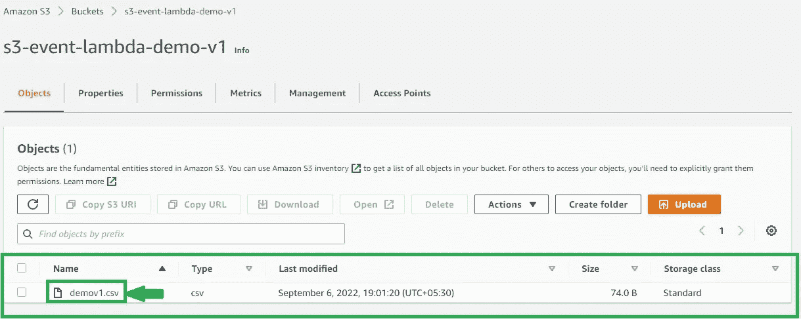
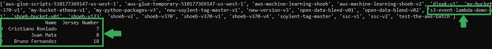

# 当我们将数据上传到 S3 桶时调用 Lambda 函数—第 1 部分。

> 原文：<https://medium.com/codex/invoke-lambda-function-when-we-upload-data-into-s3-bucket-part-1-e1e5a0081ecd?source=collection_archive---------4----------------------->

S3 水桶是 AWS 平台上最受欢迎和使用最多的服务。

我们已经知道，我们使用 S3 存储桶来存储 CSV 文件、Excel 文件、数据库文件等数据。

每当我们上传和删除任何文件或在 S3 桶上执行任何操作时，它都会触发并运行 AWS Lambda 函数。

我提到了下面的框图，它让你明白我在整个场景中会做什么。



框图

我们在这整个场景中所做的

1.  我们将创建一个 S3 存储桶。
2.  我们将编写一个示例代码，打印一些数据，如文件上传列表和文件内容。
3.  之后，我们将创建一个事件。
4.  然后我们将在 AWS Lambda 中运行代码。
5.  我们将在 AWS Cloudwatch 中看到输出。

如果你想创建一个 AWS S3 桶并通过 python 代码放入一个文件，你可以访问我以前的文章 [**AWS S3 与 Python——Shoeb Ahmed**](/codex/aws-s3-with-python-by-shoeb-ahmed-923c1cf47110)

在这篇文章中，我将手动创建一个 S3 桶，它非常简单快捷。

您只需登录 AWS 控制台，访问 S3 铲斗服务。

之后，点击“创建存储桶”。



单击创建存储桶

我只是简单地给出了桶的名称，但是我更愿意给出位置 US East-1，如下所示。之后，单击“创建存储桶”。



存储桶信息

现在，我将上传存储桶中的文件。我们将编写一个脚本来读取文件并打印数据内容。

现在，我已经手动上传了 CSV 文件，以测试我的代码是否可以从 S3 桶中提取数据。



我将编写一个脚本来收集文件列表并打印文件内容，对于这个场景，我更喜欢使用 CSV 文件。这对于初学者来说很容易，如果你想提取另一种文件格式或下载另一种格式的文件，我会帮助你，你可以在我的 LinkedIn 帐户上 ping 我。

执行上面的代码后，我们可以看到下面的输出，可以看到桶的列表和文件的内容。



代码的输出

在输出图像的右侧，我们可以看到箭头，这是我们正在使用的存储桶，左侧是 CSV 文件的输出。

现在我们将深入研究 AWS Lambda。

在使用 AWS Lambda 之前，我们需要设置我们的层，其中包含运行代码及其功能所需的包。

1.  首先，我们将创建一个名为“packages”的目录。

```
mkdir packages
```

2.现在，我们将更改目录，进入“packages”目录。

```
cd packages
```

3.现在我们要创建一个虚拟环境。

```
python3 -m venv venv
```

4.之后，我们将激活环境。

```
source venv/bin/activate
```

5.现在我们要创建另一个名为“python”的目录。

```
mkdir python
cd python
```

6.现在，我将安装所需的软件包。

```
pip3 install pandas -t .
pip3 install numpy -t .
pip3 install boto3 -t .
```

7.现在，我将返回 python 目录。

```
cd ..
```

8.现在，我们将把 python 目录中包含的任何数据制作成 zip 文件。

```
zip -r layer-v1.zip python
```

我做了一个新的 S3 桶来存储 zip 文件，它将在运行 lambda 函数时用作层。

笔记。确保 S3 桶的区域、λ和λ层应该相同。我用的是“N.Virginia”地区。

我把一个新的 S3 桶命名为“层-为-S3-λ-v1”。

9.现在我正在转移压缩文件到 S3 桶。

```
aws s3 cp layer-v1.zip s3://layer-for-s3-lambda-v1/aws s3 cp zip_file_name.zip s3://s3_bucket_name/
```

现在我们转到 AWS Lambda。我将在第 2 部分向您展示。