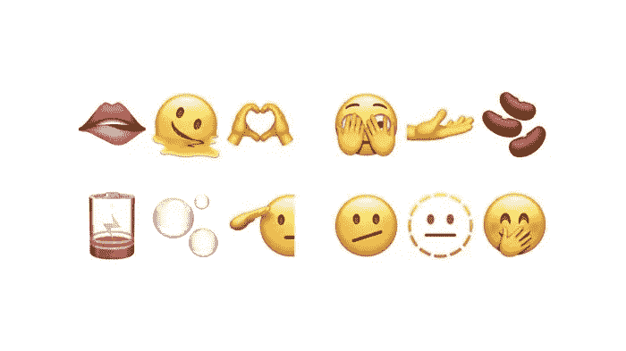
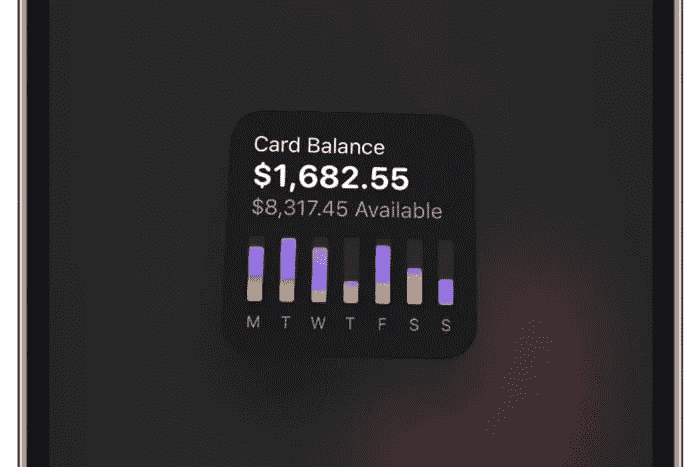
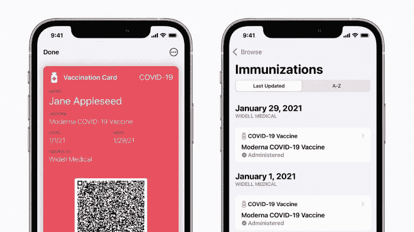

# iOS 15.4——你激动吗？

> 原文：<https://medium.com/codex/ios-15-4-are-you-excited-886be765138c?source=collection_archive---------2----------------------->

## 目前，仅处于测试阶段，但很快就会出现在你身边的 iOs 设备上！

因此，如果我们相信目前流传的一半谣言，那么今年对苹果来说将是非常令人兴奋的一年。范围从 M2 芯片或无论它将被称为(Mac Max Maxed？？)，一台 27 英寸的专业 iMac，一台新的 MacBook Air，新的消费级显示器，这样的例子不胜枚举。这可能会成为他们有史以来最忙的一年。但那都是硬件。操作系统呢？

我们现在都在运行 iOS 15.3(或者，如果你是一个好的小苹果爱好者，至少应该如此)。最近的更新是相当无害的。这基本上是一个必要的更新，集中在错误修复，更新，布局或措辞的变化。但 iOS 15.4 目前只有测试版，预计将于今年春天或夏天全面推出，看起来可能会有很多好东西。以下是一些诱人的亮点。

## 戴面具的 Face ID

早在 14.5 更新的时候，我们就应该得到这个了。然而，魔鬼是非常详细的。到目前为止，要使用这一功能，你必须佩戴 600 美元的 Apple Watch，因为那时它使用你的眼睛和手腕作为第二身份。不过，有了这次更新，你可以在戴着口罩甚至眼镜的情况下，不用看手表，就能进入 Face ID 的设置页面注册你的脸。Face ID 算法会为你做所有的计算，就像变魔术一样，你戴着面具的脸会被识别出来。随着限制似乎终于解除，这有点像马跑了就打开马厩的门，但是，鉴于我们不知道拐角处会发生什么，迟到总比不到好。

## 新表情符号

准确地说是 37 个！从一张融化的脸，一张敬礼的脸，咬嘴唇，甚至一个怀孕的男人中挑选！是的，我们生活在包容的时代。我是一个普通的人，对表情符号有普通的需求，但是，嘿，很高兴知道我有选择！此外，苹果通过多种族握手解决了种族主义问题。

 [## 信息…蓝色 v 绿色气泡

### 你知道颜色很重要！

medium.com](/@Davidtalkingtech/its-all-about-those-bubbles-f77708b32297) 

## 通用控制

这是我迫不及待要开始使用的一款。去年在 WWDC 宣布，它经历了一次又一次的延迟，但最终，我们将在今年晚些时候获得这个超级新功能。如果你对此一无所知，它可以让你只使用一个鼠标和键盘，直接将文件和文件夹从 iOS 设备拖放到 Mac 桌面。魔法在行动！

## 信用支付终端

没错。如果你曾经经营过企业，你会记得那些在你的商店或办公室里拥有第三方支付终端需要花费一大笔钱的日子。现在看来，苹果公司将直接在你的 iPhone 上实现 NFC 支付。这真的很简单，就像有人用他们的卡在你的 iPhone 背面轻轻一拍，你就会立即收到付款。尽管还没有得到证实，彭博马克·古尔曼已经报道了它，我们也完全期待今年晚些时候的这一功能。

## 新的登录功能

你知道，当你登录一个网站时，它会给你提供用苹果或谷歌登录的方法，现在会有另一个选择，那就是 Passkey。使用设备上的身份验证，您将能够使用 face 或 touch ID 登录。

## Apple card widget

如果你有一张苹果卡，很快就会有一个小工具让你记录使用和费用。

## 自定义电子邮件域

在此之前，你必须在 iCloud 网站上进行设置。你仍然需要一个便宜的 iCloud+订阅，但现在，直接在 iOS 中，你可以设置最多五个自定义域，可以与家庭成员共享。

## 更多次要的有用更新

其中包括疫苗接种护照，很快就可以直接存储在你的 iOS 健康和钱包应用中。这样会超级方便，杜绝安装第三方 app。在我赖以生存的 Keychain 中，你很快就可以添加**条注释**。最后，其他微小的更新将包括第三方应用程序中的 120Hz 动画和 Safari 的所有重置选项。

## 结论

这看起来将会是我们最近看到的最大的更新之一，我已经等不及了。你也兴奋吗？

**每当我发布时，都会收到电子邮件通知。立即订阅。**

【https://www.talkingtechandaudio.com/blog】首次发表[**2022 年 2 月 1 日**](https://www.talkingtechandaudio.com/blog)