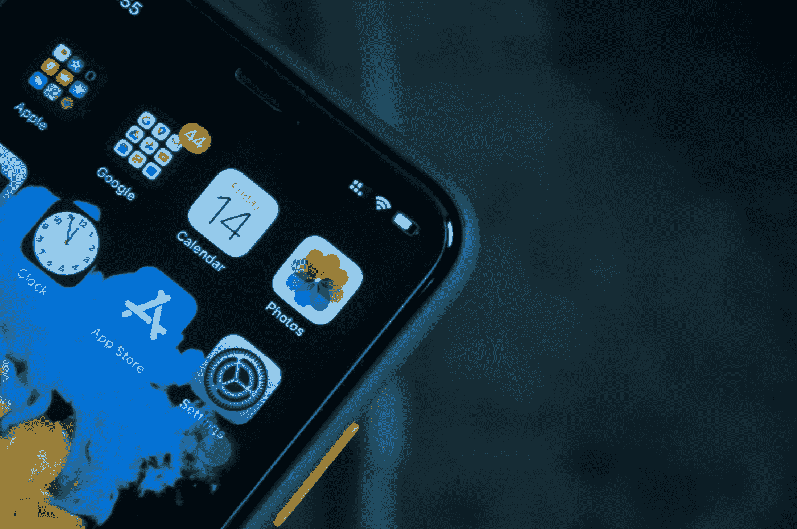

# iOS 16 回顾

> 原文：<https://medium.com/codex/ios-16-review-3a56536d09b?source=collection_archive---------9----------------------->

## 精致，有更多个性化选项

照片由 [Sumudu Mohottige](https://unsplash.com/@stm_2790?utm_source=medium&utm_medium=referral) 在 [Unsplash](https://unsplash.com?utm_source=medium&utm_medium=referral) 上拍摄

这是 CrunchX 的第三十一版，这里是我们认为值得花时间的故事和资源。

# 1.独家新闻:网飞对软件工程等级的历史性介绍

网飞引入了工程等级，结果适得其反。大多数工程师不喜欢他们着陆的地方。以下是以前没有关卡的原因，以及网飞在没有关卡的情况下成功的原因。Gergely Orosz 撰写的关于实用主义工程师和编辑选择的文章[Milo iv kovi](https://medium.com/u/3ee57b082bb?source=post_page-----3a56536d09b--------------------------------)。点击此处阅读文章:

[https://newsletter . pragmatic engineer . com/p/the-scoop-netflixs-historical-introduction](https://newsletter.pragmaticengineer.com/p/the-scoop-netflixs-historic-introduction)

# 2.用开源软件赚钱:我们的责任是什么？

用开源软件赚钱需要什么？免费和开源之间的界限是模糊的。公司滥用这一点，只能从 OSS 中获益。那么从开源软件中赚钱的做法有哪些呢？由 Eric Karkovack 撰写关于 Speckyboy 的文章，并由 Milo ivkovi[编辑选择。点击此处阅读文章:](https://medium.com/u/3ee57b082bb?source=post_page-----3a56536d09b--------------------------------)

[https://specky boy . com/making-money-with-开源-软件-责任/](https://speckyboy.com/making-money-with-open-source-software-responsibility/)

# 3.开发者基于《我的世界》创建令人愉快的编程字体

为开发选择合适的字体是每个软件工程师都很苦恼的事情——是 Consolas、Courier、Menlo 还是 old faithful Comic Sans？开发者 Idrees Hassan 可能最终解决了这个问题，他基于在《我的世界》发现的字体创造了一种等宽字体。由 Benj Edwards 撰写，由 Stuart Woolley 博士编辑。点击此处阅读文章:

[https://ars technica . com/gaming/2022/09/developer-creates-pleasant-programming-font-based-on-minecraft/](https://arstechnica.com/gaming/2022/09/developer-creates-delightful-programming-font-based-on-minecraft/)

# 4.不欠我们任何东西的 Unix 传奇，一直在修复基本的 AWK 代码

我们不能不承认 Brian Kernighan 多年来对计算机科学做出的巨大贡献，特别是在 C 语言方面。但是，您是否也知道他最初帮助创建了奇妙的 Unix 命令行实用程序 awk？您知道吗，在他 80 岁高龄的时候，他最近也给它添加了 Unicode 支持。。这就是承诺，字面上的意思。如果你不熟悉他的伟大作品，我建议你去看看他，但是在这里看看他最近对 awk 的贡献。凯文·波弟在 Ars Technica 上撰写，斯图尔特·伍利博士编辑选择。点击此处阅读文章:

[https://ars technica . com/gadgets/2022/08/UNIX-legend-who-ows-us-nothing-keeping-fixing-fundamental-awk-code/](https://arstechnica.com/gadgets/2022/08/unix-legend-who-owes-us-nothing-keeps-fixing-foundational-awk-code/)

# 5.数据故事:关于通胀的图表

这篇文章以不同的图表和可视化为特色，这些图表和可视化与全球持续的通货膨胀有关。它显示了在最近一段时间内，诸如药品、面包和石油等商品的价格是如何暴涨的。由《TDWI》的 Upside 工作人员撰写，由 [Christianlauer](https://medium.com/u/2696f801a31a?source=post_page-----3a56536d09b--------------------------------) 编辑选择。点击此处阅读文章:

[https://tdwi . org/articles/2022/09/07/bi-all-visualization-inflation . aspx](https://tdwi.org/articles/2022/09/07/bi-all-visualization-inflation.aspx)

# 6.如何应对 3 个常见的机器学习挑战

当开始创建机器学习模型时，可能会出现某些困难。本文描述了机器学习的三个最常见的挑战，包括开发一个足够好的模型，识别用例，以及克服缺乏可预测性。由 [Christianlauer](https://medium.com/u/2696f801a31a?source=post_page-----3a56536d09b--------------------------------) 撰写并发表在 KDNuggets 和编辑精选上。点击此处阅读文章:

[https://www . kdnugges . com/2022/09/comet-trough-3-common-machine-learning-challenges . html](https://www.kdnuggets.com/2022/09/comet-tackle-3-common-machine-learning-challenges.html)

# 7.你需要知道的关于数据湖库的一切

“数据湖库”这个术语似乎被认为是技术领域的一个时髦词。本文介绍了数据仓库的理论背景、优点和应用领域。由妮莎·艾莉亚在 KDNuggets 上撰写，由[克里斯蒂安劳](https://medium.com/u/2696f801a31a?source=post_page-----3a56536d09b--------------------------------)编辑选择。点击此处阅读文章:

[https://www . kdnugges . com/2022/09/everything-need-know-data-lake houses . html](https://www.kdnuggets.com/2022/09/everything-need-know-data-lakehouses.html)

# 8.各位，来见见 Loab——互联网上第一个可怕的人工智能 Cryptid

AI 当然已经到了今天人类生活的方方面面。因此，艺术家喜欢使用人工智能来创造独特的艺术并不罕见。本文描述了一位艺术家如何使用人工智能来创造互联网上第一个可怕的人工智能 Cryptid。由 ODSC ODSC 团队撰写，由[克里斯蒂安劳](https://medium.com/u/2696f801a31a?source=post_page-----3a56536d09b--------------------------------)编辑选择。点击此处阅读文章:

[https://opendata science . com/every one-meet-loab-the-internets-first-terrorible-ai-cryptid/](https://opendatascience.com/everyone-meet-loab-the-internets-first-terrifying-ai-cryptid/)

# 9.iOS 16 回顾—改进，提供更多个性化选项

随着秋天的到来，苹果公司将发布一年一度的新版 iOS。包括一些急需的主屏幕更新是过多的新功能和健康，信息，邮件和焦点的变化。苹果内部有一个简短的纲要在这里。马尔科姆·欧文在苹果内幕上撰文，斯图尔特·伍利博士编辑选择。点击此处阅读文章:

[https://appleinsider.com/articles/22/09/12/ios-16-review-更多个性化选项的优化](https://appleinsider.com/articles/22/09/12/ios-16-review---refinement-with-more-personalization-options)

# 10.iOS 16 中 HomeKit 的新功能

具体来说，HomeKit 在 UI 和底层架构上都经历了相当多的变化(大概是为了适应今年晚些时候即将推出的 Matter 标准)。这绝对值得一看，因为我知道我们中的许多人现在都在用传感器、摄像头和遥控设备实现家庭自动化。由安德鲁·奥哈拉在苹果内幕上撰写，由斯图尔特·伍利博士编辑。点击此处阅读文章:

[https://appleinsider . com/articles/22/06/09/everything-new-coming-to-home kit-in-IOs-16](https://appleinsider.com/articles/22/06/09/everything-new-coming-to-homekit-in-ios-16)

# 结束语

这些是我们本周的精选。希望你发现了一些新的、鼓舞人心的、惊人的、知识渊博的科技新闻。非常感谢您花时间阅读本版 CrunchX。下周请留意下一期。

## 问候，

法典小组