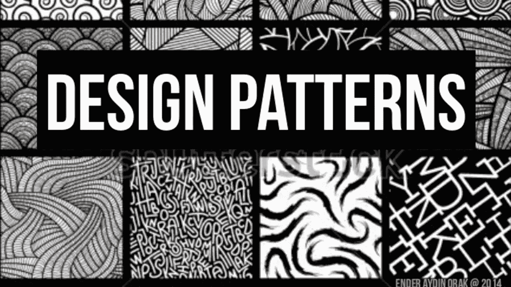

# iOS 设计模式[盒子设计模式] —编写更好的代码

> 原文：<https://medium.com/codex/ios-design-pattern-box-design-pattern-write-better-code-8d7369ca725?source=collection_archive---------7----------------------->



box 模式是 Swift 中的一种设计模式，它允许您将一个值封装在一个盒子中，以便可以通过引用来改变它。当您需要向函数或方法传递一个值，但希望函数或方法能够改变该值时，这很有用。

以下是如何在 Swift 中使用方框模式的示例:

```
struct Box<T> {
    var value: T

    init(_ value: T) {
        self.value = value
    }
}

func increment(box: Box<Int>) {
    box.value += 1
}

var number = Box(1)
increment(box: number)
print(number.value) // 2
```

在这段代码中，我们定义了一个采用泛型类型`T`的`Box`结构，它代表了盒子将保存的值的类型。这个`Box`结构只有一个属性`value`，它的类型是`T`。

然后我们定义一个`increment(box:)`函数，它将一个`Box`对象作为参数，并将`Box`的`value`属性加 1。

接下来，我们创建一个名为`number`的`Box`对象，它包含值`1`。然后我们调用`increment(box:)`函数，将`number`框作为参数传递。这导致`number`框的`value`属性增加 1，因此其值变为`2`。最后，我们打印`number`框的值，它打印`2`。

使用 box 模式，我们可以将一个值传递给函数或方法，函数或方法可以通过引用改变该值。这允许我们避免使用 inout 参数，并编写更具表现力和可读性的代码。

***如果你喜欢这个，点击💚尽你所能在下面为这篇文章鼓掌，这样其他人会在媒体上看到。如有任何疑问或建议，欢迎随时评论或打我***[***Twitter***](https://twitter.com/b_banzara)***，或***[***Linkedin***](https://www.linkedin.com/in/rranjanchchn/)***。***