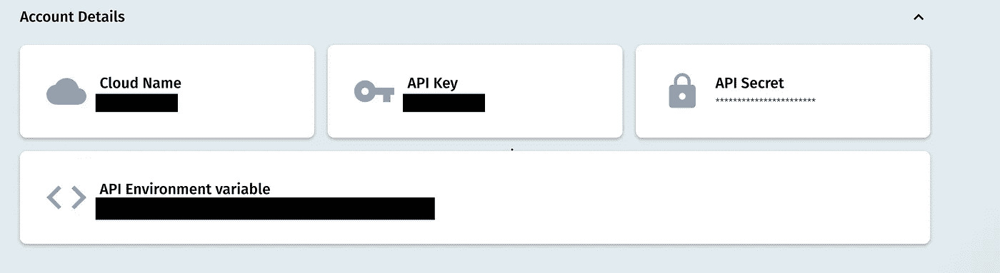

# 使用 Cloudinary 以编程方式管理映像— iOS

> 原文：<https://medium.com/codex/ios-handling-images-3cf31fb1caf0?source=collection_archive---------6----------------------->


嗨！我是阿迪。我已经很久没写信了。几个月前换了工作，这占用了我大部分的能力，所以我无法写作。我加入了一家名为 Cloudinary 的大公司，这也是我写这篇博客的部分原因。所以让我们开始吧。

# **问题！**

在我以前的一份工作中，我负责一个应用程序，允许你作为用户将图像下载到他们的手机中，并将它们设置为主屏幕、锁屏或两者的背景。
这个应用程序需要拉所有图像信息的大 JSON 文件，每个图像有多个字段，如标题，网址，创建日期等…

在主屏幕上，我必须显示每个图像的缩略图(缩略图是大图像的小图像表示)。
点击缩略图会将用户引导至全屏显示图像的屏幕。

这两个屏幕已经需要同一图像的多个版本。因为你不能用缩略图呈现全屏图像，因为你会得到一个像素化的结果，产生一个糟糕的用户体验。另一方面，我们不希望在主屏幕上呈现全屏图像(我们在一个屏幕上显示许多图像)，因为这会导致屏幕的长时间加载。这又是一个糟糕的用户体验。

除此之外，每个图像都有我们需要呈现的各种尺寸，我们不要忘记应用程序支持不同屏幕尺寸的多种设备，iPhones、iPads 和 iPods 都需要不同尺寸的图像。

那么我们该如何处理呢？我们有一个图像，但我们需要它在许多不同的大小。我们可以在客户端使用它，并在设备上处理图像，但这样效率不高。

我们可以要求服务器端(如果有的话)为每张图片提供多个 URL，但这会使 JSON 响应变得巨大而难以处理。

这就是 Cloudinary 的用武之地。

# **该解决了！**

正如你可能已经猜到的那样，这个解决方案将是模糊的

# **什么是 Cloudinary？**

Cloudinary 是一个平台，允许您快速轻松地创建、管理和交付跨任何浏览器、设备和带宽的数字体验。

# **如何使用 Cloudinary？**

## **设置**

你需要做的第一件事是去 Cloudinary [网站](http://www.cloudinary.com)注册一个免费账户。你可以在这里找到 iOS SDK 的 git 库。要将 Cloudinary 集成到您的应用中，您可以使用:

*椰子:*

```
pod 'Cloudinary', '~> 3.0'
```

*迦太基:*

```
github "cloudinary/cloudinary_ios" ~> 3.0
```

*Swift 包经理:*

```
[https://github.com/cloudinary/cloudinary_ios.git](https://github.com/cloudinary/cloudinary_ios.git)
```

## **配置**

一旦包被集成，我们将需要设置我们的 Cloudinary 对象。
您的 API 密钥和云名称将出现在您创建帐户的仪表盘中。



一旦我们设置好 Cloudinary 对象并准备好使用，这就是**魔法**开始的地方。

## **上传您的资产**

有多种方式将资产上传到您的云中，通过 API 或 UI
UI——就像拖放到您的云中一样简单。
API —您可以通过代码上传:

这里我们唯一缺少的是*上传预置。*上传预置是我们需要通过 UI 设置的字段。您可以通过访问 Cloudinary [网站](http://www.cloudinary.com)，登录并点击右上角的设置图标来完成此操作。点击上传选项，向下滚动并添加一个新的上传预设，有许多选项可以定制一个上传预设，但我不打算在这篇博客中深入探讨。查看 [Cloudinary Academy](http://training.cloudinary.com) 以了解更多关于 cloud inary API 的可能性。

一旦*上传预置*被创建，确保将其名称输入到`upload`功能的上传预置字段中。是的，将资产上传到您的云中就这么简单，一旦映像存在，我们就可以开始使用转换了！
转换是我们可以在资产(图像、视频等)上执行的操作。有许多转换，如果你想了解比我在这里展示的例子更多的内容，我建议你访问 Cloudinary 的[文档](https://cloudinary.com/documentation/image_transformations)。

## **转换**

在本文的开始，我提出了一个问题，我们有一个资产，但是我们需要它有许多不同的大小和纵横比。让我们看看如何使用 Cloudinary 的转换轻松实现这一点:(我将使用一个名为 sample 的资产)

原始图像:


## **作物**

我们想为我们的主屏幕创建一个缩略图(250x250 ):

我来解释一下上面的代码行。我们正在使用之前创建的`cloudinary`对象，我们调用`createUrl()`函数并设置一个新的转换，在这里我们给出所有我们想要在图像中修改的参数。最后，我们用资产名称(示例)调用`generate`。
这一行代码将产生下面的 [URL](https://res.cloudinary.com/test123/image/upload/c_crop,h_250,w_250/sample) :


正如我们所见，我们得到了我们想要的 250x250 的缩略图，但结果还可以改进。图像中最有趣的物体“蜜蜂”被切掉了。我们能做什么？哦！Cloudinary 还有更多锦囊妙计！我们可以使用“重力”的另一个很酷的功能，我们可以要求 Cloudinary 专注于图像中最有趣的对象。

## **重力**

输出[网址](https://res.cloudinary.com/test123/image/upload/c_crop,h_250,w_250,g_auto/sample):


正如我们所见，结果要好得多。重点是蜜蜂。

## **品质**

让我们试试另一个场景。我们有一个 2k 的图像，这是一个相当大的文件，当我们在设备上呈现它时，我们不需要它的最佳形式。漫游不能总是处理大带宽。为了使图像更亮，我们可以使用 Cloudinary“质量”功能。

这是原始图像(它重 5MB，这是一个相当大的文件)


借助 Cloudinary，我们可以做到以下几点:

这段代码将产生下面的 [URL](https://res.cloudinary.com/db0edm7to/image/upload/q_auto/big_image_sample) :


它的大小为 626.56 KB。我们把尺寸缩小了很多，在移动设备上获取这张图片会更容易。

# 总结一下！

正如我们在博客中看到的，Cloudinary 可以满足以多种大小和质量处理相同资产的需求。不仅如此，它还有许多其他功能！我鼓励您访问[文档](https://cloudinary.com/documentation/)网站，充分利用该平台。

Cloudinary SDK 也可以在 Android 上找到，另外还有 14 种语言可以在 Cloudinary 的 git 上找到。