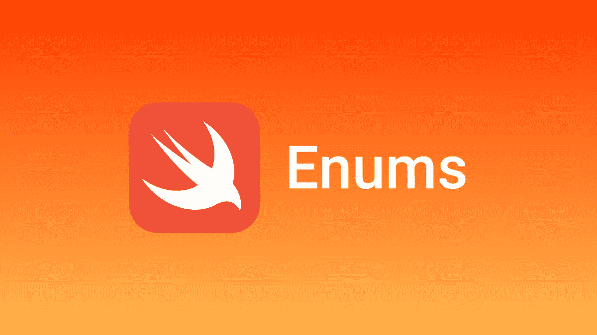
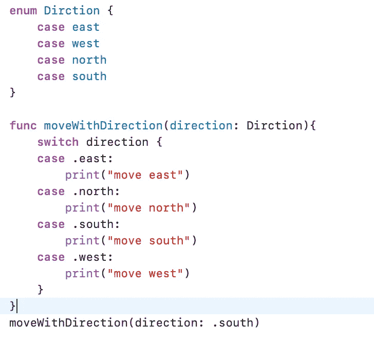
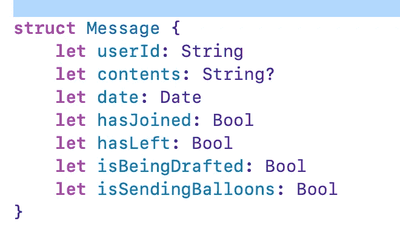
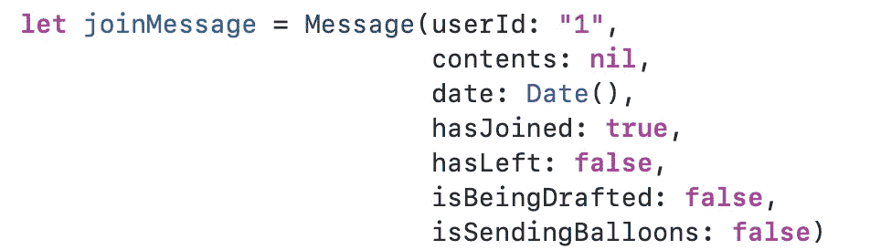
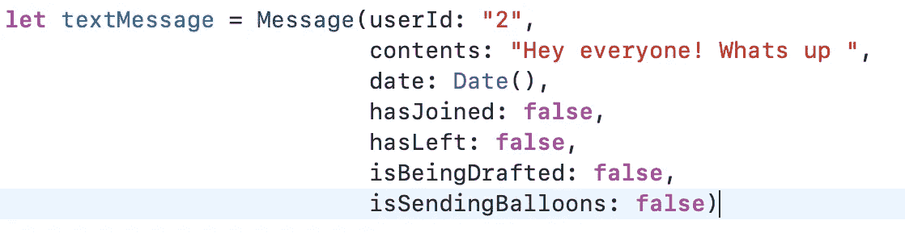
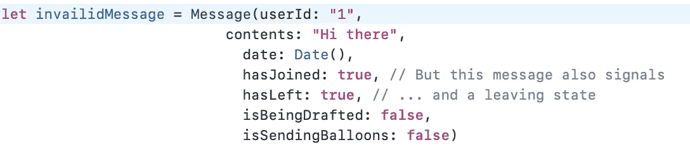
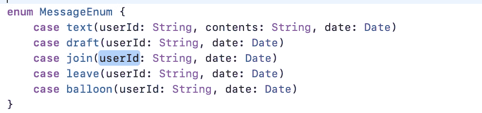
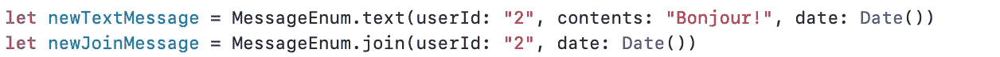
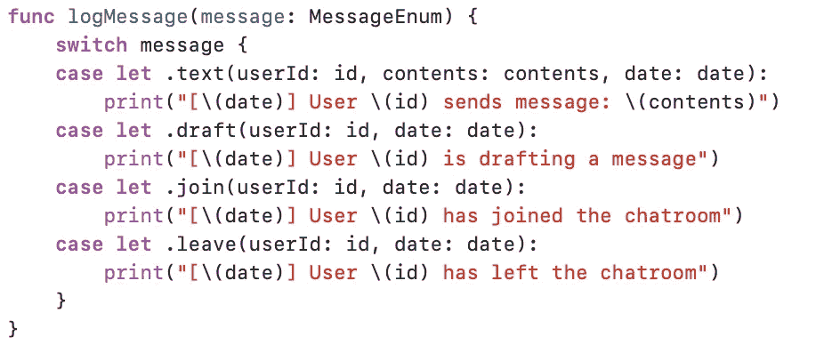
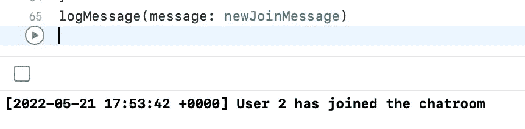

# iOS 访谈-所有关于 Enums 的内容[它们是否未被充分利用？]

> 原文：<https://medium.com/codex/ios-interview-all-about-enums-are-they-underused-61c6b04ca29f?source=collection_archive---------1----------------------->

**枚举**，简称枚举，是 Swift 编程语言中的一个核心类型，枚举允许你通过*枚举*它的值来定义一个类型，比如一个 HTTP 方法是否是一个**[**GET**](https://developer.mozilla.org/en-US/docs/Web/HTTP/Methods/GET)**，**[***PUT*****，**](https://developer.mozilla.org/en-US/docs/Web/HTTP/Methods/Put)[***POST***](https://developer.mozilla.org/en-US/docs/Web/HTTP/Methods/POST) 或 [***删除***](https://developer.mozilla.org/en-US/docs/Web/HTTP/Methods/DELETE)**动作，或表示一个 [**IP 地址**](https://en.wikipedia.org/wiki/IP_address) 是否在[***IP v4***](https://en.wikipedia.org/wiki/IPv4)***或****[***IPv6***](https://en.wikipedia.org/wiki/IPv6)*****

****这里有一个 enum 基本用例的例子，我们也可以在 swift 文档中找到，但是我们可以使用 enum 实现更多，我在下面已经描述过了。****

********

****Enum 在多种语言中使用，但是 Swift 编程语言借用了函数式编程的许多概念。正如标题所说，enum 没有被充分利用，所以读完这篇博客后，你可能会发现你对数据建模得更好了，编写 Enum 的频率更高了一点，并且在你的项目中以更安全和更干净的代码结束，并且相信在此之前 Enum 没有被充分利用。****

******枚举**是“或”型的，意思是交通灯可以是绿色*或*黄色*或*红色，而不是同时出现。如果灯不能正常工作，这是可能的。****

****为了更好地理解 Enum，让我们以 Whatsapp 群组的聊天室为例。在组中有一些消息支持:****

*   ****加入消息，如“Veer 已加入聊天室”****
*   ****有人可以写的短信，比如“大家好！”****
*   ****发送有趣的消息，其中包括一些动画和其他人可以看到和听到的恼人的声音****
*   ****留言，如“尼娜离开了聊天”****
*   ****草稿消息，例如“Mike 正在写消息”****

****因此，让我们创建一个数据模型来表示消息。您的第一个想法可能是使用一个结构来建模您的消息。您将从这样做开始，并展示随之而来的问题。然后，您将通过使用枚举来解决这些问题。****

********

****消息结构****

****一旦有人加入我们的聊天室****

********

****加入消息****

****或者当有人向群组发送消息时****

********

****发送消息****

****你能看出这种方法出了什么问题吗，所以在这种方法中，当用户加入聊天室时，我们将所有其他属性设置为空或假，因为它们没有用处，或者当我们发送任何消息时，我们不必担心用户是否加入，因为为了发送消息，用户需要被添加到组中，但我们必须为已加入或已离开或发送方法提供假值，如果提供任何值，会导致错误。****

****举例来说，您可以让消息处于无效状态。它表示文本消息，但也表示加入和离开消息。****

********

****在这个小例子中，无效数据非常罕见，因为数据块非常小，但它可能会发生，就像当您根据属性解析消息时，它会发生冲突，但您不会有任何编译时问题，这只会在运行时出现，当您的消息有冲突状态时。想象一下，当用户加入、离开或发送消息时，根据消息类型显示 UI。那么我们如何在编译时解决这个问题呢？是的，我们可以用**枚举来解决这个问题。******

******何时使用枚举:**无论何时，当你对具有互斥属性的数据建模时，你都可以使用枚举。就像上面的例子一样，消息不能同时是加入和离开消息。一条消息不能同时发送气球和草稿。但是消息可以是加入消息*或者*离开消息。消息也可以是草稿，*或*它可以代表气球的发送。**当您在模型中检测到“或”语句时，枚举可能是更适合您的数据模型的选择。**使用枚举将属性分组到案例中，使得数据更容易掌握。****

****让我们改进这个模型，把它变成一个枚举。****

********

****通过将元组添加到病例中，这些病例现在具有所谓的*关联值*。此外，您可以清楚地看到哪些属性属于一起，哪些属性不属于一起。每当您想要将消息创建为枚举时，您可以选择具有相关属性的适当大小写，而不必担心混合和匹配错误的值。****

****每当您想要将消息创建为枚举时，您可以选择具有相关属性的适当大小写，而不必担心混合和匹配错误的值。****

********

****当您想要处理消息时，您可以对它们使用切换大小写，并解开它们的内部值。假设您想要记录发送的消息。****

****************

****您可以像上面一样记录消息，而不必强制转换消息或验证类型。****

****仅仅为了从单个消息中读取一个值，就必须打开整个应用程序中的所有大小写，这可能是一个障碍。通过使用 if case 组合来匹配使用 if let 的单一类型的消息，您可以节省一些输入。****

****现在的问题是我们什么时候可以使用枚举，什么时候可以使用结构？****

****使用枚举获得编译器的好处是一个显著的好处。但是如果您发现自己经常在单个案例中进行模式匹配，那么 struct 可能是一种更好的方法。此外，请记住，枚举的关联值是没有附加逻辑的容器。你不会得到免费的属性初始化器；对于枚举，您必须手动添加它们。下次编写结构时，请尝试对属性进行分组。您的数据模型可能是一个很好的枚举候选对象！****

****我将在下一篇博客中解释使用 enum 可以实现更多的功能，比如使用 enum 实现多态性或者使用 enum 代替子类化。****

*******如果您喜欢这个，点击💚尽你所能在下面为这篇文章鼓掌，这样其他人会在媒体上看到。如有任何疑问或建议，欢迎随时评论或打我***[***Twitter***](https://twitter.com/b_banzara)***，或***[***Linkedin***](https://www.linkedin.com/in/rranjanchchn/)***。*******