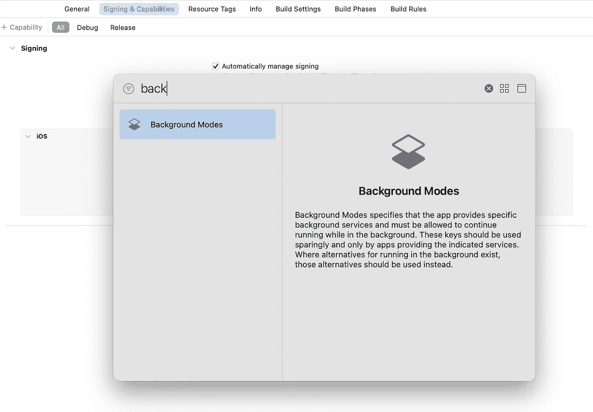
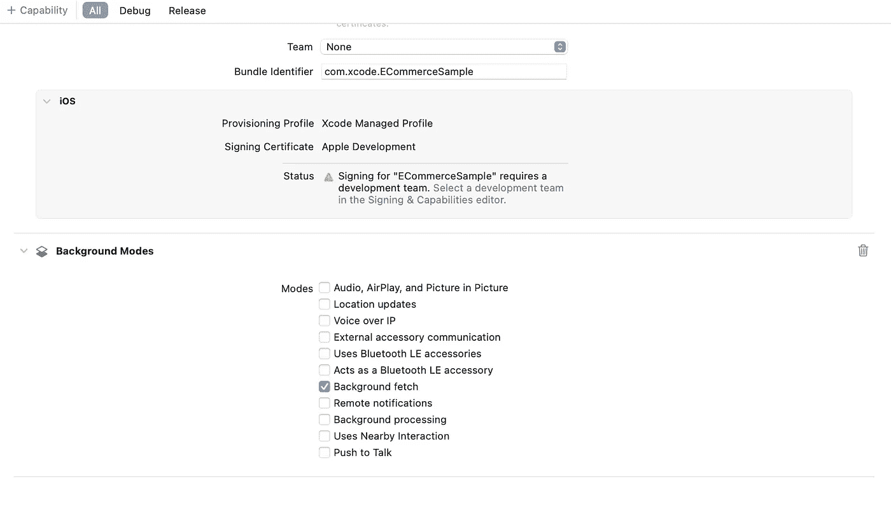

# iOS 面试:后台取||后台任务

> 原文：<https://medium.com/codex/ios-interview-background-fetch-background-task-5ed92eb11997?source=collection_archive---------4----------------------->

**iOS 中的**后台任务是一段代码，当应用程序在后台时(即，当应用程序没有被主动使用时)执行。在 iOS 应用程序中实现后台任务有多种方式，具体取决于任务的具体需求。一些选项包括:

1.  **后台获取**:iOS 操作系统的这一功能允许应用在不活跃使用时，在后台获取新数据或执行其他任务。要实现后台抓取，需要在 app 的 Xcode 项目中启用“后台抓取”功能，在 app 的`**UIApplicationDelegate**`中实现`**application(_:performFetchWithCompletionHandler:)**`方法。
2.  **后台任务**:`**BGTaskScheduler**`框架允许你安排后台任务，当应用程序在后台运行时执行这些任务。您可以使用这个框架安排任务在特定的时间间隔或特定的时间运行，或者您可以注册触发任务的特定事件。

让我们在本文中讨论背景获取。

**要在 iOS 应用程序中实现后台抓取，您需要执行以下操作:**

1.  在应用程序的 Xcode 项目中启用“后台获取”功能。为此，打开项目的“签名和功能”选项卡，并打开**“后台模式”**选项。然后，选中“后台获取”复选框。



2.在 app 的`**UIApplicationDelegate**`中，实现`**application(_:performFetchWithCompletionHandler:)**`方法。当系统想要为应用程序获取新数据时，会调用此方法。

```
func application(_ application: UIApplication, performFetchWithCompletionHandler completionhandler: @escaping (UIBackgroundFetchResult) -> Void) {
    // Perform the background fetch here.
    // When the fetch is complete, call the completion handler with the appropriate UIBackgroundFetchResult value.
    completionHandler(.newData)
}
```

3.在`**performFetchWithCompletionHandler**`方法中，执行所需的后台任务(比如从服务器获取新数据)。当任务完成时，一定要调用完成处理程序，传入表示获取结果的`**UIBackgroundFetchResult**`值。

需要注意的是，iOS 对应用程序在后台执行代码的时间有严格的限制，超过这些限制的应用程序可能会被终止。因此，尽可能高效地设计后台任务，并且只在后台执行必要的工作是很重要的。

***如果你喜欢这个，点击💚尽你所能在下面为这篇文章鼓掌，这样其他人会在媒体上看到。如果您有任何疑问或建议，请随时评论或点击我的***[***Twitter***](https://twitter.com/b_banzara)***，或***[***Linkedin***](https://www.linkedin.com/in/rranjanchchn/)