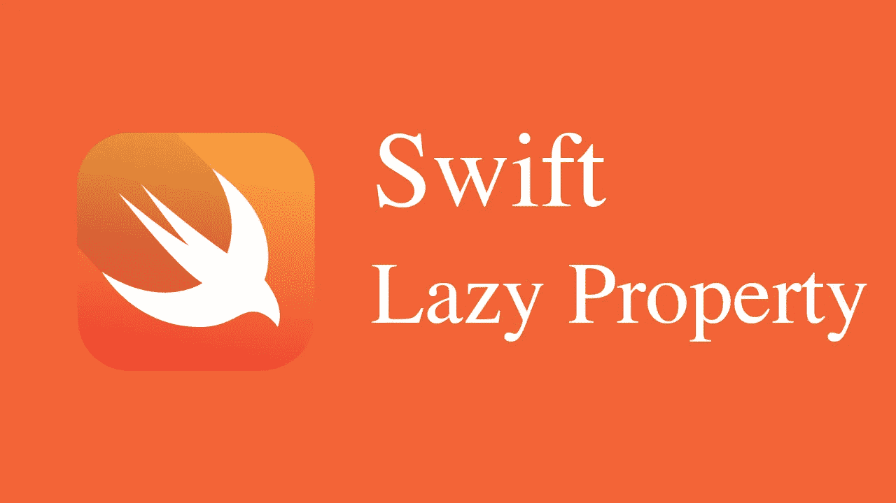

# iOS 面试:懒人属性【什么以及什么时候不用懒人属性】

> 原文：<https://medium.com/codex/ios-interview-lazy-property-what-and-when-not-to-use-lazy-property-5d621773fc5c?source=collection_archive---------2----------------------->



在 Swift 中，惰性变量是直到第一次被访问时才计算初始值的变量。当变量的初始值计算起来很昂贵时，或者直到在代码中实际使用时才需要它时，惰性变量很有用。

以下是如何在 Swift 中创建惰性变量的示例:

```
class HeavilyComputation {
    // A heavy object that takes a long time to initialize
}

class MyClass {
    lazy var heavilyComputationObject = HeavilyComputation()

    func doSomething() {
        // Use the heavy object
        heavyObject.doSomething()
    }
}
```

在这段代码中，我们定义了一个**heavy computing**类，它代表一个需要很长时间来初始化的对象。然后我们定义一个具有**heavy computation**属性的`**MyClass**`类，它的类型是**heavy computation**。我们使用`**lazy**`关键字将**heavy computation**属性标记为惰性变量。

当`**MyClass**`类的实例被创建时，**heavy calculation**属性直到第一次被访问时才被初始化。这意味着在调用`**doSomething**()`方法之前不会创建`**HeavyObject**`实例，只有在实际需要时才会创建**heavy computing**实例。

有了这个实现，我们可以避免初始化**heavy computation**属性的开销，除非它是实际需要的。这可以提高我们代码的性能和效率，并且可以使我们的代码更具可读性和可维护性。

# 什么时候我们不应该使用懒惰属性？

惰性属性在 Swift 中是一个有用的特性，但是应该谨慎使用。通常，当属性的初始值计算开销不大时，或者当属性被频繁访问并且预先计算其初始值会更有效时，不应使用惰性属性。

以下是您可能不想使用惰性属性的一些原因:

> 1.惰性属性为代码增加了额外的间接性，这使得理解和调试更加困难。
> 
> 2.如果从多个线程同时访问惰性属性，它们可能会引入意外的行为和争用情况。
> 
> 3.惰性属性如果被频繁访问，会影响代码的性能，因为每次访问时都会计算属性的初始值。
> 
> 4.惰性属性会降低代码的可预测性，因为在代码中实际访问该属性之前，不会计算它的初始值。

通常，只有当属性的初始值计算量很大，并且在代码中实际访问它之前不需要它时，才应该使用惰性属性。否则，您应该使用常规属性并预先计算其初始值。

***如果你喜欢这个，点击💚尽你所能在下面为这篇文章鼓掌，这样其他人会在媒体上看到。如有任何疑问或建议，欢迎随时评论或打我***[***Twitter***](https://twitter.com/b_banzara)***，或***[***Linkedin***](https://www.linkedin.com/in/rranjanchchn/)***。***