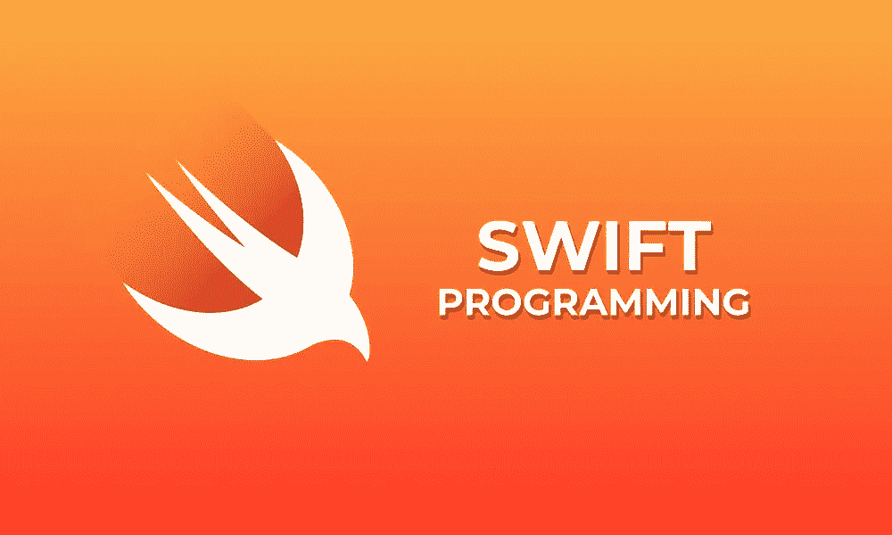

# iOS 面试:方法分派(动态 _ 分派&静态分派)

> 原文：<https://medium.com/codex/ios-interview-method-dispatch-dynamic-dispatch-static-dispatch-2ecd75891f82?source=collection_archive---------8----------------------->



我有一个非常基本的问题要问所有想了解方法分派(动态 _ 分派&静态分派)的读者。

方法分派是选择要在运行时执行的方法的实现的过程。在 Swift 这样的面向对象语言中，使用方法调度来支持多态性，允许不同类的对象以不同的方式响应同一个方法调用。

方法调度主要有两种:**动态调度**和**静态调度。**

动态分派是一种方法分派，其中方法的实现是在运行时根据接收方法调用的对象的类型来选择的。动态分派也被称为**后期绑定或运行时绑定**，因为方法实现直到运行时才绑定到方法调用。

动态分派经常用在支持继承和多态的语言中，因为它允许不同类的对象以不同的方式响应相同的方法调用。在动态调度中，运行时选择的方法实现是由接收方法调用的对象的类型决定的，而不是由调用方法的对象的类型决定的。

```
class Animal {
    func makeNoise() {
        // Default implementation
    }
}

class Dog: Animal {
    override func makeNoise() {
        print("Woof!")
    }
```

***如果你喜欢这个，点击💚尽你所能在下面为这篇文章鼓掌，这样其他人会在媒体上看到。如有任何疑问或建议，欢迎随时评论或打我的***[***Twitter***](https://twitter.com/b_banzara)***，或***[***Linkedin***](https://www.linkedin.com/in/rranjanchchn/)***。***