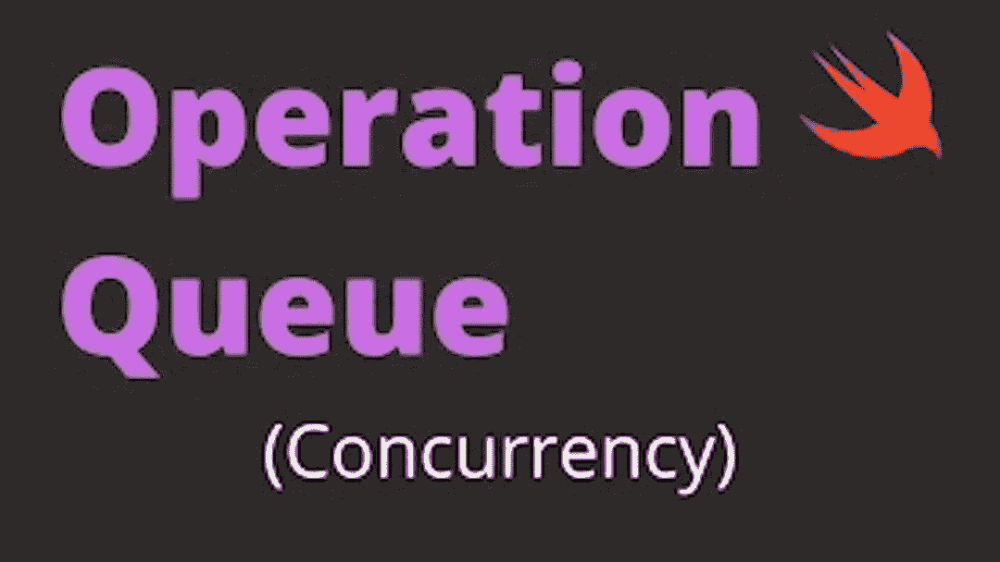

# [iOS 访谈]操作队列-并发

> 原文：<https://medium.com/codex/ios-interview-operation-queue-interview-answer-20cd0b4bdc5?source=collection_archive---------2----------------------->



操作队列是`Foundation`框架中的一个基本类，用于管理应用程序中操作的执行。一个操作是一个离散的工作单元，它可以与其他操作同时执行或独立执行。

在 Swift 中，您可以使用`OperationQueue`类创建一个操作队列。以下是如何创建操作队列的示例:

```
let queue = OperationQueue()
```

在这段代码中，我们创建了一个`OperationQueue`对象，并将其赋给一个名为`queue`的常量。然后，我们可以使用这个队列来管理代码中操作的执行。

要向队列中添加操作，可以使用`OperationQueue`类的`addOperation(_:)`方法。以下是如何向队列添加操作的示例:

```
let queue = OperationQueue()

let operation = BlockOperation {
    // Your Task
}

queue.addOperation(operation)
```

在这段代码中，我们使用`BlockOperation`类创建了一个`OperationQueue`对象和一个`Operation`对象。`BlockOperation`类是`Operation`类的一个具体子类，它允许你定义一个代码块作为操作的主要任务来执行。

接下来，我们使用`addOperation(_:)`方法将`operation`对象添加到`queue`中。这使得操作由队列执行，我们在`BlockOperation`初始化器中定义的代码块将作为操作的主任务执行。

通过这种实现，您可以使用操作队列来管理代码中操作的执行。您可以将操作添加到队列中，队列将负责执行操作并管理它们的依赖性和并发性。这允许您编写高效且可伸缩的应用程序，这些应用程序可以利用并发和并行执行的强大功能。

***如果你喜欢这个，点击💚尽你所能在下面为这篇文章鼓掌，这样其他人会在媒体上看到。如有任何疑问或建议，欢迎随时评论或打我*** [***推特***](https://twitter.com/b_banzara) ***，或***[***Linkedin***](https://www.linkedin.com/in/rranjanchchn/)***。***