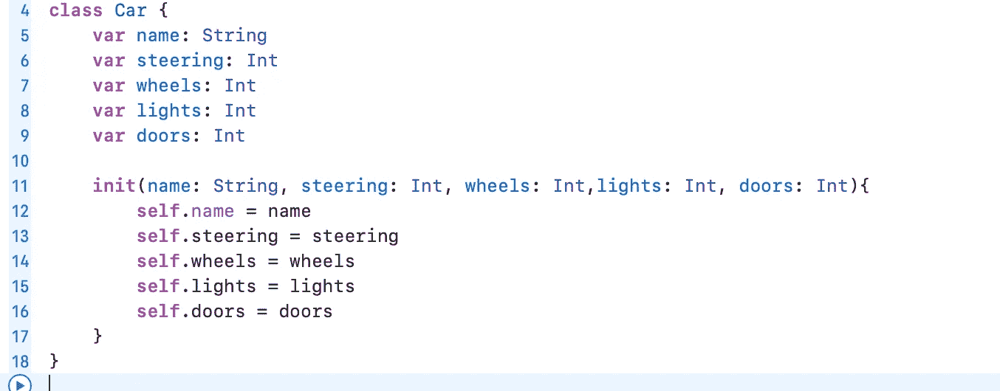
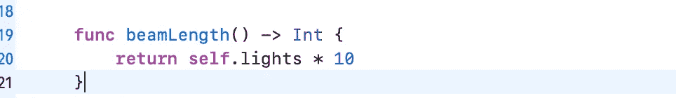

# iOS 访谈:计算属性

> 原文：<https://medium.com/codex/ios-interview-preparation-computed-property-a229a787e954?source=collection_archive---------5----------------------->

在进入计算属性之前，首先让我们了解什么是属性。

P 属性是与 Swift 中的类、结构或枚举类型相关的值。举个例子，对于汽车来说，我们有轮子、门、前灯、方向盘等等，这些都是我们可以用来制造汽车的属性。这些属性可以是常量，也可以根据实例的不同部分而有所不同。一辆汽车可以有 2 个或 4 个门，所以它是一个变量，但一辆汽车只能有一个方向盘，所以它在本质上是恒定的。

下面是汽车的骨骼结构，是的，我们也可以有其他的属性，但是为了简单起见，我只取了其中的五个。

C**computed**属性是不存储值而不是计算值的属性。因此，由于 computed 属性不存储值，它提供一个 getter 来检索可选的 ***setter，以间接设置其他属性和值。***

> 计算属性是在调用对象创建或构造函数时不会被初始化的属性。每次访问属性时都会计算它们。

让我们用这个例子来理解我们的汽车类。

假设我们想要访问前灯的光束长度，我们有一个简单的公式:
光束长度= numberOfLights * 10

所以我们可以做的是，我们可以有一个函数，可以计算梁的长度。

这是一个非常简单的计算，它不需要任何参数，也不需要验证，也不会抛出任何错误，所以我们可以创建一个计算属性，而不是创建一个函数。

> 计算属性实际上只是一个属于你的结构的函数调用，意思是计算属性类似于一个普通的函数，它将返回一个特定类型的值，但是它不能接受参数。

这个计算出的属性的行为类似于我们编写的函数，但是非常简洁。为了验证更多，如果你已经用某个名字创建了一个计算属性，你不能用相同的名字创建一个函数，除非你修改参数。

请在下面找到关于计算属性的精彩文章:

 [## Swift 中的计算属性是什么？何时应该使用它们？

### Swift 的一个非常有用的特性是它能够通过一个…

www.donnywals.com](https://www.donnywals.com/what-are-computed-properties-in-swift-and-when-should-you-use-them/)  [## Swift 中的计算属性是什么？

### 计算属性是 Swift 中属性类型家族的一部分。存储属性是最常见的保存…

www.avanderlee.com](https://www.avanderlee.com/swift/computed-property/)  [## Swift 中的计算属性

### 对象创建是一个繁重的过程。当我们创建一个类对象时，该类的所有公共和私有属性…

agrawalsuneet.github.io](https://agrawalsuneet.github.io/blogs/computed-property-in-swift/) 

***如果你喜欢这个，点击💚尽你所能在下面为这篇文章鼓掌，这样其他人会在媒体上看到。如有任何疑问或建议，欢迎随时评论或打我***[***Twitter***](https://twitter.com/b_banzara)***，或***[***Linkedin***](https://www.linkedin.com/in/rranjanchchn/)***。***