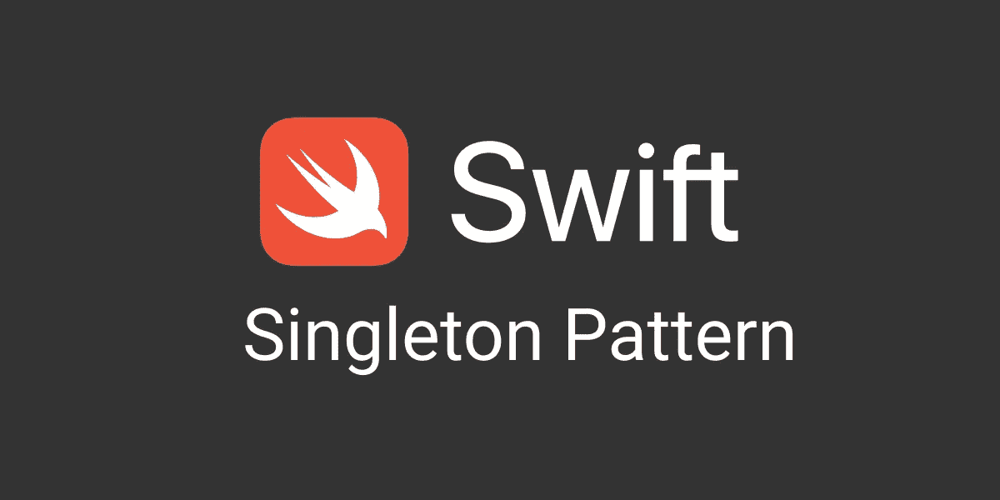
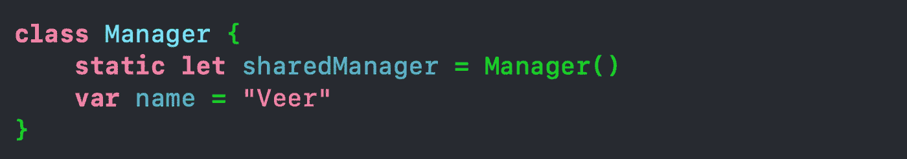
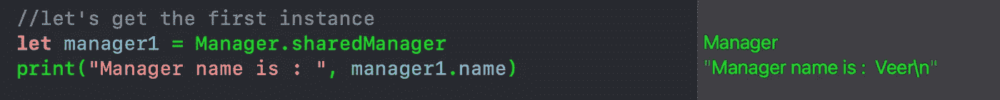
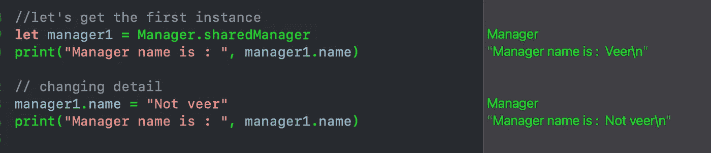
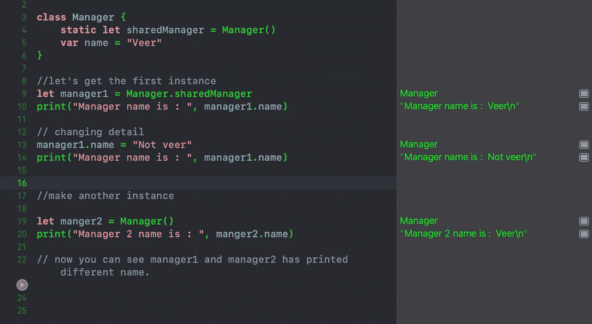
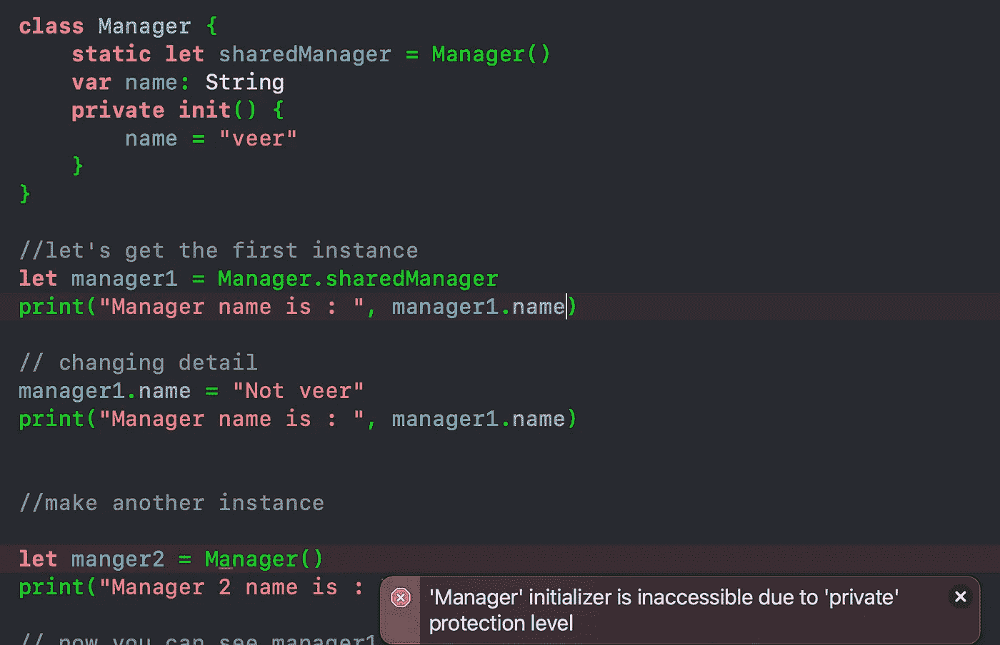
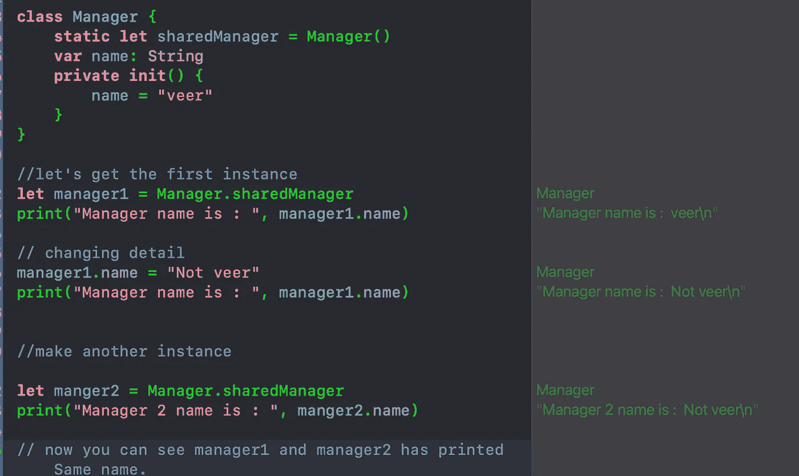

# iOS 访谈:单一设计模式(理解、实现)

> 原文：<https://medium.com/codex/ios-interview-singleton-design-pattern-understanding-implementation-d283fb2c305b?source=collection_archive---------5----------------------->

一个

许多设计模式目前在 apple swift 中很流行)但是 apple 在文档中没有显示任何设计模式，但是他们在列表中提到了 singleton[[设计模式](https://developer.apple.com/documentation/swift/cocoa_design_patterns) ]，如果你愿意，他们的许多 SDK 也遵循 Singleton 模式。

*   UIApplication.shared
*   用户默认值.标准
*   FileManager.default
*   URLSession.shared
*   OperationQueue.main

因此，让我们了解什么是单体设计模式，以及何时以及如何实现单体设计模式。

当你在维基百科上搜索单例类时，维基会说“**单例模式**是一种软件设计模式，它将一个类的实例化限制为一个“单个”实例。【[来源](https://en.wikipedia.org/wiki/Singleton_pattern)

*虽然苹果的官方文件称“单例模式(singleton pattern)使用单个共享类实例(source)提供对共享资源的访问”。*

*你发现维基百科和苹果对 Singleton 的说法有什么不同吗？。两者之间唯一的区别是苹果没有说我们不能只做一个单例类的实例，是的，这就是苹果的情况。*

*让我们借助代码来理解这一点:*

**

*单例类*

*我已经创建了一个 Singleton 类名 manager，并用共享实例的名称创建了一个 Manager 的静态实例，还向 Manager singleton 类添加了 name 属性。*

*Manager singleton 类的 sharedManager 属性允许我们在任何地方访问它，通过这种方式，我们还可以借助共享管理器来访问 name 属性。*

**

*获取管理器单例类的实例*

*从上面我们可以看到，我们在第一行得到了一个经理的实例，从这个实例中，我们可以打印出经理的名字。现在，我将使用实例更改 name 属性值*

**

*更新属性*

*现在，管理器名称更改为 Not veer，之前用“veer”初始化。*

*现在，如果我们通过直接创建一个对象来为 Manger 创建另一个实例，我们仍然可以看到它的名字是“Veer ”,这意味着我们可以创建单例类的多个实例。*

**

*创建管理器类的对象*

*因此，我们如何避免创建任何单例类的多个实例，以及如果创建任何单例类的另一个实例，我们如何引用同一个对象。*

*Singleton 类的关键原则是给它一个私有的初始化器，这样任何地方的任何人都不能为 Singleton 类创建其他实例，所以如果我们像下面这样修改代码:*

**

*初始化 singleton 的新实例时出错*

*我们可以看到 Xcode 不喜欢创建另一个 Manager 类的实例，因为它是不可访问的，因为它是一个私有的初始化器。当我们使用共享实例属性创建另一个管理器时，我们可以看到我们现在指向同一个对象，因为管理器 1 和管理器 2 的名称将与“Not Veer”相同。*

**

*所以单个类的主要目的是**将对象创建的数量限制为只有一个**。这通常可以确保对资源的访问控制，例如，在套接字或数据库连接中，我们可以创建一个 sharedManager 或 sharedSocket，这样我们就只为数据库或套接字创建一个对象。*

****如果您喜欢这个，点击💚所以其他人会在媒体上看到这个。如果你有任何合唱团或建议，请随时评论或在 Twitter 上打我。****