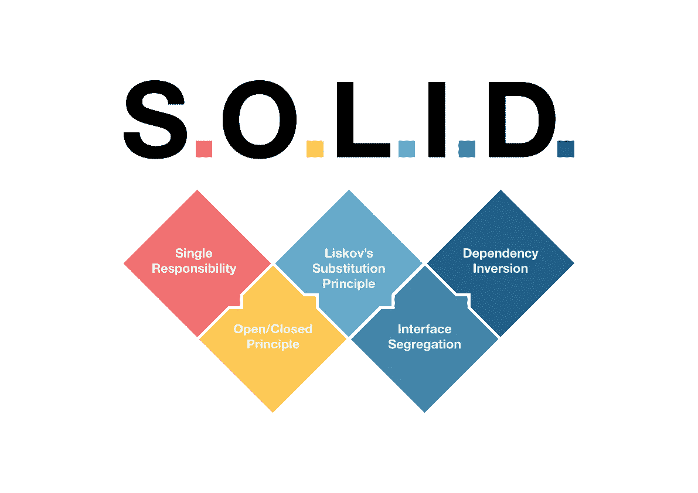

# iOS 面试:扎实校长【理解与执行】-1

> 原文：<https://medium.com/codex/ios-interview-solid-principal-understanding-and-implementation-1-dbaab28e9a63?source=collection_archive---------8----------------------->

S O L I D 原则是开发产品的标准，任何开发人员都应该严格遵守，不管他是独自工作还是与团队合作，但问题是**为什么？为什么这很重要？**

固体

为什么是 T4？为什么它在**软件开发**中很重要？

为了理解 Solid，让我们举个例子，你想建造一个令人惊叹的房子来居住。因此，要建造一座房子，我们有多个阶段，从获得土地开始，让我们以获得土地为例，这是建造你的房子的第一步，你可以单独完成这项工作，获得土地可以称为建造你梦想中的房子的初始化，在软件术语中，初始化你的项目，这可以单独完成，因为现在任务是明确的，只有一个。

现在为了建造你的房子，你需要大量的设备和机器，因为建造房子的基础是要有原材料，如铁棒、水泥、沙子、砖块，🧱，所以现在你不能单独制造所有这些东西，所以不同的机构建造这些材料或提供这些材料，所以你现在的工作只是根据成本要求下订单。

所以你的一个原材料任务已经解决了，要消耗这些原材料，你需要一个专家，或者用这些材料为你建造一个漂亮的房子，这个任务也会被分割。因此，在软件开发中，如果你在一个团队中工作，你是团队的领导者，那么你将把任务划分或分配给每个团队成员，这样他们就可以处理单独的问题陈述，一旦他们都合并了他们的代码库，那么产品就开发出来了。所以在代码内部，我们也必须使用这种方法来解决问题，为此我们使用 S O L I D Principal。

在 **S O L I D** 中，主要固体代表:

1.  **S:单一责任原则。**
2.  **O:开-关本金。**
3.  **L:利斯科夫替代原理。**
4.  **一:界面分离原理**
5.  **D:依存倒置原则**

在下一篇博客中，我将讨论我们如何在任何项目中实施 Solid principal。我将在 Swift 中使用一个代码示例，但这个原则可以适用于任何编程语言。

***如果你喜欢这个，点击💚所以其他人会在媒体上看到这个。如有任何疑问或建议，欢迎随时评论或打我***[***Twitter***](https://twitter.com/b_banzara)***，或***[***Linkedin***](https://www.linkedin.com/in/rranjanchchn/)***。***