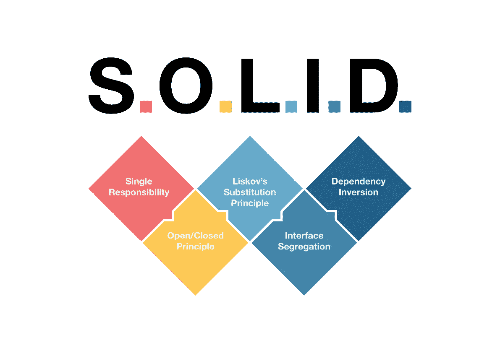
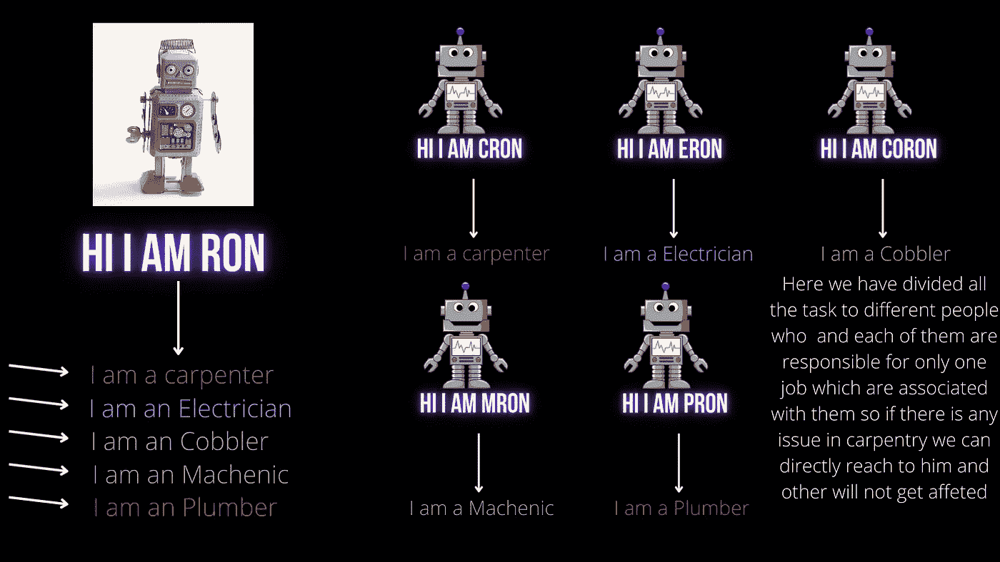
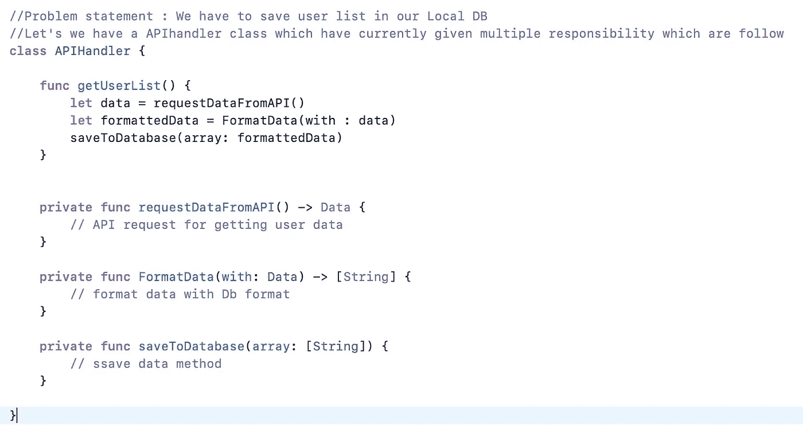
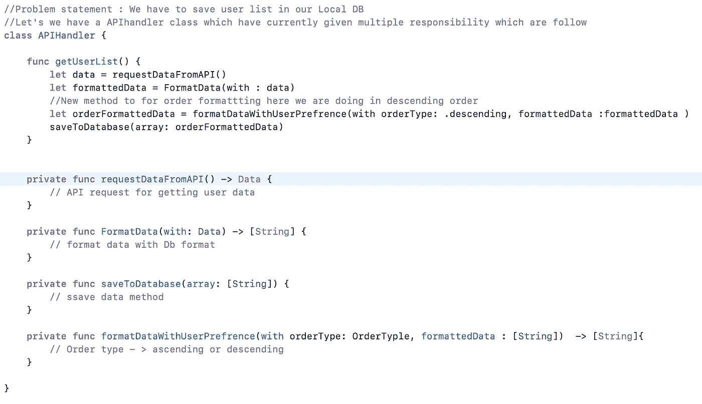
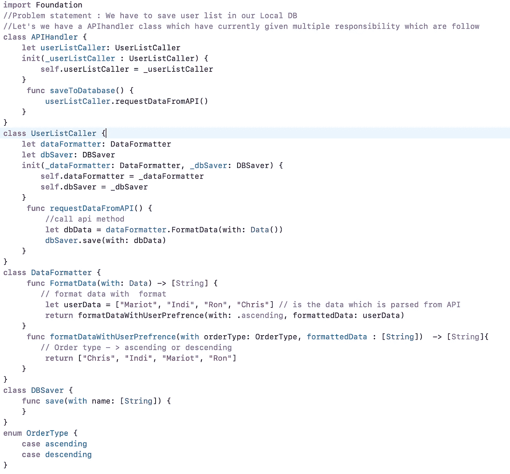

# iOS 面试:扎实校长【理解与执行】- 2【单一责任】

> 原文：<https://medium.com/codex/ios-interview-solid-principal-understanding-and-implementation-2-2d372bc8d36c?source=collection_archive---------4----------------------->

从之前的[博客](/@r.ranjanchn/ios-interview-solid-principal-understanding-and-implementation-1-dbaab28e9a63)中，我们已经讨论了一点对固体原理的理解什么是固体？为什么每个开发者都应该遵循这个原则。关于 solid 原则有趣的事实是，SOLID 中的每个原则是由不同的人给出的，这些都是由[罗伯特·c·马丁](https://en.wikipedia.org/wiki/Robert_C._Martin)也就是“鲍勃叔叔”耦合在一起的。让我们在代码的帮助下深入理解每一个原则，并且我们将在图像的帮助下可视化它们。

# S O L I D 原则

1.  **单一责任原则**:就像在之前的博客中我们讨论的那样，如果我们把所有的责任都交给一个人，这对他来说会变成一个非常忙乱的任务，这可能会导致错误。在软件领域中，如果一个类有多个职责，那么这个类可能是一个错误，因为这个类有多个职责。这个原则规定**“一个*类应该只有一个改变*** 的理由”，这意味着每个类都应该有一个单一的责任或单一的工作或单一的目的。

SRP

在上图中，我们将所有工作的所有责任都交给了 Ron，如果责任有任何变化，都会在不知情的情况下影响 Ron 的工作，因此 SRP(单一责任)的目标是将行为或任务分开，这样，如果出现任何问题或错误，在不同行为中进行任何变化都不会影响其他人。

上面的代码没有问题，因为 API handler 类可以处理这个问题，但是我们有了另一个要求，要求您必须按顺序(根据用户偏好升序或降序)制作这个列表。现在，您将再次在 API 句柄类中添加一个新函数，它将变成

现在使用这个代码仍然没有问题，但是你可以看到 API 处理程序类有很多责任，如果有任何类型的行为改变，那么其他方法可能会受到影响，例如，如果来自 API 的数据现在不是字符串数组，它现在是用户的对象，在里面我们有名称数据，我们必须保存在数据库中，所以我们必须根据它对每个函数进行更改。这导致这个类容易出错。

我们如何用单一责任原则使代码更具可伸缩性，更少出错。SRP 说**“每一个类都应该有一个单一职责或者单一任务或者单一目的”**

因此，我们将把每项任务分配给不同的班级来完成他们的具体工作，如果我们需要做任何类型的改变，我们将在同一个班级中完成，这不会影响到其他人。让我们通过代码来看看这一点。

因此，现在如果响应中有任何类型的更改，那么我们不必在 DB saver 类上工作，我们只需在 DataFormatter 类中进行更改，并根据 DB saver 类函数生成数据，一切都会正常工作。

在下一篇博客中，我会详细讨论其他的原则，如果你有任何问题，请在下面评论。

***如果你喜欢这个，点击💚所以其他人会在媒体上看到这个。如有任何疑问或建议，欢迎随时评论或打我***[***Twitter***](https://twitter.com/b_banzara)***，或***[***Linkedin***](https://www.linkedin.com/in/rranjanchchn/)***。***