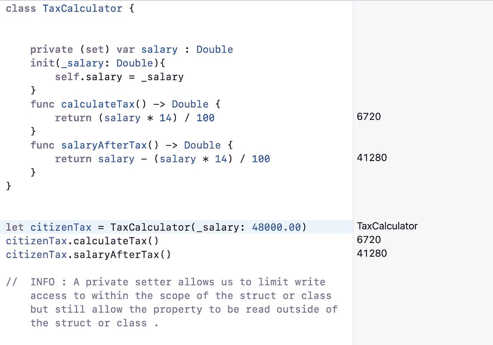
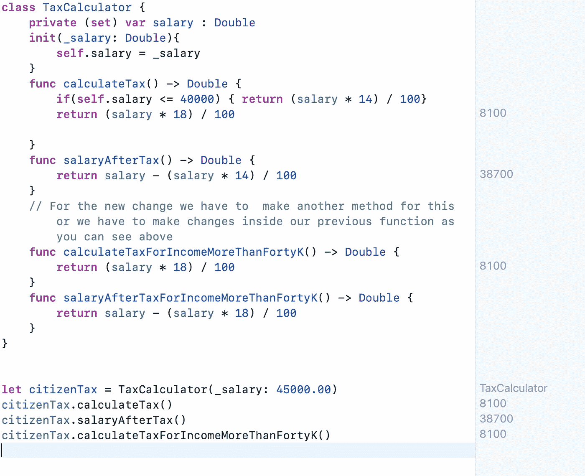
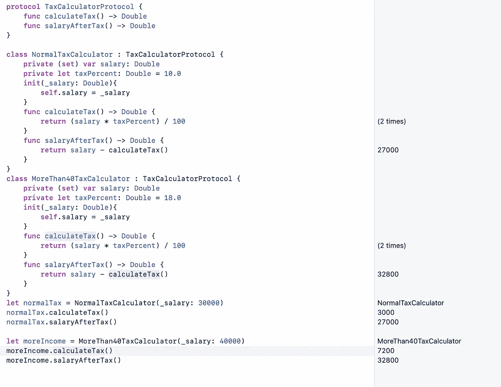
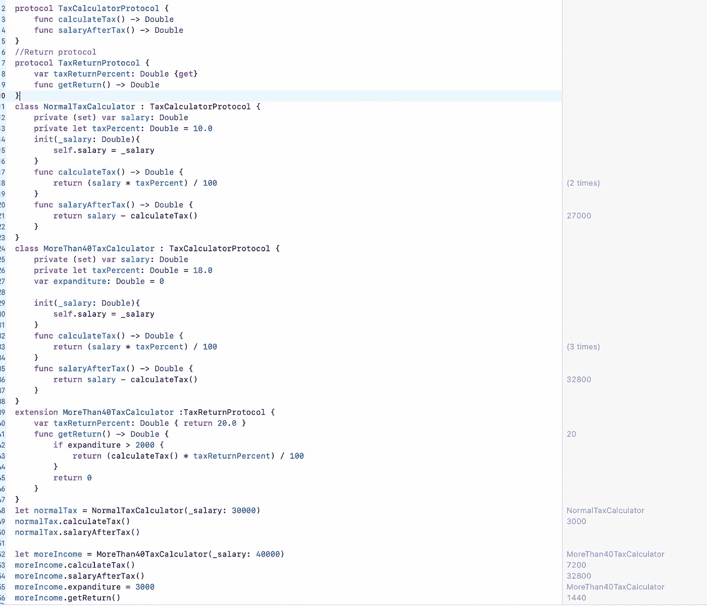

# iOS 访谈:坚实的原则[理解和执行]—3[开放-封闭原则]

> 原文：<https://medium.com/codex/ios-interview-solid-principal-understanding-and-implementation-3-open-close-principal-756f1dab1e3b?source=collection_archive---------4----------------------->

当客户不断要求改变时，软件开发变得非常烦人。频繁的更改非常烦人，如果代码写得不好，还会导致其他错误。因此，每个开发人员都想到了一个问题，客户想要的变化是一个永无止境的过程，那么我们如何才能避免这些变化带来的错误呢？这个问题的简单答案就是使用设计模式。在 In S O L I D 中，O 原则旨在克服这种频繁变化的问题错误，但如何克服呢？让我们明白这一点。

固体

## S O L I D 原则

**2。开闭原则:**这个原则是面向对象设计的关键原则之一。 **Bertrand Meyer** 是 1988 年在他的《面向对象软件构建****一书中写到了这一点。****

**这个原理说明了***一个软件的每个实体(类、模块、函数等。)应该对扩展开放，但对修改关闭。*****

**上面的陈述非常简单，但是如果我们遵循它，当我们在任何模块、实体或类中有很多变化或频繁变化时，它将解决许多问题。**如何？**先理解这个说法，再用真题来理解这个。**

**这个原则的思想是" ***"你应该编写你的代码，这样你就可以在不破坏任何以前的手段的情况下添加新的功能，而不改变现有的代码* "** 。**

**让我们再次打破这个听起来是不是很困惑？**

***“****开-关原则说，如果你的类需要一些其他的新功能，那么如果你添加了新功能，它也应该与前一个功能一起工作，这意味着你不必改变你以前的代码中的任何东西”。*****

**让我们用一个真实的问题陈述来理解这个。让我们假设我们正在开发一个全新的应用程序，它计算我们必须扣除的税，目前政府说所有人都必须缴纳他们收入的 14 %的税。所以作为一个程序员，我们将创建一个类税计算器如下。**

****

**现在政府需要建设一些新的基础设施，为此，他们提出了一项法案，规定收入超过 40000.00 的人必须缴纳工资的 18 %的税。这是政府的一个非常粗鲁的决定，但为了良好的基础设施，人们还是同意这个税收方案😣。所以现在我们必须在我们的类中进行改变，并且必须在我们的薪水计算器类中进行改变。而且会变成这样。**

****

**你能看到这个代码中的问题吗，我们已经根据我们的要求进行了更改，有两种可能的方法来做到这一点，一种是为超过 40000 的薪水创建另一个函数，或者我们必须对现有的函数进行更改。是的，我们的新函数需要一些验证，如果薪水低于 40000k，我们必须给出错误，所以现有类中的大量工作完全违背了 S . O . L . I . D 原则中的" **O** 。如果我们有另一个带有一些其他约束的需求来了， **phewww** 大量的工作，难以测试，更多的错误，更多的验证，所以我们如何使用开闭原则来避免这种错误。现在增加了一个新的要求，即支付 18%税的人在显示他们的健康教育交易时可以获得 3%的回报，但这不适用于支付 10 %税的人。如果 tax slab 有更多选项，则很难管理所有选项，如果我们在类内更改某些内容，可能会破坏内部功能，因此在 swift 协议的帮助下，我们可以在不破坏的情况下扩展功能。**

****

**在上面的代码中，我们创建了一个协议，其中我们定义了计算税收的行为。该协议不知道任何税收的实现。现在，当我们想要添加更多与税收计算器不相关的行为时，我们可以将其分离，例如，如果我们需要更多的行为变化，以便根据纳税申报协议对超过 40000.00 的工资进行退税**

****

**在上面的例子中，我们没有对税收计算器进行任何更改，但我们创建了一个新的申报协议，该协议只适用于收入超过 40000 英镑的人，这样我们就扩展了他的行为，而没有改变他的实际纳税行为。**

*****如果您喜欢这个，点击💚所以其他人会在媒体上看到这个。如有任何疑问或建议，欢迎随时评论或打我***[***Twitter***](https://twitter.com/b_banzara)***，或***[***Linkedin***](https://www.linkedin.com/in/rranjanchchn/)***。*****