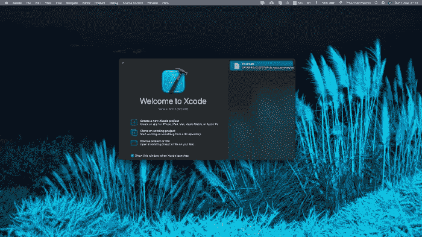

# iOS/Swift 系列:[#08]设置 iOS 环境

> 原文：<https://medium.com/codex/ios-swift-series-08-setup-ios-environments-f414a86b10cd?source=collection_archive---------8----------------------->

> 最佳实践是为您的 iOS 应用程序创建单独的环境，尤其是当它们与任何服务器通信时。例如，考虑一个 iOS 应用程序和三个不同的可用 web 后端环境:开发、试运行和生产。

在 iOS 应用程序中切换使用这些不同服务器的最佳方式是什么？那么所有其他潜在的键/值对呢…