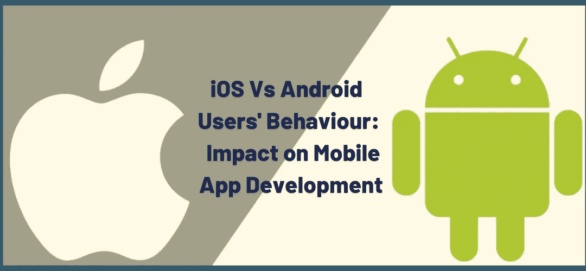

# iOS 与 Android 用户行为对比:如何影响移动应用开发？

> 原文：<https://medium.com/codex/ios-vs-android-user-behavior-how-does-it-impact-mobile-app-development-9c456be902ef?source=collection_archive---------12----------------------->

如果你有一部智能手机，你的手机上可能会下载几个应用程序。当你用它们来访问你的社交媒体账户或编辑图片时，你有没有想过是什么让它们如此受欢迎？特定的移动应用程序如何在其他应用程序每天获得数百万次下载而其他应用程序仅获得微不足道的下载量？