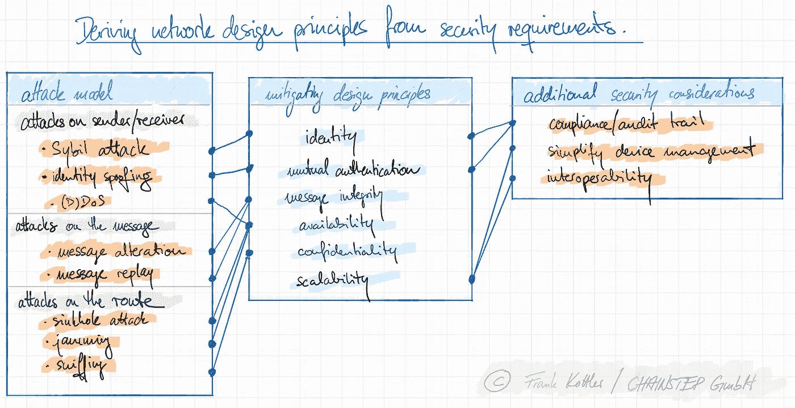

# 用 SSI 保护新冠肺炎疫苗—第 1/3 部分

> 原文：<https://medium.com/codex/iot-network-security-protecting-covid-19-vaccines-with-ssi-part-1-requirements-b6523a607fbe?source=collection_archive---------11----------------------->

## 利用分布式身份管理定义物联网的未来

物联网系统有许多颜色和方面。从看似简单的智能家居，光传感器控制你的窗帘，你的冰箱根据其内容和推送到你手机的食谱建议发出一小时的杂货交付订单，到自主仓库，再到高保真自适应生产系统，批量 1 和按需生产需要不断修改生产计划和补充投入，所有这些都是由客户监控的，物联网将影响几乎每个行业。物联网设备的广泛应用使其成为网络攻击的诱人目标，由于设备的固有属性，IT 网络架构师将很快面临保护其物联网网络的操作挑战。

由[亚历克斯·普多夫](https://unsplash.com/@a_pudov?utm_source=medium&utm_medium=referral)在 [Unsplash](https://unsplash.com?utm_source=medium&utm_medium=referral) 上拍摄的照片

在许多情况下，支撑物联网网络安全的问题类似于经典的区块链商业案例:在不信任的环境中创建信任——在这种情况下，是可信的数据和消息交换。虽然自主权身份(SSI)概念以特定的分布式方式解决了这个问题，但我们希望探索当前的解决方案，并将它们的属性与分布式体系结构(包括 SSI)进行比较。许多理想的网络属性(吞吐量、简单性、保密性等)在传统解决方案中更容易实现，了解每种方法如何根据特定应用为物联网网络安全提供价值将令人兴奋。

为了便于说明，我们假设一家虚构的物流公司 *VirGo，*赢得了一份政府合同，提供新冠肺炎疫苗。处女座是一家现代公司，100%的透明度、最后时刻的灵活性和零失误的承诺对政府来说很有吸引力。如果推广成功，双方都愿意加强合作关系。*处女座*依靠智能温度和位置传感器来保护冷却链，并运营各种区域安全仓库，具有粒度和临时访问权限。他们的物联网系统能支撑这个挑战吗？让我们来看看…

# 物联网网络面临的已知和未知挑战

与过去几十年的传统企业 IT 基础设施相比，物联网网络表现出三个显著的差异:它们连接(1)许多截然不同的设备，这些设备可能都说不同的语言(即使用不同的 API)，(2)几乎完全无线连接(这使得连接更容易被拦截)，设备(3)在技术上受到限制，不容易升级以承载更多的计算能力或内存。

在处女座的概念中，仓库入口是根据卡车的位置被地理围栏起来的。此外，违反冷却链应自动停止运输，并阻止货物的任何移交。温度计必须突然与手持扫描仪共享信息，位置传感器、卡车司机徽章和仓库大门都需要找到一个共同点。虚假或伪造的数据、来自错误设备的正确数据或不完整数据可能会立即危及疫苗安全。此外，设备来自不同的制造商，并针对各种使用情况进行设计:温度传感器也可以用于生产车间，位置传感器在军事应用中同样有用。随着设备的增加，保持固件最新并确保设备互操作性变得越来越复杂。对不同设备数据和功能的粒度访问控制进一步增加了复杂性，并加剧了过时或孤立访问策略的风险，而过于笼统的访问策略会引发欺诈、“内部工作疫苗”或只是为任意动机的(网络)犯罪创造另一个攻击媒介。当数据流很容易被窃听时，情况也是如此。此外，维护和更换现有设备，并装载新设备，所有这些都需要保护网络免受未知和/或潜在恶意参与者的攻击。

尽管存在所有这些挑战，但这种物联网魔法已经在今天启动并运行，但对于*处女座的*网络管理员 Dylan 来说，考虑到他们应用程序的属性，显然安全的物联网系统必须能够:

*   确保访问控制(只有获得许可的用户/设备可以访问传感器数据)，
*   确保系统可用性，
*   防止消息被篡改，
*   防止身份欺骗(伪装成不同的设备)，
*   防止被窃听，
*   创建审计线索:谁在系统中做了什么，什么时候做的？
*   简化设备管理，
*   促进设备互操作性。

虽然后者将系统暴露给令人兴奋的新应用(在未来的帖子中会详细介绍)，但它也是一种安全要求，因为随着物联网技术的进步，系统必须支持增强功能。

# 处女座物联网网络的攻击模型

## 对发送方和接收方的攻击

*   **西比尔发作。**攻击者制造多个假设备，以便**改变网络投票权、消息路由、资源分配或分布式数据存储** (51%攻击)。
*   **身份欺骗。**攻击者伪装成已知设备，以获取其权限。攻击会导致**伪造数据、注入不存在的数据**和**信息丢失**。
*   **(分布式)拒绝服务— (D)拒绝服务。**攻击者通过用无用的数据包干扰其接口，导致**节点中断**。

## 对消息的攻击

*   **消息变更。**攻击者拦截并更改传输的消息，导致**伪造数据**。
*   **消息重放。**攻击者重新传输之前的有效消息，导致**伪造数据**和**不可解释**。

## 路线上的袭击

*   **天坑攻击。**攻击者拦截通信(中间人攻击)并拒绝转发消息。这导致**信息丢失**和**使** **设备通信不可靠**。
*   **嗅。**攻击者窃听设备通信，获得对受限数据的未授权访问，导致**数据泄露**。
*   **卡涩。**攻击者不是对节点进行(D)DoS 攻击，而是用无用的流量堵塞网络，造成包碰撞，强制数据重传，占用网络带宽。这导致传感器侧的**能量消耗**和**网络不可用**。

# 网络设计要求

鉴于疫苗交付合同的高姿态，网络管理员 Dylan 决定重新审视 *VirGo* 的网络架构——也许他们甚至可以根据他们的安全概念确定新的服务机会。不用说，网络安全的一般话题比我们在这里讨论的要复杂得多。非营利技术咨询机构 MITRE 发布了超过 150 种网络攻击技术的[行业认可的 ATT & CK 框架](https://attack.mitre.org/)，及其网络安全对策的[互补 D3FEND 框架](https://d3fend.mitre.org/)。在 VirGo 目前的生产系统中，网络管理员对许多潜在的攻击媒介的控制是有限的，尤其是设备的硬件和固件安全。这就是为什么 Dylan 需要更加关注保护设备通信的原因。出于这个原因，他重点关注 ATT & CK 框架中提到的凭证访问、网络发现、数据收集和影响方面的潜在攻击。在这种情况下，我们还想单独关注 D3FEND 框架的硬化部分中的*预防性*对策。

处女座的*网络中的“通信事件”由发送者、接收者、实际的消息/数据(包括时间戳)以及消息包从发送者到接收者的路径组成。因此，Dylan 根据他们之前的考虑因素分析了这些可能的威胁元素，从而形成了上面的攻击模型[1][2]。*

为了防御这些攻击，Dylan 提出了减轻攻击的网络设计原则。他们将攻击模型的含义与上一步中确定的所需功能结合起来: *VirGo 的*物联网网络需要提供可用性、可扩展性、消息完整性、身份、相互认证和机密性(参见**图 1** )。**身份**的设计原则要求设备能够获取系统特定的属性及其动作历史。对于*处女座*来说，这意味着他们的位置和温度传感器必须在网络中单独区分，以便数据流可以分配给正确卡车中的正确传感器(动作历史)。这也确保了处女座的 T21 只允许那些已经被迪伦和他们的同事配置和调试过的传感器和控制器进入网络(特定于系统的属性)。

**相互认证**更进一步，要求设备向其通信伙伴证明其身份。简单地说，设备必须安全地证明它们就是自己所声称的那个人。没有身份验证的身份没有意义，因为这种状态会导致属性和数据分配不可靠。尽管如此，它仍然值得一提，因为身份验证也是不可否认性和机密性等属性的基本构件(见下文)。同样，发送设备验证接收设备的身份(*相互*认证)也同样重要，以防止信息泄露。

**图一。**安全考虑如何影响设计原则及其相互作用。

**消息完整性**要求可以检测到消息的更改或损坏(在“区块链话”中:消息是*防篡改的*)。对于处女座的*目的来说，完整性还包括**不可否认性**(发送者不能否认已经发送了某条消息)，以及数据**新鲜度**(接收到的消息在可接受的延迟内是当前的，没有过期)。*

**可用性**是指系统的所有功能在设备需要的时候都是可用的，而**保密性**则保证传输的消息不会被未授权的设备偷听。最后，一个**可扩展的**系统可以轻松扩展，即使被管理的设备数量很大，也可以安全地添加、管理和移除设备。此外，系统吞吐量应该支持网络的动态增长。

[*在下一篇文章中加入我们*](/p/1b5e8e49605d) *迪伦发现了解决物联网安全问题的可用架构——它们兑现了承诺吗？*

请随时在 LinkedIn 或 Twitter 上联系我！我热衷于在 Web3 中讨论商业模式机会和运营优势。我的目标是让有前途的技术为中小型企业所用。 **#weare4ir**

# 来源

[1]萨基兹，f .，&森，S. (2017)。智能交通系统的攻击和检测机制综述:VANETs 和 IoV。在:*临时网络，61* ，33–50。[https://doi.org/10.1016/j.adhoc.2017.03.006](https://doi.org/10.1016/j.adhoc.2017.03.006)。

[2]沃尔特斯，J. P .，梁，z .，施，w .，，乔德里，V. (2007 年).无线传感器网络安全综述。在 y .肖(编。)，*分布式、网格、移动和普及计算中的安全性*(第 367-409 页)。奥尔巴赫出版社。https://doi.org/10.1201/9780849379253-20[。](https://doi.org/10.1201/9780849379253-20)