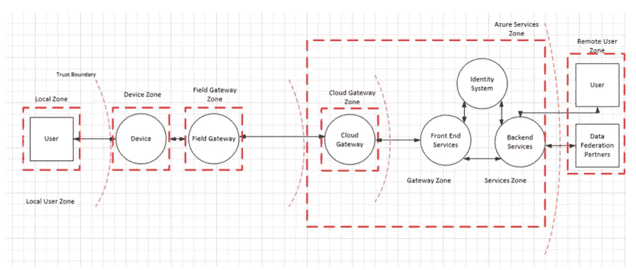

# 用 SSI 保护新冠肺炎疫苗—第 2/3 部分

> 原文：<https://medium.com/codex/iot-network-security-protecting-covid-19-vaccines-with-ssi-part-2-architecture-1b5e8e49605d?source=collection_archive---------13----------------------->

## Dylan 认识到，已确定的设计要求对应于通常通过密码术解决的属性。为了在他们的网络中安全地嵌入加密方法， *VirGo* 需要识别网络架构和身份管理范例，当它们相互作用时满足设计原则。

[黄福生](https://unsplash.com/@killerfvith?utm_source=medium&utm_medium=referral)在 [Unsplash](https://unsplash.com?utm_source=medium&utm_medium=referral) 上的照片

# 网络架构:可伸缩性和可用性的基础

经过更多的研究，他们发现了目前在生产中使用的各种解决方案。特别是，微软提出了由信任边界分隔的信任区域[1]。另一方面，软件定义的网络通过标准化提供了更高的粒度和灵活性。此外，Dylan 还收集了一些关于如何改进这些解决方案的想法，特别是在区块链/分布式账本技术和自我主权身份的帮助下。

## 微软 Azure:信任区域和信任边界

微软的物联网安全架构基于这样一种想法，即网络的不同连续部分(“区域”)在不同的安全环境中运行，需要相互屏蔽。假设每个区域在不同的数据和访问控制策略下运行，由网关保护，这样每个区域可以有自己的安全环境。网关将控制其区域内的附属设备和服务，从而简化安全工作，分为管理网关和保护信任区域/网关之间的通信链路(参见**图 1** )。通过这种方式， *VirGo 的*仓库大门传感器将在不同的安全环境中运行，由不同于卡车传感器的现场网关控制。这种设置允许网关之间某种程度的标准化:现场网关可以被配置为将接收到的数据处理成标准化的输出，并通过例如预共享秘密或公钥加密来实施安全通信标准。另一方面，网关和设备仍然需要进行供应(尽管像*微软 Azure 物联网中心设备供应服务*这样的供应服务基础设施和像*微软 Azure 物联网即插即用*这样的专有标准在某种程度上简化了这一点)，并且该架构似乎在某种程度上依赖于拥有一个中央数据处理单元(云)。

**图一。**微软设想的物联网网络安全架构[1]。

## 软件定义的网络:分布式网络控制

软件定义网络(SDN)可以为物联网网络提供所需的抽象级别。微软的信任区描述了 SDN 的一个特例，其中一个 SDN 域充当唯一的数据处理器。在 SDN 中，就像在微软的物联网架构中一样，设备和服务被屏蔽在由 SDN 控制器控制的 SDN 域中。然而，数据处理并不依赖于特定的云架构。这种抽象级别允许更广泛的用例，如分布式数据管理或联合学习。有了 SDN， *VirGo* 可以允许他们的仓库根据卡车的身份验证以及可能无法预见的当地情况，独立授予卡车进入许可。这种设置最大限度地减少了信任边界/SDN 域之间的通信跳数，从而有效地减少了技术和人为攻击媒介的数量。此外，基于每个设施的物理设置定制仓库操作在操作上更容易。设备管理可以分散到一定程度，可以级联到安全域。这样，可以在出现故障时灵活地更换设备(参见**扩展场景 1** )。

## 扩展场景 1:设备管理

> 为了保持疫苗冷藏，*处女座*依靠智能温度传感器。传感器是冗余的:一个传感器的故障被快速检测到，并且该传感器被替换。 *VirGo* 需要一种解决方案来淘汰故障设备，并在不中断运营的情况下无缝集成替换传感器。

## 基于区块链的访问管理

最近，出现了更多利用物联网网络分布式访问管理的想法。在*fair access*【2】中，资源访问和控制可以被令牌化，这样资源所有者就可以创建唯一的访问令牌(实际上是 NFT)并将其发送给区块链上的资源用户。资源所有者甚至可以在区块链上用加密脚本记录用户的访问条件。只有当用户满足条件时，脚本才能在区块链上记录访问授权。然后，用户可以将他们的访问 NFT 发送到设备，设备可以验证与区块链上的 NFT 相关的访问策略。这将允许*处女座*与他们关系之外的可信合作伙伴动态共享他们的物联网资源，就像**扩展场景 2** 中的许可跟踪示例一样。像这样的系统将特别改善设备之间的对等访问。

管理设备和控制器之间的访问的一种更加简化但有限的方法是在区块链上记录组成员。研究人员将这一概念称为“信任气泡”[3]，假设与其他设备和用户建立主/从关系的每个设备气泡都有一个控制器。主设备向从设备发放签名的“票”，从设备进而可以与区块链上的主设备相关联。信任气泡提供了一种相当简单的机制来管理大量的设备。由于其简单性，这可能是实现动态和标准化访问管理的有力途径，尽管互操作性不一定扩展到消息传递协议。因此，在不同生态系统的设备需要相互认证并频繁加入或离开网络的领域，可以找到信任气泡的用例。

## 扩展场景 2:许可跟踪

> 公众对疫苗供应感到愤怒——太慢、太少、太混乱、太不确定。政府进退两难:他们知道事情并不像预期的那样顺利，公布所有的运输和跟踪信息只会暴露灾难的真实程度。时局艰难，政府最不希望的就是冒内乱的风险。但是，他们希望提高规划确定性，并增加大规模疫苗接种点的规划窗口。处女座可以允许政府管理的疫苗接种点访问他们分配的疫苗批次的实时位置数据吗？

从 Dylan 和我们的书呆子工程师的角度来看，这种基于身份的安全模式也非常令人兴奋，因为它与日益系统化和整体化的企业级网络安全管理的趋势完全一致。继 [ISO 27001 标准](https://www.iso.org/isoiec-27001-information-security.html)之后，由美国国防部新设立的[网络安全成熟度模型认证](https://www.acq.osd.mil/cmmc/draft.html)，正在成为高安全性 IT 环境中日益强制性的准最佳实践标准。

与 SDN 相比，基于区块链的访问管理提高了系统的弹性和可用性，因为不再存在单点故障。在 SDN 架构中，对域控制器的攻击会导致整个域的中断。由于其不变性和公共可见性，当您需要创建跨生态系统的审计跟踪时，基于区块链的访问管理也很有优势。这里的权衡是跨生态系统的标准化要求:只要所有设备都在您的控制之内，区块链就会构成太多的开销。因为您通常会信任自己的实体，所以访问策略可以弹性地存储在内部数据库系统中。然而，一旦您超越了 nexus，您的业务合作伙伴将需要使他们的设备与基于区块链的接入解决方案兼容，以利用其优势——这是一项复杂的工作，如果它与您的价值战略相一致，仍可能具有优势。

[*加入我们的第三部*](/p/87c480fb8007) *，迪伦在其中探索了网络的身份成分。找出 SSI 对网络安全如此有吸引力的原因，以及为什么在使用它之前应该三思而行。*

请随时在 LinkedIn 或 Twitter 上联系我！我热衷于在 Web3 中讨论商业模式机会和运营优势。我的目标是让有前途的技术为中小型企业所用。 **#weare4ir**

# 来源

[1]r . Shahan、p . Meadows 和 b . Lamos(2018 年)。物联网(IoT)安全架构。[https://docs . Microsoft . com/en-us/azure/IOT-fundamentals/IOT-security-architecture](https://docs.microsoft.com/en-us/azure/iot-fundamentals/iot-security-architecture)。

[2] Ouaddah，a .，Elkalam，A. A .，& Ouahman，A. A. (2017 年)。物联网中基于区块链技术的隐私保护访问控制模型。在Á。罗查等人(编辑。)，*欧洲和中东和北非信息和通信技术合作的进展(*智能系统和计算的进展，520)。湛:斯普林格。[https://doi.org/10.1007/978-3-319-46568-5_53](https://doi.org/10.1007/978-3-319-46568-5_53)

[3]汉米、汉米、贝洛特、p .和塞罗奇尼(2018 年)。信任的气泡:基于区块链的物联网分散认证系统。输入:*计算机&安全，78* ，126–142。[https://doi.org/10.1016/j.cose.2018.06.004](https://doi.org/10.1016/j.cose.2018.06.004)。